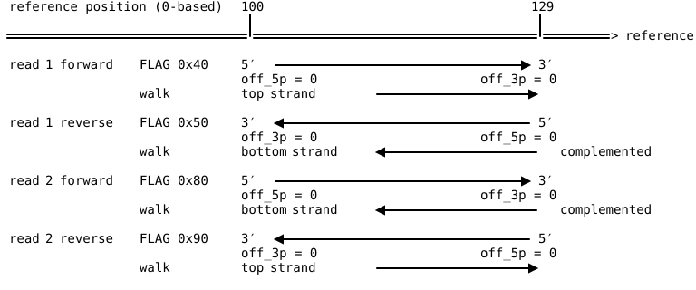

# alnbase

Query aligned read/reference columns.

alnbase compares a read against the reference it aligned to, column by column,
and answers questions you write down: *where does this read show a T over a
reference CG?* The answers come back either as tags on the reads, or as a table
of one row per hit.

It was built for bisulfite and enzymatic methylation data, where the question is
some variation on "which cytosines were converted, in which sequence context",
but nothing in it is specific to methylation. A query is a pattern over aligned
columns, and the patterns say what you want them to say.

- [Why it exists](#why-it-exists)
- [Installing](#installing)
- [A first run](#a-first-run)
- [The model](#the-model)
- [Query files](#query-files)
- [Commands](#commands)
- [Understanding a query before you run it](#understanding-a-query-before-you-run-it)
- [Performance](#performance)
- [Reference: codes](#reference-codes)

## Why it exists

A methylation caller has the rules baked into it. Bismark decides what a CpG is,
what to do when a deletion falls inside the context, whether to look past the
end of a read. Those decisions are correct for the common case and invisible
when they are not, which makes them hard to check and harder to change.

alnbase turns them into something you write in a file:

```toml
[query.CG]
read = "C~"
refr = "CG"
```

That is the whole definition of a protected CpG cytosine on the top strand: the
read has a C where the reference has the C of a CG. Every other rule the tool
follows is in the same file, in the same form, and travels with the output.

Four consequences worth knowing about:

**Your definitions are in the BAM.** Every output carries a copy of the query
files that made it, in its header. A BAM from six months ago can tell you what
its `XM` tag means.

**Reference context is not limited to the read.** A cytosine at the last base of
a read still has its CG context, because alnbase reads the reference past the
end of the alignment.

**Indels are explicit.** Columns are CIGAR-aligned, so what happens when a
deletion lands inside a context window is decided by your pattern, not buried in
the caller.

**No filters that other tools already have.** alnbase does not skip duplicate,
secondary, supplementary or QC-fail reads, and has no MAPQ or base-quality
threshold. `samtools view -F 0x900 -q 20` upstream does that, and the parquet
output carries `qual` and `mapq` so downstream filtering is a `WHERE` clause. A
second implementation of those filters would be one more thing to keep in step,
and two filters that disagree is worse than one.

## Installing

You need Rust 1.85 or newer, a C compiler, and the headers the htslib build
needs.

```bash
cargo build --release
```

The binary lands in `target/release/alnbase`. For a faster build, add
`RUSTFLAGS="-C target-cpu=x86-64-v3"`, which enables SIMD CRAM decoders. The
resulting binary needs a Haswell-era or newer CPU.

## A first run

**1. Index the reference.** alnbase uses its own memory-mapped format rather
than a FASTA, so that every worker can read sequence without locking or
decoding.

```bash
alnbase index mm10.fa mm10.aref
```

**2. Write a query file.** `calls.toml`, Bismark's six methylation contexts:

```toml
[query.TG]                  # converted C in CpG
read = "T~"
refr = "CG"

[query.CG]                  # protected C in CpG
read = "C~"
refr = "CG"

[query.THH]                 # converted C in CHH
read = "T~~"
refr = "CHH"

[query.CHH]
read = "C~~"
refr = "CHH"

[query.THG]                 # converted C in CHG
read = "T~~"
refr = "CHG"

[query.CHG]
read = "C~~"
refr = "CHG"

[tag.XM.bases]              # one character per base of SEQ
fill = "."
z = "TG"
Z = "CG"
h = "THH"
H = "CHH"
x = "THG"
X = "CHG"
```

**3. Tag the BAM.**

```bash
alnbase query --query-file calls.toml --query-file queries/strand/directional.toml \
  -@ 8 in.bam mm10.aref out.bam
```

The second file is the **strand rule**: how this aligner records the strand a
read was converted on ([Strand](#strand)). `queries/strand/` ships one per
aligner; pass the one that matches the BAM.

Every record comes out in the order it went in, carrying an `XM` string one
character per base:

```
...z....Z.....h..
```

**4. Get a table of the calls.**

```bash
alnbase extract out.bam calls.parquet
```

One row per call, with its position, quality, and context. No reference needed:
the tag already holds the answers, and the query file in the header says what
its characters mean.

## The model

### Columns

alnbase walks an alignment and produces one **column** per aligned position: a
read symbol, a reference symbol, a quality, a read offset, and a reference
coordinate. A pattern is written as two rows of equal width, one per side, and
matches where every column agrees.

```
read  C ~        the read has a C, then anything
refr  C G        the reference has C then G
```

Four things that fall outside a plain base:

| Situation | Read side | Reference side |
|---|---|---|
| Deletion in the read | gap (`.` `-` `Z`) | the base |
| Insertion in the read | the base | gap |
| Past the end of the read | pad (`_` `X`) | the base |
| Intron (`CIGAR N`) | junction (`,` `J`) | the base |

`~` matches all of these as well as any base. That is why an anchor written `~`
can land on a deletion, and why `bases` tags refuse such queries: there is no
read base there to mark.

Pads past the end of the read, and the intron columns described below, are shown
so that a pattern can see past the read. A query fires on any window it matches,
including windows made only of pads or only of intron columns: `_N` fires on the
read's end base, and a one-column `_` fires on every pad. Where the read is
soft-clipped, the flank columns nearest the aligned part are clips (`:`) instead,
one per clipped base: the read continues there, but was not aligned. They carry
the reference base and the clipped base's offsets, so `_N` fires on the end base
of an unclipped read and `:N` on the end of the aligned part of a clipped one.

**Pads and the widest query.** By default each read end gets as many pad columns
as the widest query's span, and each intron edge the same number of intron
columns, so every query, the widest included, can fit a whole window into them. So
adding a wider query to a run adds columns to every record, and a query that can
match a window made only of pads or intron columns gains hits. A reference-context
query such as `~~@CG` finds 1 CG alone but 3 beside a six-column query, the extra
two lying wholly past the read. To keep a query's hits the same whatever else
you run, either set `--end-context N` and `--splice-context N` explicitly, or
exclude those windows in the query:

```toml
[pat.cg_ref]
read = "~~"
refr = "CG"

[pat.all_pad]
read = "__"
refr = "~~"

[query.CG_in_reference]
where = "cg_ref and not all_pad"
```

A query that needs a read base somewhere, such as `C~@CG`, is unaffected.
Details in [the query language reference](reference/02-query-language.md#86-pads-flank-contig-ends-and-record-boundaries).

By default, inserted bases produce no column at all, so the reference bases
either side of an insertion stay adjacent and a pattern can span it.
`--insertions emit` changes that when the insertion is itself the thing you are
asking about. Soft-clipped bases are never aligned columns: they were sequenced
but not aligned, and appear only as clip columns in the flank. Read offsets still count both, and hard-clipped bases too
(see [Read offsets](#read-offsets)).

### Strand

A read from the bottom strand is walked in its own orientation, complemented, so
the same pattern works for both strands. `C~@CG` finds the cytosine of a CpG
whichever strand it came from; on the bottom strand that cytosine is a G in SEQ.

Which conversion strand a read came from is decided by a **strand rule**: the
`[strand.*]` tables of one of the run's query files, as
`queries/strand/` ships one per aligner. Pass the file like any other:

```
alnbase query --query-file queries/strand/bismark.toml --query-file my-queries.toml ...
```

A run has exactly one rule; two files declaring one is an error naming both,
and a run that reads records without one is refused. There is no default,
because a default would be a rule built into alnbase that can quietly disagree
with the aligner that wrote the BAM. `queries/strand/directional.toml` is the
plain directional rule for aligners that write no strand tag — read 1 forward
is OT, read 1 reverse is OB, read 2 reverse is CTOT, read 2 forward is CTOB —
and it is a file you pass like any other, not a fallback.

`extract` is the exception: with no `--query-file` of its own it reads the tag
definition out of the BAM's header, and the rule comes back with it, since the
tagging run's query files are stored there. A re-extraction is then oriented
the way the run it is reading was.

A rule may decline a record — an `unknown` key, or an aligner tag that says the
conversion was never observed. Such a record has no strand, so it has no walk:
it is **skipped and counted**, and the count is reported at the end of the run.
Widening the rule's tables until they cover the input is how that count goes
down; nothing is guessed on your behalf.

In a hit table, the record field `strand` says which reference strand was
walked (`+` for OT and CTOT, `-` for OB and CTOB), and `conv_strand`
(`-F conv_strand`) names the conversion strand itself, for per-strand outputs
and M-bias by mate. A rule that distinguishes only two of the four strands —
several aligners' tags do — leaves `conv_strand` null rather than guessing
which of OT and CTOT a read came from. The run manifest records which file the
rule came from, under `strand`.

### Read offsets

Every hit row carries two offsets for its anchor: `off_5p` counts from the
first base the sequencer read and `off_3p` from the last, whatever the FLAG, so
`off_5p = 0` is always sequencing cycle 0, for read 2 as for read 1. They count
the read as sequenced, not just the aligned part: soft-clipped bases, skipped
insertions and hard-clipped bases all take their place. A supplementary
alignment `60H20M` reports `off_5p = 60` for its first base, the same offset its
primary alignment reports for that base, and `off_5p + off_3p` is the full read
length minus 1. The record fields `hard_clip_5p`, `hard_clip_3p`,
`soft_clip_5p` and `soft_clip_3p` give the clips at each sequenced end if you
need them separately: `off_5p - soft_clip_5p - hard_clip_5p` counts from the
first aligned base instead. A pad is not a base of the read, so a hit anchored
on one has null offsets. (Before 0.1.4,
hard clips were not counted.)



Patterns do not follow the sequencer: they run along the walk, the conversion
strand, which for read 2 is the reverse of the order it was sequenced in. So for
read 2 a pad before a base (`_N`) marks the base with `off_3p = 0`, its
sequenced 3' end, and `N_` the base with `off_5p = 0`. `--explain` notes this
under any query that places a pad. Details and worked
examples are in [the walk reference](reference/03-walk-and-matching.md#3-offsets-read_off--off_5p--off_3p).

### Queries

A query is a boolean expression over patterns, plus an **anchor**: the column
whose coordinates the hit reports, and for a `bases` tag the base it marks.

```toml
[query.mCpG]
mark  = ".......+...."     # column 7 is the anchor
where = "cpg and not junc_end"
```

Without a `mark`, the anchor is column 0. Every pattern a query uses must be the
same width, and so must the mark row.

## Query files

TOML. Every value is text in double quotes, or a list of them. Tables may come
in any order, and a query may name a pattern declared below it.

### `[pat.NAME]`

A pattern: `read` and `refr` rows of equal width.

```toml
[pat.cpg]
read = "~~~~~~~Yo~~~"
refr = "~~~~~~~CG~~~"
```

### `[query.NAME]`

`where` says which patterns, combined with `and`, `or`, `not`, and parentheses.
It is optional when the file declares one pattern. `mark` is a row as wide as
the patterns: `.` for nothing, `+` for the anchor, `^` to also record that
column in the output. The anchor is always recorded.

A query may declare its own pattern inline, which is the short form used in the
first-run example above:

```toml
[query.CG]
read = "C~"
refr = "CG"
```

That declares a pattern named `CG`, uses it as the query's `where`, and anchors
on column 0. Other queries can name it too. If you give a `where` as well, the
query's own pattern is just one of the patterns available:

```toml
[query.CG]
read  = "C~"
refr  = "CG"
where = "CG and not junc"
```

### `[alias]`

A row holds one character per column, and most base sets have no one-character
code. An alias names one, in lowercase:

```toml
[alias]
o = "{N.}"      # any base, or a gap
```

### `[tag.XX.bases]`

A tag with one character per base of SEQ. `fill` is written where nothing
matched; every other entry maps a character to the query that writes it.

```toml
[tag.XM.bases]
fill = "."
z = "TG"
Z = "CG"
```

Rules, all checked before the run starts:

- One query per character, and one character per query.
- A query's anchor must always land on a read base. A query that could fire with
  its anchor on a deletion or intron is refused, with a message saying how to
  fix it.
- The fill cannot also be a code.

### `[tag.XX.strand]`

A tag with one value per read, chosen by its strand of origin. All four strands
need a value, because which ones occur depends on the library.

The run's strand rule has to be able to name that origin. A rule that reaches
only the conversion strand — `+`/`-`, which does not say whether a read is OT or
CTOT — is refused together with the tag when the query files are read, rather
than part-way through the scan.

```toml
[tag.XR.strand]             # Bismark's read conversion
CT = ["OT", "OB"]
GA = ["CTOT", "CTOB"]

[tag.XG.strand]             # Bismark's genome conversion
CT = ["OT", "CTOT"]
GA = ["OB", "CTOB"]
```

## Commands

Every option, with its default and the reasoning behind it, is in
[`cli-reference.md`](cli-reference.md). What follows is the shape of each
command.

### `alnbase index FASTA INDEX`

Convert a reference FASTA into alnbase's format. Do this once per reference.

The index stores each contig's MD5, the `@SQ M5` digest. Indexes built by
alnbase 0.1.1 or earlier have no MD5 and are refused; rebuild them. A FASTA
with two contigs of the same name is refused, and a failed run leaves no file
behind, so an existing index survives a bad rebuild.

### `alnbase info INDEX`

What an index holds: format version, contig count, total bases, file size, and
the contigs with their lengths and MD5s, which match the `M5` values
`samtools dict` writes for the same FASTA. A long list is abridged unless you
pass `--all`. Mostly for answering "is this the reference the BAM was aligned
against" without running a scan.

`--seq chr1:1000-1100` prints the sequence over a region instead, in
`samtools faidx`'s coordinates and line width, so the two can be compared
directly:

```bash
diff <(alnbase info --seq chr19:3034740-3034780 mm10.aref | tr a-z A-Z) \
     <(samtools faidx mm10.fa chr19:3034740-3034780 | tr a-z A-Z)
```

The index stores which base is at a position, not whether a masker
lowercased it, so compare case-insensitively.

An index built from a different FASTA than a downstream tool was given
produces calls that are each self-consistent and mutually contradictory, and
this is how to see it.

### `alnbase query [OPTIONS] BAM REFR OUT`

Walk every record and write it back out with the declared tags. Input order is
preserved exactly; `-` works for either end, so it fits in a pipe.

```bash
samtools collate -O in.bam | alnbase overlap - - \
  | alnbase query --query-file calls.toml --query-file queries/strand/directional.toml \
      - mm10.aref - > out.bam
```

Records the scan cannot walk are written through unchanged and untagged, so the
output is the whole input. Unmapped records are normal input. A record on a
contig the reference does not have is not: by default it stops the run at the
first one, since its calls would otherwise be silently missing. `--permissive`
turns that into a counted warning, and does the same for a record whose aux
block is damaged. A mapped record with no SEQ (`*`) has nothing to walk and is
skipped and counted.

A contig the BAM and the index both have must agree: a different length stops
the run, and so does an `@SQ M5` checksum that differs from the index's MD5.
A header without `M5` cannot be checked, so a contig with the same name and
length but different sequence is not caught by the header; use the FASTA the BAM
was aligned against. `--require-m5` makes the checksum mandatory: a record on a
contig whose `@SQ` line has no `M5` stops the run (`samtools dict` prints the
values for a FASTA, and `samtools reheader` puts them on a BAM).

The reads themselves are checked against the reference too. The run counts how
many read bases disagree with the reference (a reference C read as T is not
counted, so conversion does not raise the rate), and the run summary reports the
rate. Correct data disagree at a few percent at most; a wrong reference, a BAM
aligned to another assembly or shifted coordinates disagree at well over half.
The count is shared by every thread. Once the run has compared 100,000 bases, a
rate above `--max-discordance` (default 0.25) stops it and removes the partial
output; a run that ends before that is judged on everything it compared (at least
1,000 bases). `--max-discordance 1` turns the check off. `--trace-records` reports
the rate for each traced record and applies the same check to them.

**Damaged aux blocks.** An aux block is a flat run of fields with no framing,
so a field that cannot be read makes everything after it unreachable to every
reader. Under `--permissive` such a record is still tagged, but the new tags
are written at the *front* of the block, where readers reach them before the
damage. The run reports how many.

A record that already carries one of the tags stops the run, so another tool's
calls are never silently replaced. Pass `--overwrite-tags` to replace them, or
give your tag a different name. Tag names containing a lowercase letter (`xm`)
are reserved for local use and cannot collide with any tool's.

Useful options:

| Option | Meaning |
|---|---|
| `-@ N` | tagging threads |
| `--reader-threads N`, `--writer-threads N` | BGZF threads; default min(4, `-@`) |
| `--overwrite-tags` | replace tags the input already has |
| `--permissive` | warn and count instead of stopping on data the run cannot handle |
| `--max-discordance F` | stop when more than this fraction of compared read bases disagree with the reference (default 0.25; 1 turns it off) |
| `--require-m5` | stop at a record on a contig whose `@SQ` line has no `M5` checksum |
| `--insertions emit` | emit a column for each inserted base instead of skipping it |
| `--end-context N` | pad columns shown past each read end; default the widest query's span (see [Pads and the widest query](#columns)) |
| `--splice-context N` | reference bases shown at each end of an intron; default the widest query's span; set it explicitly for a splice motif or the `,@,` marker (0 puts the marker between the exons) |
| `--parquet` | write hit rows instead of a tagged BAM |
| `--output-format ipc` | Arrow IPC instead of parquet: append-only, so it can be written to a FIFO and read batch by batch as the scan runs |

### `alnbase query --parquet`

Skip the tags and write hit rows straight from the walk, sharded into one file
per worker and shard beside `OUT`: `calls.parquet` becomes `calls_0_0.parquet`,
`calls_0_1.parquet`, and so on (`{stem}_{worker}_{shard}.{ext}`). Use this when a call does not fit one character
per base — overlapping contexts, several captured columns — or when the table is
all you want.

The extra options under "Parquet output" apply here: `-f`/`-F` choose record
columns, `--only-hits` drops rows for records that matched nothing, and
`--partition-by` decides which shard a record goes to. `--batch-rows` is the
number of rows held in memory across all the files together, so it sets memory
whatever the shard count.

Coordinates are 0-based, and every file says so: its footer carries
`coordinate_base = 0` and `format_version` beside `alnbase_manifest`, a JSON
record of the run (version, command line, input and reference, query file text,
the walk with its defaults resolved, the contigs with lengths and MD5s, and the
output's file names).

When the run succeeds, it writes `{stem}.manifest.json` beside `OUT` last
(`calls.parquet` → `calls.manifest.json`), with the same record plus the rows in
each file. That file is the sign the output is complete: a run removes any
manifest already there before writing, and a run that fails removes every file
it was writing and leaves no manifest. Read the file list from the manifest
rather than a glob: files left by an earlier run with more shards are not
removed, though the run warns about them.

### `alnbase extract [OPTIONS] BAM OUT`

Turn a tag back into hit rows, without a reference. The definition comes from
the query file stored in the BAM's header, choosing the most recent run that
defines the tag. `--tag` picks one when several are defined.

`--query-file` supplies a definition instead, which is also how you read a tag
written by another tool: write a `bases` tag mapping that tool's characters to
queries, and Bismark's `XM` becomes a table.

Output is sharded like `query --parquet`, and the same "Parquet output" options
apply: `-f`/`-F`, `--only-hits`, `--partition-by`, and the compression settings.

Each row holds:

| Column | |
|---|---|
| `shard`, `record_id` | which file, and the record's position in the input |
| `name` | the query that fired |
| `off_5p`, `off_3p` | offset from each end of the read, as sequenced, hard clips included |
| `refr_pos` | reference coordinate |
| `qual` | base quality; null when the record's QUAL is `*` |
| `read_base`, `refr_base` | the bases at the anchor |

`refr_base` is filled in when the query determines it — `T~~@CHH` can only fire
over a C — and null otherwise.

Every record read gets a row, so `record_id` is its position in the input and
the table lines up one-to-one with the BAM. A record that matched nothing, or
that could not be walked at all, gets a row with the query columns null;
`--only-hits` drops those.

### `alnbase dump-query [OPTIONS] BAM`

Print the query file stored in a BAM's header, with its `@PG` line as a comment
on top. `--pg` picks an earlier run; `--file` picks among a run's files. The
output is a valid query file you can feed straight back in.

### `alnbase overlap [OPTIONS] IN OUT`

The two reads of a fragment overlap, and the overlap is one molecule observed
twice. Counting it twice inflates coverage and makes a PCR error look like two
independent observations. This command works out each fragment's length, keeps
one copy of the overlap, and merges the qualities.

Input must be grouped by name (`samtools collate -O` is enough). Run it before
`query`.

## Understanding a query before you run it

Three flags, none of which opens a BAM:

**`--explain`** renders each query column-aligned, in words, with its anchor and
captures:

```
TG
  Fires at a position where TG matches.
    TG 2 columns: at columns 0-1 the read is T at column 0, and the reference is CG
  Reports the coordinates of column 0, and records what was observed at column 0.

         col  0 1
     capture  ^
      anchor  +
    TG  read  T ~
        refr  C G
```

**`--trace 'READ@REFR'`** runs the queries over a synthetic alignment and shows
where each pattern got to:

```
  col         0 1 2 3 4 5 6 7
  read        T T T C G T T T
  refr        T T T C G T T T

  pattern progress: columns matched so far, * where complete
  CG   . . . 1 * . . .
  CHH  . . . 1 . . . .

  CG: matches ending at column 4
    column 4, anchor column 3: read C, refr C, walk offset 3, refr_pos 3 (0-based)
  CHH: no match
    CHH   never completed; got 1 of 3 columns, furthest at column 3
```

`--trace-records N` does the same over the first N records of a real BAM, so
the columns are real CIGARs, indels, clipped reads and read ends rather than a
string you typed. That is usually where a surprise comes from, which makes it
the tool for investigating a disagreement with another caller: find the read,
trace it, and see which pattern broke where.

**`--list-codes`** prints every code a row may hold, and which letters are still
free for aliases.

With more than one query, `--explain` ends with a one-line summary per query:
the normal form its predicate compiled to, how many groups, and its span. An
odd line there — a query that fell back to a tree walk, or a span wider than
intended — is worth a look before a long run.

## Performance

The pipeline is one reader, a pool of tagging threads, and one writer that puts
the records back in order:

```
reader ──(batches)──▶ taggers ──▶ writer
   ▲                               │
   └──────── recycled ─────────────┘
```

A fixed number of batches is in flight, which bounds memory and means no stage
can deadlock. Throughput is usually limited by the reader or the writer rather
than by the taggers, so:

- Raise `--reader-threads` until reads/s stops improving. A single BGZF thread
  tops out around 150–250 MB/s.
- Raise `--writer-threads` if the output is large.
- More `-@` past that point buys little.

Each thread counts against the per-user process/thread limit (`ulimit -u`). If
the system refuses one, the run stops with an error naming that limit; lower
`-@` or raise the limit.

For CRAM input, decoding dominates. Building with
`RUSTFLAGS="-C target-cpu=x86-64-v3"` enables the SIMD rANS decoders, which is
worth a large fraction of decode time.

## Reference: codes

Run `alnbase query --list-codes` for the authoritative table, including which
alias letters are free.

**Bases:** `A C G T`, the IUPAC ambiguity codes `R Y S W K M B D H V`, and `N`
for any base.

**Extensions:**

| | |
|---|---|
| `.` `-` `Z` | gap: a deletion, or an insertion on the other side |
| `_` `X` | pad: past the end of the read, or off the contig |
| `:` `L` | clip: a soft-clipped base, in the flank beside the aligned part |
| `,` `J` | junction: reference skipped by a `CIGAR N` |
| `~` | anything: a base, gap, pad, clip or junction — but not a read `=` in SAM SEQ, which no code matches |
| `{ACG}` | union of codes; `{C.}` is C-or-gap |
| `a`–`z` | an alias |

**Relational**, written on one side only, with the other side supplying the base
set:

| | |
|---|---|
| `=` | both sides the same unambiguous base |
| `/` | both sides unambiguous and different |

Neither fires on a gap, pad, junction, or ambiguity code, so they are not
complements of each other.

**Introns** are not emitted base by base. alnbase emits a window of reference
bases at each end against `,` on the read side, and one `,@,` marker for
everything between. A pattern that does not name a junction cannot span one,
which is the point: two exonic bases either side of an intron are not adjacent
in the genome. `~,@~~` finds a junction from the aligned side at any setting. A
pattern about the `,@,` marker or a splice motif should set `--splice-context`
explicitly (0 puts the marker right between the exons), since the default moves
with the widest query; see [Pads and the widest query](#columns).
