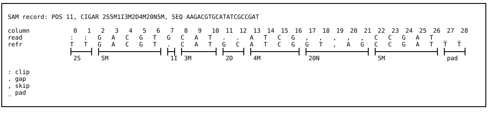
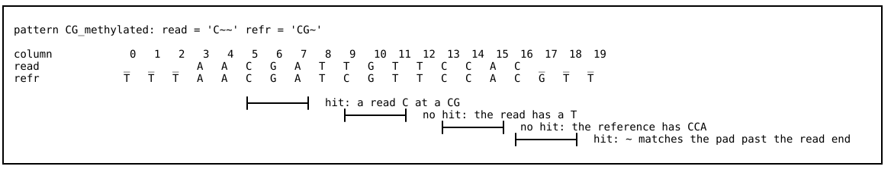
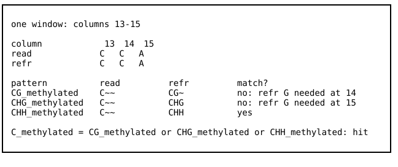
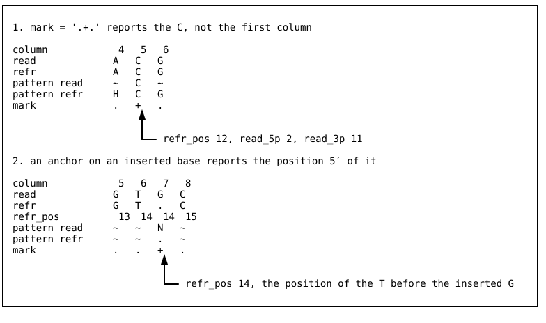
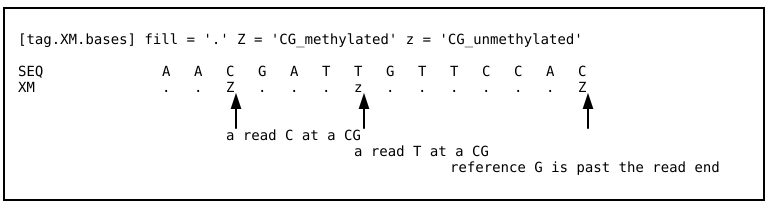

## Introduction

Broadly speaking, an `alnbase` query is a sequence match over a contiguous run of aligned read and reference bases. In plain language, an example query for unmethylated CHG cytosines in a bisulfite conversion assay might be "a T in the read aligned to a C in the reference genome in a CHG context."

Many bioinformatics programs implement specific queries in order to read out measured properties of the genome or transcriptome. However, these programs hardcode their queries, giving them only the flexibility their configuration affords. Furthermore, in many cases, edge cases are discarded, left unspecified, or handled incorrectly. Such edge cases can be present on a large fraction of reads, and include indels, context-position mismatches between read and reference, ambiguous reference bases, positions at the 3' end of the read, splice junctions, supplementary alignments, and handling of over-converted or under-converted reads. These programs are also often compatible with only 1-2 aligners, limiting the ability to take advantage of new aligners. Finally, the output of these programs is often restricted to bulk pileups, preventing the analysis of single cell assays or performing single-molecule analysis. To address these challenges, `alnbase` offers a simple, declarative, flexible, and carefully tested query language that encompasses and extends the implicit queries implemented in a wide variety of existing bioinformatics tools.

We expect there are two types of `alnbase` users: query *runners* and query *writers*. For query runners, we provide preset query files that reimplement the implicit queries of existing extraction utilities (currently Bismark and MethylDackel). They are located in `query/extract` and can be specified using the `--query-file` CLI flag.

These query files also serve as a template for query writers, for whom we also provide a detailed description of how query files are specified. This allows a new extraction method to be implemented as a short query file (MethylDackel's is 26 lines).

## Terms and definitions

Here, we build up the definition of an `alnbase` query from the bottom up.

A **record** is a single entry in a BAM file. A **read** is a set of records generated from a single entry in a fastq file. A **fragment** is a set of record generated from all reads with the same qname, which is the same as a read in single-end alignments or a mate pair in paired-end alignments.

In addition to the A, C, G, and T bases, IUPAC defines a set of [symbols](https://www.bioinformatics.org/sms/iupac.html) for ambiguous bases (e.g. N for {A, C, G, T}, H for {A, C, T}, or M for {A, C}). `alnbase` extends this system and makes it more specific.

An `alnbase` **code** has eight types, which can be referred to by one or more **basic symbols**:
1. A
2. C
3. G
4. T
5. gap (indel)
6. clip (soft-clipped base)
7. skip (intron, i.e. a CIGAR `N`)
8. pad (not on read/contig)

| code | symbol | in read | in refr |
| ---- | ------ | ------- | ------- |
| A    | `A`    | an A in SEQ | an A in the reference |
| C    | `C`    | a C in SEQ | a C in the reference |
| G    | `G`    | a G in SEQ | a G in the reference |
| T    | `T`    | a T in SEQ | a T in the reference |
| gap  | `.` `-` `Z` | a deletion: the reference has a base that the read lacks | an insertion: the read has a base that the reference lacks (only with `--insertions emit`) |
| clip | `:` `L` | a soft-clipped base, in the flank beside the aligned part of the read | never occurs |
| skip | `,` `J` | a reference base inside an intron (CIGAR `N`); introns are shown only near each end, plus one marker column for the rest | only the marker column that stands for the middle of a long intron |
| pad  | `_` `X` | past the end of the read, in the flank (`--end-context`) | off the end of the contig |

An `alnbase` **codeset** is a set of 1+ codes. IUPAC symbols are translated into `alnbase` codesets, with N := {A,C,G,T}, H := {A,C,T}, M := {A,C}, A := {A}, etc. An `alnbase` **standard symbol** is any IUPAC symbol, basic symbol, or `~`.

| symbol | codeset | in read | in refr |
| ------ | ------- | ------- | ------- |
| `A` | {A} | an A | an A |
| `C` | {C} | a C | a C |
| `G` | {G} | a G | a G |
| `T` | {T} | a T | a T |
| `R` | {A,G} | an A or G | an A, G, or R |
| `Y` | {C,T} | a C or T | a C, T, or Y |
| `S` | {C,G} | a C or G | a C, G, or S |
| `W` | {A,T} | an A or T | an A, T, or W |
| `K` | {G,T} | a G or T | a G, T, or K |
| `M` | {A,C} | an A or C | an A, C, or M |
| `B` | {C,G,T} | a C, G, or T | a C, G, T, or any ambiguity code within them |
| `D` | {A,G,T} | an A, G, or T | an A, G, T, or any ambiguity code within them |
| `H` | {A,C,T} | an A, C, or T | an A, C, T, or any ambiguity code within them |
| `V` | {A,C,G} | an A, C, or G | an A, C, G, or any ambiguity code within them |
| `N` | {A,C,G,T} | any base | any base, including an N |
| `.` `-` `Z` | {gap} | a deletion | an insertion |
| `:` `L` | {clip} | a soft-clipped base | never occurs |
| `,` `J` | {skip} | an intron column | the intron marker column |
| `_` `X` | {pad} | past the end of the read | off the end of the contig |
| `~` | {A,C,G,T,gap,clip,skip,pad} | anything | anything |

The standard symbols can be extended via an `alnbase` **alias**, which defines a new symbol indicating a specific codeset. For example, a query file might define `e` as a symbol for the codeset meaning "any base or pad, but not gap, clip, or skip" using `e = "{ACGT_}"`. 

`alnbase` parses the BAM record to emit a series of observed read and reference codes, which typically correspond to a single-base code. For example, an A in the read SEQ yields an observed codeset of {A}. An `alnbase` **read-side or reference-side match** is when the observed codeset is a subset of a given pattern codeset for the read or reference. For example, an observed codeset of {A,C,T} (H) is a subset of a pattern codeset of {A,C,G,T} (N), but an observed codeset of {A,C,G,T} (N) is not a subset of the pattern codeset {A,C,T} (H).

alnbase uses the CIGAR string to reconstruct the original alignment between the read and reference for aligned records. It then emits a series of **columns**, which are pairs of aligned read and reference codesets, taking indels, clips, junctions, and pad (off-read/off-contig) regions into account. Each column has two **sides**, the **read side** and the **reference side**, which refers to the pattern and observed codesets that are compared to determine if there is a read-side or reference-side match respectively. `alnbase` emits the columns in 5'->3' order along the read's original strand (see [[strand_files]]), reverse-complementing both sides when the original strand is reverse. A **column match** is when a column has a read-side and reference-side match.

**CIGAR alignment example.** Vertically aligned read and refr bases are columns produced by CIGAR-aligning SEQ against the reference genome and adding two pad characters to the 3' end of the read. Note that the number of intronic (CIGAR N) bases to parse can be configured. 2 bases are used here. The rest are skipped to avoid wasted testing of large introns. 

There is an optional additional requirement for the read and reference bases to match or mismatch, specified using `=` (must match) or `/` (must mismatch) in the read or reference. If `=` or `/` is used on the read side, then the reference side codeset is applied to the read side as well, and vice versa, and only A, C, G, or T bases can be matched using `=` or `/`. These characters cannot be used in a codeset.

An alnbase **pattern** is a pair of equal-length strings of symbols for the read and reference. A **pattern match** is when a column match is found for every column of a $K$ length pattern over a window of $K$ contiguous columns.

Example:
```
[pattern.CG_methylated]
read = "C~~"
refr = "CG~"

[pattern.CHG_methylated]
read = "C~~"
refr = "CHG"

[pattern.CHH_methylated]
read = "C~~"
refr = "CHH"
```
**CG_methylated pattern example.** Each bracket is a 3-column window. The final C in the read illustrates an edge case. Because the read pattern ends with `~~`, up to two bases beyond the end of the read allow `_` (pad), so a C at the end of the read may match if the `CG~` context is present in the reference. To enforce that the context position was also observed and matches, `read = "CG~"` could have been used instead, which would have allowed a `CG` as the last two columns of the read but disallowed matching a `C` in the final column, even if the subsequent reference base was a G.

A **query** is a boolean expression over one or more equal-length patterns. A **hit** is when all patterns are satisfied or unsatisfied (when `not` is used) in a way that satisfies a query on a contiguous run of columns for a specific record.

Example:
```
[query.C_methylated]
where = "CG_methylated or CHH_methylated or CHG_methylated"
```

**Example of a multi-pattern query.** This example illustrates how three patterns can be defined and combined in a single boolean query. Note that the example is somewhat contrived for illustrative purposes (`read = "CN"; refr = "CN"` would have also worked and would not have required a boolean query).

*Note:* For this query, the CG_methylated pattern uses information from only the first two bases. It is written with a placeholder on the 3rd base because all queries must be equal-length.

A **column position** is the aligned position for the column, or, for columns with no proper aligned position (insertions), the position of the nearest 5' aligned column. The **anchor column** is the column whose column position is used as the hit position. A **marked column** has its read and reference bases, position, phred, and offset stored with respect to the read's 5' and 3' ends as sequenced. Additionally, other record attributes, including specific flag bits and aux tags, can be written into the output.

A **query file** is a [TOML](https://toml.io/en/) file with multiple **sections**. Comments are specified with `#`. Each section begins with square brackets, and may include a name following a dot, such as `[pattern.CG]` (`pattern` section named `CG`). Under the section header, there are a series of keys and values. Here, "read" and "refr" are keys, and "C~" and "CG" are their respective values.
```
[pattern.CG]
read = "C~"
refr = "CG"
```

The sections of a query file can include `pattern`, `query`, `alias`, `tag`, and `strand`. Briefly, `pattern` describes a single read and reference pattern. A `query` section defines a boolean expression over one or more patterns. For convenience, a `query` section can also internally define a single pattern whose matches produce a hit for the query. `alias` defines one or more new symbols for codesets. `tag` defines a way of representing query hits as characters in BAM tags, from which they can later be extracted, as an intermediate output prior to extraction to `parquet`.  Finally, `strand` defines how to reconstruct the native origin strand (distinct from the strand the sequence was aligned to) based on BAM flags and tags.

## Query files

### `[pattern]`

A `[pattern]` section has a name defined like `[pattern.NAME]`. It has two keys, `read` and `refr`, whose values are strings of equal-length symbols specifying the read-side and reference-side patterns that produce matches. Vertically-aligned symbols are the codesets for that column. Optionally, one side or the other may use `=` or `/` to enforce a A/C/G/T match or mismatch respectively between read and reference in a specific column. `=` and `/` only match A/C/G/T, so a clip, gap, pad, or skip allowed in the codeset for the other side can never match in that column (`alnbase` warns).

Examples:
```
[pattern.CG]
read = "C~"
refr = "CG"

[pattern.C_insertion]   # an inserted base after a C; needs --insertions emit
read = "CN"
refr = "C."

[pattern.CGH]
read = "C~~"
refr = "CGH"

[pattern.HCG]
read = "~C~"
refr = "HCG"

[pattern.splice_AG]     # the last two intron bases, then an exon base
read = ",,N"
refr = "AG~"
```

### `[query]`

A `[query]` section has a name defined like `[query.NAME]`. It may have a `where` key whose value is a boolean expression over pattern names. It may also have a `read` and `refr` key following the same rules as for `pattern`, in which case the query is interpreted as matching on that specific pattern. Example:

```
# Uses [pattern.CG], defined above
[query.CG]
where = "CG"

# Equivalent to [query.CG]. Makes defining [pattern.CG] and the where key unnecessary.
[query.CG_implicit]
read = "C~"
refr = "CG"

[query.NOMe_HCG]
where = "HCG"
mark = ".+."
```

The `mark` key can be used to specify which query column is the anchor (`+`), and to mark other columns as well (`^`). By default, the first column (5'-most) is the anchor column and no other columns are marked. Example:

```
[query.col4]
read = "GATT"
refr = "GATC"
mark = "...+"

[query.mark_C_and_G]
read = "C~~"
refr = "C~G"
mark = "+.^"
```

**NOMe-seq example:** In NOMe-seq, mCG is identified specifically in an HCG context. The C is the natural anchor, since it is what's methylated. By explicitly specifying the `mark` key in the `[query]` section to set the second column as the anchor, that can be achieved. In the second example, the anchor is placed on the position of an insert base (G). Since inserts have no natural position, the nearest aligned (CIGAR M) column 5' of the anchor is used as its position. 

### `[alias]`

The `alias` section allows defining new symbols for specific codesets. Upper-case characters are base codes, so aliases must be lower-case characters, which are reserved for user-defined symbols.

Example:
```
[alias]
n = "{ACGT.}" # Any base or gap, but not clip, skip, or pad
```
### `[tag]`

The `tag` section gives a syntax for writing hits into BAM tags. The currently supported format is specified by `[tag.TAG_NAME.bases]` for writing out query hits and `[tag.TAG_NAME.strand]` for writing out the original strand, and is inspired by bismark. In this format, a tag stores hits for one or more disjoint (non-overlapping) queries as a string with one character per read base. Each base is a fill character where there was no hit (specified with the `fill` key), or a character defined for a specific query where that query was hit (specified with a single-character key). 

Example of `[tag.TAG_NAME.bases]`:
```
[tag.XM.bases]
fill = "."
Z = "CG_methylated"
z = "CG_unmethylated"
```

**Tag section example.** The tag uses the `.` character for columns that are not hits, `Z` for hits on `CG_methylated`, and `z` for hits on `CG_unmethlated`. Results are stored in the XM tag, matching the bismark convention.

The original strand (OT, CTOT, OB, CTOB) is reconstructed based on rules defined in the `[strand]` section (see below). The value written as a string into the tag is on the left hand side of `[tag.TAG_NAME.strand]`, and the strand causing that value to be written is listed on the right hand side. In this example, "CT" is written to the `XR` tag if the strand is OT or OB, while "GA" is written to the `XR` tag if the strand is CTOT or CTOB:
```
[tag.XR.strand]
CT = ["OT", "OB"]
GA = ["CTOT", "CTOB"]
```

The `[tag]` section is only utilized for BAM output. For parquet output, it is bypassed. Note that the `[tag]` contents are stored in the output BAM and automatically identified and used by `alnbase` in order to extract the hits to parquet downstream. More recent `[tag]` definitions take precedence over earlier ones if `alnbase query` was run multiple times over a stream of records. 
### `[strand]`

The `strand` section actually has two subsections: `[strand.original]` and `[strand.aligned]`. These are often specified in a separate query file for specific aligners. Please see [[strand_files]] for more information.