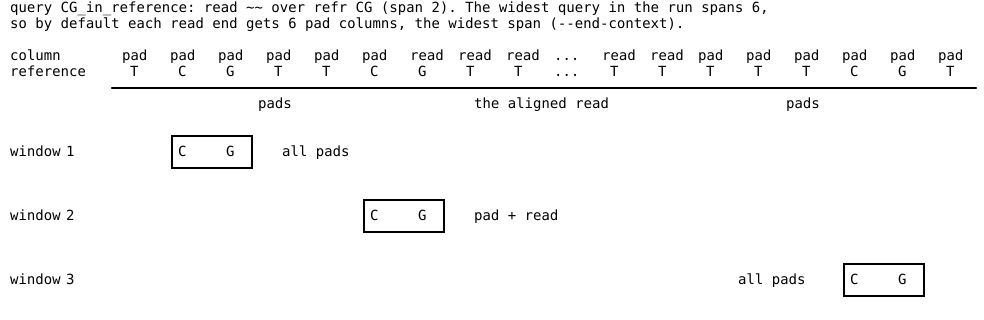

# 02 — The query language

File format, grammar, validation, compilation and firing semantics of alnbase
0.1.2 query files, verified against the source and the release binary.

Conventions:

- `src/file.rs:N` cites the code a claim rests on.
- **(example NN)** means the claim was run, and its output is in
  `examples/02-query-language/NN-*/expected.txt`. Every example has a `run.sh`
  that rebuilds it: `bash run.sh > expected.txt 2>&1`. Set `ALNBASE` to use
  another binary.
- **(executed)** means the claim was checked by running the binary during
  writing, but has no example directory. Every error message quoted in §9 was
  produced this way.
- **(code only)** means the claim comes from reading the code and was not run.
- What the symbols in a row *mean* (the `Seq` bit model, IUPAC sets, gap, pad,
  clip, junction, and the relational codes) is covered in
  `01-reference-and-codes.md`. How columns are produced (orientation, flank,
  clips, insertions, introns) is covered in `03-walk-and-matching.md`. This
  chapter covers only what the grammar and the matcher need from those.

---

## Contents

1. [Where queries come from](#1-where-queries-come-from)
2. [The TOML file: tables and keys](#2-the-toml-file-tables-and-keys)
3. [Names and namespaces](#3-names-and-namespaces)
4. [Rows: the pattern grammar](#4-rows-the-pattern-grammar)
5. [`mark`: anchor and captures](#5-mark-anchor-and-captures)
6. [`where`: the boolean grammar](#6-where-the-boolean-grammar)
7. [Compilation](#7-compilation)
8. [Firing semantics](#8-firing-semantics)
9. [Every validation error](#9-every-validation-error)
10. [Tag tables](#10-tag-tables)
11. [Dry-run tools: `--explain`, `--trace`, `--trace-records`, `--list-codes`](#11-dry-run-tools)
12. [Idioms](#12-idioms)
13. [Discrepancies](#13-discrepancies)

---

## 1. Where queries come from

- Queries come **only** from `--query-file FILE`, which may be repeated
  (`src/cli_query.rs:154-160`). No option takes a query on the command line:
  `-q`, `--query` and `--alias` do not exist (`src/cli_query.rs:785-793`).
  With no file, and without `--list-codes`, the run stops with
  `no queries given; pass --query-file` (`src/cli_query.rs:662-665`)
  (executed).
- Every file is parsed as TOML whatever its extension. When parsing fails and
  the extension is not `.toml`, the error gets
  ` (query files are TOML; see --help on --query-file)` appended
  (`src/cli_query.rs:584-590`).
- The files are read in command-line order. Each file is parsed **on its own**
  (`query_toml::parse_file`). Only then are the results merged
  (`src/cli_query.rs:574-599`). §3.3 has the consequences.
- The pipeline is:
  TOML → typed structs (`src/query_toml.rs:128-165`) → aliases, patterns and
  queries lowered (`src/lower.rs:108-141`) → tags built and checked
  (`src/query_toml.rs:290-322`) → merged across files → run-wide name checks
  (`src/dsl.rs:986-1021`) → compiled to one automaton plus one predicate per
  query (`src/query.rs:164-229`).

The "terse" `read@refr` syntax that several comments mention (for example
`C~@CG`, `~8@GATCGATC`) **is not an input**. It survives as an internal form:
every TOML pattern is lowered by joining `read` and `refr` with `@`
(`src/lower.rs:201`). The same text shows up in `--explain`, in trace labels
and in error messages, for example `pattern '.@=' column 0`. See §13.

---

## 2. The TOML file: tables and keys

TOML's own rules apply: an unquoted value is a syntax error, and a repeated
table or key is an error. **Every table rejects unknown keys**
(`#[serde(deny_unknown_fields)]`, `src/query_toml.rs:128-165`). A file must
declare at least one `[query.*]` or one `[tag.*]` (`src/query_toml.rs:196-198`).

| Table | Key | Required | Type | Meaning |
|---|---|---|---|---|
| top level | `alias`, `pat`, `query`, `tag` | all optional | tables | nothing else is allowed at top level (`src/query_toml.rs:130-139`) |
| `[alias]` | *one character* | — | string | a lowercase letter naming a base set (§4.4) |
| `[pat.NAME]` | `read` | yes | string | read row |
| | `refr` | yes | string | reference row, the same width as `read` |
| `[query.NAME]` | `where` | see below | string | boolean expression over pattern names (§6) |
| | `mark` | no | string | anchor and capture row (§5). Absent: anchor is column 0, and only the anchor is captured |
| | `read`, `refr` | no, but both or neither | string | declares a pattern named `NAME` (the query's *own pattern*) |
| `[tag.XX.bases]` | `fill` | yes | string, 1 char | §10.1 |
| | *one character* | at least one | string | code → query name |
| `[tag.XX.strand]` | *value text* | all four strands covered | string or list of strings | §10.2 |

Rules for `where` (`src/lower.rs:215-228`, `src/query_toml.rs:275-279`):

1. If `where` is given, it is used. It may be any expression over the file's
   patterns. It does not have to mention the query's own pattern.
2. If `where` is absent and the query has its own `read`/`refr`, then `where`
   is the query's own name.
3. If `where` is absent, the query has no own pattern, and the file declares
   **exactly one** pattern (counting own patterns), that pattern is used.
4. Otherwise the query is an error: `needs a 'where'`.

A query with its own pattern is the same as a `[pat.NAME]` table plus
`where = "NAME"`. The unit test at `src/query_toml.rs:671-678` checks this
equality at the level of `Debug` output.

**Declaration order does not matter.** Every pattern is lowered against the
complete alias table (`src/lower.rs:118-123`), and every query is resolved
against every pattern in the file. A query may come before the patterns it
names, and a pattern before the alias it uses. Both were **executed**
(`alias_later`, and `EXAMPLE` in `src/query_toml.rs:53-78`). Queries keep file
order (`src/query_toml.rs:423-430`), and file order decides the order of hit
rows (§8.5).

Values that are not strings: `z = 5` in a tag table gives
`line 7: text must be in quotes in TOML: z = "5" (TOML's own complaint: invalid type: integer ...)`
(executed). The "quotes" hint is added whenever the value on the failing line
is not quoted (`src/query_toml.rs:379-393`).

---

## 3. Names and namespaces

### 3.1 Pattern and query names

- The only checks are that a name is non-empty and has no whitespace
  (`src/query_toml.rs:333-342`). Case matters (`docs/bismark-xm.toml` has
  queries `Z` and `z`). Any other character is accepted, including `.`, `-`,
  `(` and `@`. TOML needs a quoted key for most of these: `[pat."a.b"]`.
- **A name has to be usable in `where`.** The `where` lexer splits words at
  whitespace, `(` and `)`, and treats the exact words `and`, `or` and `not`
  as operators (`src/dsl.rs:585-627`). So:
  - `[pat."a.b"]` can be referenced as `a.b` (executed).
  - `[pat."a(b"]` or a pattern named `and` cannot be referenced. A query named
    `and` or `a(b` with its own pattern fails at once, because its default
    `where` is its own name:
    `[query.and] read: expected a pattern, found an operator` and
    `[query."a(b"] read: no pattern named 'a' (defined: a(b)` (executed).
  - Keywords are case-sensitive: `q AND q` is
    `trailing input; missing 'and' / 'or' between patterns?` (executed).
- Pattern and query names are **separate namespaces**. `[pat.cg]` together with
  `[query.cg]` and `where = "cg"` is legal (executed). The one collision that
  is refused: a query with its own `read`/`refr` whose name is already a
  `[pat.*]` name (`src/query_toml.rs:251-261`).
- **`where` names patterns, never queries.** A query without its own pattern
  is not a pattern: `where = "a"` naming such a query gives
  `no pattern named 'a' (defined: p)` (executed). A query *with* its own
  pattern does add a pattern of that name, and other queries in the **same
  file** can use it (`src/query_toml.rs:697-711`; `docs/bismark-xm.toml` uses
  `U` this way).
- Tag names follow §10.

### 3.2 Uniqueness within one file

TOML already rejects a repeated `[pat.X]` or `[query.X]`: `line 5: duplicate key`
(executed). Aliases are unique per character (`src/dsl.rs:94-96`).

### 3.3 Combining several `--query-file`s

Each file is parsed alone, so **patterns, aliases and query names used inside
a file resolve only within that file**. Every row below was executed with
`--query-file a.toml --query-file b.toml`. Here `a.toml` declares `j = "{C.}"`,
`[pat.cg]` = `C~@CG` and `[query.a]` with `where = "cg"`.

| `b.toml` does | Result |
|---|---|
| uses alias `j` without declaring it | error `'j' is lowercase; base codes are uppercase ...`. Aliases are not visible across files |
| declares `j = "{C.}"` too | fine. Identical declarations merge (`src/dsl.rs:104-119`) |
| declares `j = "{T.}"` | `b.toml: 'j' is declared as {C.} in one place and {T.} in another` |
| `where = "cg"` without declaring `cg` | `no pattern named 'cg' (defined: x)`. Patterns are not visible across files |
| declares `[pat.cg]` identically and uses it | fine |
| declares `[pat.cg]` = `T~@CG` and uses it | `pattern 'cg' means 'C~@CG' in query 'a' but 'T~@CG' in query 'b'; a pattern name must denote one thing across the run` (`src/dsl.rs:1001-1019`) |
| declares a conflicting `[pat.cg]` that **no query uses** | accepted, with only the unused-pattern warning. The run-wide check sees only operands (`src/dsl.rs:1002-1006`) |
| declares `[query.a]` | `two queries are named 'a'; their rows would be indistinguishable` (`src/dsl.rs:988-999`) |
| declares `[tag.XM.bases]` with code `z = "a"` | `[tag.XM.bases]: code 'z': no query named 'a' (defined: b)`. A bases tag may name only queries in its own file (`src/query_toml.rs:290,297`) |
| declares a tag already declared in `a.toml` | `tag XM is declared in more than one query file` (`src/tags.rs:218-226`; test `src/cli_query.rs:1051-1052`), even when the two are identical |

The merged alias table is used only to render `--explain` and `--list-codes`
(`src/main.rs:315-318`, `334-340`).

---

## 4. Rows: the pattern grammar

### 4.1 How a row is checked

`read` and `refr` go through these steps in order (`src/lower.rs:162-204`,
`src/dsl.rs:299-569`):

1. Neither row may be empty (`src/query_toml.rs:211-215`).
2. **No ASCII digit anywhere in either row** (`src/lower.rs:175-187`). This
   runs before anything else, so `{00}` is reported as a digit.
3. **The two rows must have the same number of characters** (`chars().count()`,
   `src/lower.rs:188-199`). This counts *characters*, not columns (§4.3).
4. The rows are joined as `read@refr` and parsed. An `@` in either row gives
   `more than one '@' in a pattern`.
5. Each side is scanned into columns. The two sides must have the same number of
   columns (`src/dsl.rs:518-528`).
6. A column may not carry a relational code on both sides
   (`src/dsl.rs:543-548`).
7. `^` or `+` anywhere in a row is rejected: `'^' and '+' go in the mark row here, not in the pattern`
   (`src/dsl.rs:480-491`). Markers are allowed only in `mark` (§5).

### 4.2 EBNF (rows as accepted in a query file)

```ebnf
row        = column , { column } ;              (* ASCII only; no whitespace; no digits *)
column     = code | group | relational | alias ;

code       = base | gap | pad | clip | junction | any ;
base       = "A" | "C" | "G" | "T" | "U"         (* U parses as T *)
           | "R" | "Y" | "S" | "W" | "K" | "M"
           | "B" | "D" | "H" | "V" | "N" ;
gap        = "." | "-" | "Z" ;
pad        = "_" | "X" ;
junction   = "," | "J" ;                         (* outside a group only for "," *)
clip       = ":" | "L" ;                         (* a soft-clipped base, flank only *)
any        = "~" ;                               (* {N._:J}: every symbol *)

group      = "{" , gchar , { gchar } , "}" ;     (* the union of its members *)
gchar      = letter (* either case: lowercase is read as UPPERCASE, never as an alias *)
           | "." | "-" | "_" | ":" | "~" ;
           (* no "," (use J), no "{", no "=" "/" "^" "+" "@", no digits;
              letters must be IUPAC, U, Z, X, L or J *)

relational = "=" | "/" ;                         (* on one side of a column only *)
alias      = "a" | ... | "z" ;                   (* must be declared in this file's [alias] *)
```

Sources: `src/dsl.rs:299-445` for the scanner and `src/seq.rs` (`from_name`)
for code letters. Details:

- A single character goes to `Seq::from_name`, which upper-cases before it
  decodes. A lowercase letter that is **not** a declared alias is rejected
  before decoding, with
  `'c' is lowercase; base codes are uppercase so that 'and', 'or' and 'not' stay unambiguous`
  (`src/dsl.rs:411-421`). So `c` outside a group is an error, but inside a group
  `{c.}` is `{C.}` (executed: `--explain` shows the read as `{C.}`).
- **Aliases are not expanded inside groups.** `{j}` with `j` declared as
  `{C.}` does not mean `{C.}`: it means `J`, a junction (executed: the grid
  shows `,` and the prose says "the read is a junction").
- `U` is accepted and means T (executed: `read = "U~"` explains as `T ~`).
- `E` is `unknown code 'E'`. A non-ASCII character is `patterns must be ASCII`.
- A group whose set is empty (`{0}`) is rejected, but only digits can spell
  "empty", and step 2 rejects digits first.
- **Repeat counts (`C7`, `~8`) are not accepted.** The column scanner still has
  code for counts (`src/dsl.rs:356-381`), but the digit check in step 2 always
  runs first. Neither a query file nor `--trace` can reach it (§13).

### 4.3 Width rules

- Inside a pattern: the `read` and `refr` rows must have the same **character**
  count (step 3) and the same **column** count (step 5).
- Consequence for groups: `read = "{CT}G"` with `refr = "CG"` is 2 columns
  against 2 but 5 characters against 2, and fails with
  `read row is 5 columns, refr row is 2` (executed). To use a group, pad the
  other row to the same character count, for example
  `read = "{CT}~"` with `refr = "{CC}G"` (executed; it explains as `Y ~` over
  `C G`). The usual answer is an alias (§4.4).
- Inside a query: every operand named in `where` must have the same number of
  **columns** (`src/lower.rs:256-269`). There is no automatic padding. To
  combine patterns of different natural widths, pad them with `~`
  (example 04).
- `mark` must have exactly as many characters as the query's **column** span
  (`src/lower.rs:275-283`). When a group widens a row's text, the mark row is
  shorter than that text: `mark = "....+"` for the 2-column `{CT}~` pattern
  fails with `mark row is 5 columns, the patterns are 2` (executed).
- Different queries in a run may have different spans. Unless `--end-context`
  and `--splice-context` are given, the widest one sets the flank and intron
  context for the whole run (§8.6).

### 4.4 Aliases

```toml
[alias]
o = "{N.}"
```

- The key must be exactly one character (`src/lower.rs:145-150`), and a
  lowercase ASCII letter `a`–`z` (`src/dsl.rs:47-49,82-93`). Any of the 26
  letters is allowed, including ones that look like bases (`a`, `c`, `g`, `t`,
  `n`). None is reserved. `--list-codes` recommends `f i j l o p q`
  (`src/codes.rs:96-97`).
- The value is parsed by `Seq::from_name` (`src/lower.rs:151-155`), not by the
  row scanner. It is any spelling of a base set: `C`, `{C.}`, `c.`, `~`, and so
  on. It must not be empty.
- **Aliases do not nest.** A value is never looked up as an alias:
  `k = "j"` makes `k` a junction (`J`), not a copy of `j` (executed).
- One declaration per character per file. Across files, see §3.3.
- `--explain` shows any column whose set equals an alias's set by the alias
  character, including columns written in some other way
  (`src/dsl.rs:252-256`, `src/explain.rs:182-191`).

---

## 5. `mark`: anchor and captures

EBNF:

```ebnf
mark = { "." | "+" | "^" } ;   (* exactly span characters; at most one "+" *)
```

`.` means nothing, `+` is the anchor, `^` means capture this column
(`src/lower.rs:23-25,284-304`). Every other character is rejected, and so is a
space: `' ' in a mark row; use '.' for nothing, '+' for the anchor, '^' to capture`
(executed).

- **Default anchor:** column 0 when `mark` is absent or has no `+`
  (`src/dsl.rs:949`).
- **The anchor is always captured** (`src/dsl.rs:956-961`). A column marked
  both `+` and `^` is captured once. Captures are sorted and de-duplicated.
- **What the anchor reports:** the hit row's scalar columns (`off_5p`,
  `off_3p`, `refr_pos`, `qual`) describe the anchor column, not column 0
  (`src/hits.rs:203-213`). A `bases` tag writes its code at the anchor's SEQ
  position (§10.1).
- **Column order is not offset order for read 2.** Pattern columns run along
  the conversion strand (§8.6), but `off_5p` / `off_3p` are measured from the
  ends of the read as sequenced (`src/hits.rs:457-466`). For a record with
  FLAG 0x80 the walk visits the read from its sequenced 3' end, so a later
  pattern column has a **smaller** `off_5p`. In `03-walk` example 06, `CG`
  anchored on its C has `off_5p 5` for read 1 (flag 65) and `off_5p 6` for
  read 2 (flag 129), and anchoring on the G (`mark = ".+"`) gives `6` and `5`.
- **Flat or list capture output is decided once for the whole run.** When
  every query in the run captures only its anchor, `flat_captures` is true
  (`src/query.rs:217-219`). The parquet file then has scalar `read_base` and
  `refr_base`. If **any** query captures another column, **every** query's
  rows use the list columns `capture_col`, `capture_read`, `capture_refr`,
  `capture_qual`, `capture_off_5p`, `capture_off_3p` and `capture_refr_pos`,
  one element per captured column in ascending column order
  (`src/hits.rs:224-252`) (example 03). `capture_off_5p` / `capture_off_3p`
  are as sequenced, like the scalars.
- In list form, a captured column with no read base (a deletion or flank
  column) has null `qual`, `off_5p` and `off_3p`, while `refr_pos` is still
  set (`src/hits.rs:229-241`) (example 03: `r_del` shows `[3, NULL]`).
- `extract` and `bases` tags record only the anchor (`src/hits.rs:261-264`).
  Extra captures reach only `--parquet` output.

---

## 6. `where`: the boolean grammar

### 6.1 EBNF

```ebnf
expr     = and_expr , { "or" , and_expr } ;
and_expr = unary , { "and" , unary } ;
unary    = "not" , unary | primary ;
primary  = "(" , expr , ")" | NAME ;
NAME     = word - ( "and" | "or" | "not" ) ;   (* must name a pattern in this file *)
word     = char , { char } ;                   (* char: anything but whitespace, "(" and ")" *)
```

Sources: lexer `src/dsl.rs:585-627`, precedence climbing `src/dsl.rs:836-900`,
end of input `src/dsl.rs:907-921`.

- Precedence, loosest first: `or`, then `and`, then `not`. `a or b and c`
  means `a or (b and c)`. The `--explain` tree shows the grouping
  (`src/explain.rs:424-446`).
- Parentheses do not need surrounding whitespace, because the lexer splits
  words at `(` and `)`: `(p)and(p)` is valid (executed).
- A `where` that is empty or whitespace only is rejected
  (`src/query_toml.rs:228-230`).
- Mentioning a pattern twice is allowed. Operands are numbered by first
  appearance (`src/lower.rs:230-254`). `a.b and a.b` compiles (executed).
- `Expr` has a `Count` variant ("between lo and hi of these patterns",
  `src/predicate.rs:58-62`) that the compiler, explainer and tracer all handle.
  **The grammar has no syntax for it**, so query files cannot use it
  (code only).

### 6.2 What `and`, `or` and `not` mean

For each column `c` and each operand `p`, "p is true" means that p's columns
match the `span` most recent columns ending at `c` (§8.1). `not p` means
exactly "p does not match **that same window**". It does not mean "p matches
nowhere nearby", and it does not mean "p does not match somewhere else".
Because all operands have the same span, one query's operands always describe
the same window, column for column.

### 6.3 What is illegal, and why

A query whose predicate is **true on an all-zero hit bitmap** is rejected at
compile time (`src/query.rs:199-204`). The message is:

```
query 'not p' is satisfied by a window containing no matches at all, so it would fire at essentially every position, including past the ends of reads. Combine the negation with at least one positive pattern.
```

This check is semantic, not syntactic. `not p` and `p or not q` are refused
(both executed). `p and not q` and `cg and (not cg or junc)` are accepted. The
second simplifies to `cg and junc`, which compiled to `dnf, 1 groups`
(executed). The rule exists because the scanner skips predicate evaluation at
every column where no pattern matched at all (`src/scanner.rs:270-275`). The
skip is correct only when no query can be true on an empty bitmap.
"Everything except X" therefore needs a positive pattern that means "anything
real", for example `~@~` of the same width (which matches every column
including pads) or `N@N`.

The quoted name in this message, and in dead-column errors and compile
warnings, is the query's **`where` text**, not its name (§13).

---

## 7. Compilation

### 7.1 Pattern interning

All operands of all queries in the run go into one table, keyed by their
resolved columns. Two operands with identical columns share one set of
automaton bits, whatever their names and whichever files they came from
(`src/query.rs:165-180`). The automaton costs time in proportion to the
**total width of the distinct patterns**, not to how many queries mention them
(`src/byg_search.rs:14-16`). So repeating a pattern across queries, for example
an exclusion used by eight queries, adds no matching work.

### 7.2 The compat table and relational codes

For each pattern column, every non-empty subset of the read set is paired with
every non-empty subset of the reference set (`Seq::bit_combinations`,
`src/seq.rs:303-316`). A pair is kept if the column's relation holds for it
(`src/query.rs:275-287`). An observed column matches a pattern column when the
observed read value is a subset of the read set, the observed reference value
is a subset of the reference set, and the relation (if any) holds
(`src/dsl.rs:227-236`). `=` and `/` are fully resolved here, so they cost
nothing at scan time. Both require one unambiguous A/C/G/T **on each side**
(`src/dsl.rs:210-224`). They are not complements of each other. See
`01-reference-and-codes.md`.

While building the table the compiler also:

- **Rejects a dead column**, one no observation can satisfy. Only a relational
  column can be dead, for example `.@=` (`src/query.rs:290-307`):
  `in query 'q', pattern '.@=' column 0: '=' requires unambiguous A/C/G/T on both sides, which no value here can provide. No observation can satisfy this column, so the pattern can never match.`
  (executed).
- **Warns about unreachable parts** of a set, printed to stderr before
  anything else (`src/query.rs:309-326`, `src/main.rs:325-327`). For example
  `j@=` with `j = "{C.}"` warns twice (executed). Writing `~` opposite a
  relational code **always** warns, because the relation removes the flag
  bits: `~/@=G` warns `'{._J}' on the read side is unreachable; the column reduces to 'N'`
  (executed). The warnings do not affect results. To avoid them, write `N`
  opposite `=` or `/`.

### 7.3 Predicates: DNF, CNF, tree

For each query, `predicate::compile` (`src/predicate.rs:792-823`):

1. Expands the expression to DNF (sum of products), pushing negations down and
   dropping contradictory products (`src/predicate.rs:275-353`), then removes
   subsumed groups (`src/predicate.rs:366-378`).
2. Expands it to CNF by taking the DNF of the negation and dualizing it
   (`src/predicate.rs:388-403,641-658`).
3. The budget is **4096 groups** (`NORMAL_FORM_BUDGET`, `src/query.rs:29`).
   It is checked as the expansion grows, so an oversized form is abandoned
   early.
4. Keeps the form with fewer groups. **Ties go to CNF.** If both forms exceed
   the budget, the tree-walking evaluator is used (`src/predicate.rs:811-822`).

The choice changes speed only. All three evaluators give identical results,
which exhaustive and fuzz tests check (`src/predicate.rs:869-885,1042-1080`).
Observed (executed): a single pattern gives `cnf, 1 groups`; `cg and not junc`
gives `dnf, 1 groups`; `(p1 or p2) and ... (13 pairs) and ((q1 and q2) or ... 13 pairs)`
gives `tree, 0 groups`.

### 7.4 Other properties computed from a `QuerySpec`

- `anchor_can_lack_read_base` is used by `bases` tags (§10.1,
  `src/dsl.rs:662-676`).
- `anchor_refr` is used by `extract` to fill `refr_base` without a reference
  (`src/dsl.rs:707-753`). Every truth assignment of the operands is tried
  (none are tried when there are more than 20). The result is `Fixed(base)`
  only when every satisfying assignment pins the anchor's reference symbol to
  the same single base, and `SameAsRead` when every one has `=` there.

---

## 8. Firing semantics

### 8.1 What is evaluated, and when

For each record the scanner clears its column ring and automaton state
(`src/scanner.rs:259-260`). Then, for **each** emitted column `c`, in walk
order (`src/scanner.rs:263-288`):

1. The column is stored in the ring.
2. The shift-and automaton advances one column
   (`src/byg_search.rs:123-153`). After this step, pattern `p`'s hit bit is set
   **only if p's k columns match the k most recent columns, the last of which
   is `c`**. A pattern completes at its last column.
3. If no pattern completed at `c`, nothing more happens at `c`.
4. Otherwise every query is evaluated **in run order** (§8.5) on the current
   hit bits. A query whose span is larger than the number of columns stored so
   far for this record is skipped (its window is not filled yet); every other
   query fires when its predicate is true (`src/scanner.rs:278-287`).

   There is no other condition. A query fires on **any** window of the emitted
   columns that it matches, whatever those columns are: read bases, deletions,
   inserted bases (under `--insertions emit`), flank pads, intron-context
   columns and the `,@,` marker alike. A window made only of pads, or only of
   intron columns, fires if the query matches it. How many pad and intron
   columns exist is set by `--end-context` and `--splice-context`, both
   defaulting to the widest query's span (§8.6, including the edge case
   there). `--trace` and `--trace-records` use the same rule
   (`src/trace.rs:241`).

So:

- **A query is evaluated at the column where its operands' last column
  arrives, and fires there.** All operands of a query end at the same column
  (the current one) and start at the same column (they share a span). Its
  window is columns `c-span+1 … c`, and its **anchor column is
  `c - span + 1 + anchor`** (`src/query.rs:206-214`, `src/trace.rs:344`).
- Two patterns of one query can never "match at different places". A pattern
  that completed at an earlier column counts as **false** at `c`. In the trace
  in §11.2 (executed), `cg` completed at 4 and `junc` at 5, so
  `cg and junc` never fired.

### 8.2 Several firings of one query in one read

A new attempt at matching starts at **every** column. Each query is evaluated
once per column, so a query fires **at most once per window end column**, and
**overlapping windows each fire**. `AA@AA` over reference `AAAA` fires three
times, anchored on each of the first three A's (example 02; also
`src/byg_search.rs:319-328`). Hits are never de-duplicated or suppressed as
overlapping: not within one query, not across queries, not across a template's
two mates (for that, see `alnbase overlap`).

A single query evaluation produces a single hit, however many operands are
true. That is why indel variants belong under **one** query joined with `or`
(§12.3). As separate queries, each variant that matches would add a row of its
own.

### 8.3 Several queries at one position

Any number of queries may fire at the same column, and at the same anchor.
Each writes its own row (example 02: `C` and `CG` both anchor on the same C).
Only a `bases` tag forbids two **different codes** at one SEQ position of one
tag (§10.1).

### 8.4 Only the current window counts

The predicate reads only the bits of patterns completing at `c`. A negated
operand therefore excludes only an exact window (§6.2). To exclude "an X
anywhere within 3 bases", enumerate each placement of X as its own pattern
with the query's width, and `and not` each one.

### 8.5 Order of hits

Within one record, rows are emitted **in order of the firing (window end)
column, then in run query order**. Run query order is the order of the files
on the command line, then `[query.*]` table order within each file
(`src/scanner.rs:277-287`, `src/cli_query.rs:595`) (example 02). This is
**not** the order of anchors. A wide query fires later than a narrow query
anchored on the same base: in example 04, `CG_genomic` (span 2) comes before
`CG_skipping_deletions` (span 4) for the same C, and in example 02, `r_end`'s
rows alternate between queries. `--explain` lists queries and their compiled
shapes in the same order (executed). With several threads or shards, the order
across records is covered by the output chapter. Within a record's rows it is
as above.

### 8.6 Pads, flank, contig ends and record boundaries

- **Flank:** unless `--end-context` is given, the walk adds `max_span` columns
  before the first and after the last aligned column of **every record**.
  `max_span` is the widest query **in the whole run**
  (`src/scanner.rs:221-236,526-538`). In these columns
  the read side is a pad (`_`) and the reference side is the real reference
  base, or a pad where the column is beyond the contig
  (`src/column.rs`, `src/alignment.rs:147-153,291-296`; see
  `03-walk-and-matching.md`). The intron context defaults to the same number.
  Before 0.1.8 both defaults were `max_span − 1`.
- A span-k pattern whose first column is a read's last base reaches k−1
  columns past the read end. With the default every query has `max_span ≥ k`
  pad columns, so it reaches that far and can also fit a whole window into the
  pads; the widest query is no exception. A `--end-context` below k−1 cuts that
  reach; a larger one only adds pads.
- **Firing on pads.** A query fires on every window it matches (§8.1), so a
  query whose read row accepts a pad in every column (`~`, `_`, or a set
  containing `_`) also fires on windows made only of pads, and one whose read
  row accepts `,` in every column fires on windows made only of intron columns.
  A query that needs a read base in some column (`C~` over `CG`, `_N`) can never
  match such a window.

> **Edge case: pads and the widest query**
>
> With the defaults, the number of pad columns past each read end
> (`--end-context`) and of intron-context columns at each intron edge
> (`--splice-context`) is the widest query's span
> (`WalkConfig::to_opts`, `src/scanner.rs:526-538`). Adding a wider query to a
> run therefore adds pad and intron columns to **every** record, and new
> all-pad (or all-intron) windows appear. A query that can match such windows
> gains hits, although nothing about it changed. Example 09: the reference-context
> query `CG_in_reference` (`read = "~~"`, `refr = "CG"`) on one read has 1 hit
> alone (2 pads per end), and 3 beside an unrelated six-column query (6 pads per
> end), because the reference CGs at 7 and 35 now lie in all-pad windows.
>
> 
>
> | | window 1 (all pads, CG at 7) | window 2 (pad + read, CG at 11) | window 3 (all pads, CG at 35) |
> |---|---|---|---|
> | default, 6 pads per end | hit | hit | hit |
> | `--end-context 1` | not shown | hit | not shown |
> | `where = "cg_ref and not all_pad"` | no hit | hit | no hit |
>
> "Not shown" means the columns are not emitted, so there is no window. Two
> remedies, either of which keeps the query's hits the same whatever else the
> run holds:
>
> 1. **Fix the columns:** pass `--end-context N` (and `--splice-context N` for
>    introns) explicitly. The pad and intron columns then no longer depend on the
>    queries, so every query's hits are independent of the others
>    (`scanner::tests::with_fixed_context_every_query_fires_identically_alone_and_in_company`).
>    N must be at least the widest query's span − 1 for every pattern to reach
>    as far past a read end as its span allows (the default, the span itself, is
>    one more).
> 2. **Refuse the windows in the query:** exclude all-pad windows with `and not`:
>
>    ```toml
>    [pat.cg_ref]
>    read = "~~"
>    refr = "CG"
>
>    [pat.all_pad]
>    read = "__"
>    refr = "~~"
>
>    [query.CG_in_reference]
>    where = "cg_ref and not all_pad"
>    ```
>
>    For introns, the analogous pattern is `,` in every read column
>    (`[pat.all_intron] read = ",,"  refr = "~~"`); a query that may meet both
>    ends and introns can exclude each (`and not all_pad and not all_intron`).
>
> This is intended behaviour: whether an all-pad window counts is the query's
> decision. (0.1.3 to 0.1.6 refused to fire on windows holding no read base,
> inserted base or deletion; 0.1.7 reverted that and added `--end-context`;
> 0.1.8 raised the default from span − 1 to the span, so the widest query too
> meets all-pad windows.)
> Example 09 shows the dependence and both remedies.

- **Junctions.** A query about the `,@,` marker or intron context fires on
  those columns like any other. `--splice-context` intron columns lie between
  the marker and each exon; with the default that number moves with the widest
  query, so set
  `--splice-context` explicitly for a motif or marker pattern (0 puts the marker
  right between the exons). `~,` over `~~` (an aligned base followed by an
  intron column) detects a junction from the aligned side at any setting.
- In a hit anchored on a flank column, `off_5p`, `off_3p` and `qual` are null:
  a pad is not a base of the read (example 02; 03 §5.2). For read 2 the flank
  the walk emits first lies past the sequenced 3' end.
- **Contig ends:** off-contig flank columns carry pad on both sides. `~` and
  `_` match them. `N`, bases and `{N.}` do not (example 02 `offcontig`, `_@_`,
  fires on the 5 flank columns past `r_end`, `refr_pos` 22-26, all beyond the
  22 bp contig, and on `r_left`'s outermost leading pad at `refr_pos` -1;
  example 06 `contig_start`). In example 02 `flankC` (`_@C`) and `offcontig`
  fire only in the flank, and only as far out as `wide` (span 5, so 5 pads per
  end) makes it: the edge case above.
- **Records:** the ring and the automaton are reset for each record, so no
  match spans two records (`src/scanner.rs:259-260`).
- **Orientation: patterns follow the conversion strand, offsets follow the
  sequencer.** Columns come in walk order, which is the conversion strand:
  for records walked as the bottom strand, the walk runs along decreasing
  reference coordinates with both sides complemented
  (`src/alignment.rs:101-102,138-141,155-159`). A pattern, including the
  position of a pad in it (`_N` versus `N_`), is always read in walk order.
  The reported offsets are not: `off_5p` / `off_3p` count from the first and
  last base **as sequenced** for every FLAG (`src/hits.rs:457-466`). For read
  1 and unpaired reads the two agree. For read 2 (FLAG 0x80) the walk starts
  at the sequenced **3'** end, so `_N` marks the base with `off_3p = 0` and
  `N_` the base with `off_5p = 0` (example 06). `03-walk-and-matching.md`
  has the full table.

---

## 9. Every validation error

The message format:

- TOML syntax and schema errors: `FILE: line N: msg`.
- Errors found after parsing: `FILE: [table] key: msg`.
- Run-wide and compile errors: no file prefix.

The CLI prints each one as `Error: ...` and exits with status 1. Every message
below was produced with `--explain`, except those marked *runtime* or *test*.

### 9.1 File and TOML schema (`src/query_toml.rs`)

| Trigger | Message |
|---|---|
| `marks = "+."` in a query | `line 5: unknown field `marks`, expected one of `mark`, `where`, `read`, `refr`` |
| `[paterns.q]` | `unknown field `paterns`, expected one of `alias`, `pat`, `query`, `tag`` |
| `[tag.XM.char]` | `unknown field `char`, expected `bases` or `strand`` |
| `read = C~` (unquoted) | `line 2: text must be in quotes in TOML: read = "C~" (TOML's own complaint: ...)` (`:379-393`) |
| `[pat.p]` twice | `line 5: duplicate key` |
| `[pat.p]` without `refr` | `line 1: missing field `refr`` |
| file with no `[query]` and no `[tag]` | `[query]: no queries or tags in file` (`:196-198`) |
| `[pat."a b"]` | `[pat."a b"]: pattern name must not contain whitespace` (`:338-340`); `query name ...` for queries |
| `[pat.""]` | `[pat.""]: pattern name is empty` (`:335-337`) |
| `read = ""` | `[pat.p] read: 'read' row is empty` (`:211-215`, `:262-266`) |
| `where = "  "` | `[query.x] where: 'where' is empty` (`:228-230`) |
| query has `read` but no `refr` | `[query.q] read: has 'read' but no 'refr'; a query's own pattern needs both` (`:238-243`) |
| query has `refr` but no `read` | `[query.q] refr: has 'refr' but no 'read'; a query's own pattern needs both` (`:244-249`) |
| own pattern named like a `[pat]` | `[query.q]: its 'read' and 'refr' declare a pattern named 'q', and [pat.q] declares another; a pattern name must mean one thing` (`:251-261`) |

### 9.2 Aliases (`src/lower.rs:145-157`, `src/dsl.rs:82-99`)

| Trigger | Message |
|---|---|
| `ab = "C"` | `[alias] ab: alias name must be one character, got 'ab'` |
| `B = "C"` | `[alias] B: 'B' cannot be an alias: uppercase letters are base codes. Alias names are lowercase letters, a through z.` |
| `"1" = "C"` | `[alias] 1: '1' cannot be an alias: only letters can be aliases. Alias names are lowercase letters, a through z.` |
| `j = "Q"` | `[alias] j: 'Q' is not a base set` |
| `j = "0"` | `[alias] j: '0' names the empty set` |
| same letter, different sets, two files | `FILE: 'j' is declared as {C.} in one place and {T.} in another` (`src/dsl.rs:104-119`) |

### 9.3 Rows. Prefix: `[pat.p] read: pattern 'p': ` (the location is always the `read` key, even when `refr` is at fault)

| Trigger | Message |
|---|---|
| a digit in either row | `digit in the read row at position 1. Repeat counts belong to the terse form; a grid holds one character per column, so write the columns out.` (`src/lower.rs:175-187`) |
| unequal character counts | `read row is 2 columns, refr row is 3. A misaligned grid shows up here rather than as shifted output.` (`src/lower.rs:188-199`) |
| equal characters, unequal columns | `read side is N columns, reference side is M. Both sides describe the same columns, so they must be the same length.` (`src/dsl.rs:518-528`), e.g. `{C}G` over `CGAA` |
| `C ~` | `whitespace is not allowed inside a pattern` (`src/dsl.rs:310-312`) |
| `{CT` | `unclosed '{'` |
| `{}C` | `empty group` |
| `{C{T}}` | `nested '{' is not allowed` |
| `{A,C}` | `commas are not allowed in a group; write the codes together, as {ACG}, and spell a junction 'J', as {NJ}` |
| `{CQ}` | `unknown code 'CQ'` |
| `C}` | `unmatched '}'` |
| `c~` (not an alias) | `'c' is lowercase; base codes are uppercase so that 'and', 'or' and 'not' stay unambiguous` |
| `E~` | `unknown code 'E'` |
| a non-ASCII character | `patterns must be ASCII` |
| `=` over `/` | `a relational code goes on one side only; the other side supplies the base set` |
| `C^+~` over `{C}G` | `'^' and '+' go in the mark row here, not in the pattern` |
| `^C` | `'^' with no column before it` |
| `C@` | `more than one '@' in a pattern` |
| an empty side | `empty pattern side` (unreachable after the empty-row check) |

These scanner messages are unreachable from a query file (code only): `repeat count ...`, `two repeat counts on one column`, `'^' cannot mark a repeated column ...`, `repeated '^'`, `more than one '+'` (in a row), `'^' and '+' go on the read side ...` (the width check fails first), `pattern has no '@' ...`.

### 9.4 Queries (`src/lower.rs:207-322`, `src/dsl.rs:907-973`). Prefix: `[query.x] where: ` unless noted

| Trigger | Message |
|---|---|
| no `where`, no own pattern, file has ≠1 patterns | `[query.x]: query 'x' needs a 'where' saying which patterns it uses (the file defines 2)` |
| unknown name | `no pattern named 'nope' (defined: p)` |
| `p and` | `expected a pattern, found end of input` |
| `(p` | `expected ')'` |
| `p)` or `p p` | `trailing input; missing 'and' / 'or' between patterns?` |
| `or p` | `expected a pattern, found an operator` |
| `p and )` | `unexpected ')'` |
| operands of different widths | `query 'x' uses 'q' (1 columns) alongside 'p' (2 columns); every pattern in a query describes the same window` |
| `mark` of the wrong width | `[query.x] mark: mark row is 3 columns, the patterns are 2` |
| two `+` | `[query.x] mark: more than one '+' in the mark row` |
| any other mark character | `[query.x] mark: 'x' in a mark row; use '.' for nothing, '+' for the anchor, '^' to capture` |

Unreachable guards in `dsl::finish` (code only): `expression has no patterns`,
`operands describe the same window, so they must be the same length: ...`,
`anchor is past the end of the window`.

### 9.5 Run-wide (`src/dsl.rs:986-1021`, `src/tags.rs:218-226`)

| Trigger | Message |
|---|---|
| duplicate query names across files | `two queries are named 'a'; their rows would be indistinguishable` |
| a used pattern name with two meanings | `pattern 'cg' means 'C~@CG' in query 'a' but 'T~@CG' in query 'b'; a pattern name must denote one thing across the run` |
| the same tag in two files | `FILE: tag XM is declared in more than one query file` (test) |

### 9.6 Compile (`src/query.rs:42-61`)

| Trigger | Message |
|---|---|
| true on an empty bitmap (`not p`, `p or not q`) | `query '<where text>' is satisfied by a window containing no matches at all, ...Combine the negation with at least one positive pattern.` |
| an unsatisfiable relational column (`.@=`) | `in query '<where text>', pattern '.@=' column 0: '=' requires unambiguous A/C/G/T on both sides, which no value here can provide. No observation can satisfy this column, so the pattern can never match.` |
| predicate-internal errors | `in query '...': unknown pattern id N` / `... past end of bitmap` (internal, code only) |

### 9.7 Warnings (stderr, not fatal)

| Trigger | Message |
|---|---|
| a pattern no query in its file uses (own patterns included) | `warning: FILE: [pat.q]: pattern 'q' is defined but no query uses it` (`src/lower.rs:131-138`) |
| an unreachable part of a column's set | `warning: in query '<where text>', pattern 'j@=' column 0: '.' on the read side is unreachable; the column reduces to 'C'` (`src/query.rs:74-82`) |
| BAM output: a query no tag uses | `warning: query 'x' is used by no tag, so it writes nothing to the BAM output` (`src/bam_out.rs:157-166`) (code only) |

### 9.8 Tags

See §10. Every message there was executed.

---

## 10. Tag tables

A tag name is exactly two characters: an ASCII letter, then a letter or digit
(`src/tags.rs:42-52`). Lowercase is allowed (`xc` in example 07). A tag table
must contain exactly one of `bases` or `strand` (`src/query_toml.rs:294-320`).
Tag tables are **not used with `--parquet`** (`src/cli_query.rs:277-283`).
BAM output with no tags at all is refused: `no tags to write: ...`
(`src/bam_out.rs:126-131`).

| Trigger | Message |
|---|---|
| `[tag.XMM.bases]` | `[tag.XMM]: 'XMM' is not a BAM tag name: a tag is two characters, a letter then a letter or digit, e.g. XM` |
| `[tag.XM]` with no subtable | `[tag.XM]: says nothing about what to write; give it a 'bases' or 'strand' table` |
| both subtables | `[tag.XM]: has both a 'bases' and a 'strand' table; a tag holds one kind of value` |

### 10.1 `[tag.XX.bases]`

One character per base of SEQ. `fill` everywhere, and at a firing query's
anchor, that query's code (`src/bam_out.rs:15-31`).

Parse-time rules (`src/tags.rs:260-341`, `src/query_toml.rs:295-302`):

| Rule | Message (`[tag.XM.bases]: ` prefix) |
|---|---|
| a key longer than one character other than `fill` | `'fil' is neither a one-character code nor a setting; a bases table takes one-character codes and 'fill'` |
| `fill` required | `no 'fill': say which character to write where no code applies, e.g. fill = "."` |
| `fill` is one printable non-space ASCII character | `'fill' must be one printable character other than a space, got '..'` |
| `fill` is not a list | `'fill' takes one character, not a list` |
| a code is printable non-space ASCII | `code ' ' must be a printable character other than a space` (also for `é`) |
| a code names exactly one query, as a string | `code 'z' takes one query name, not a list: a character stands for exactly one query` |
| the query exists **in this file** | `code 'z': no query named 'nope' (defined: x)`; `(defined: none)` for a file without queries |
| one query per code, one code per query | `query 'x' is used by code 'z' and again by code 'Z'` |
| at least one code | `declares no codes` |
| fill ≠ every code | `'.' is both the fill and a code, so the tag could not tell them apart` |
| **anchor on a read base** | `code 'z': query 'q' can fire with its anchor on a deletion or intron, where the read has no base to mark. Make the anchor column's read side exclude gaps -- e.g. N rather than ~ -- or AND the query with a pattern that does.` |

**How "anchor must land on a read base" is decided**
(`src/dsl.rs:638-676`, `src/tags.rs:232-245`). An operand *admits no read
base* at the anchor when its anchor column has no relation and its read set
contains GAP or SKIP. `~`, `.`, `,` and aliases like `{C.}` admit it. `N`,
bases, `_`, `=` and `/` do not. The query is refused if its expression can be
true when every operand that does *not* admit it is false. That is checked by
trying all assignments of the admitting operands, and more than 20 of them
means refusal. The consequences (executed in `src/query_toml.rs:620-649`, and
`tag_anchor_ok_and`):

- `~~@CG` anchored at 0 is refused. `N~@CG` and `=~@CG` are accepted.
- `q and c`, where `c`'s anchor column is `C`, is accepted. `q or c` and
  `q and not c` are refused.
- **Pads are not considered.** An anchor on `_` is accepted. At run time,
  a hit whose anchor lies past either end of the read writes nothing and is
  counted: `N hits were anchored on a pad or a soft-clipped base, so had no aligned base to tag`
  (`src/bam_out.rs:314-317`, `src/main.rs:699-704`) (example 07, 6 hits: the
  span-1 `_@_` fires on each of the 6 flank columns past the contig ends, 3 per
  end because the span-3 `T` sets the flank; with `--end-context N` it would be
  2N, see §8.6).

Runtime rules (`src/bam_out.rs:284-355`):

- A code goes at SEQ index `read_off`, or at `len-1-read_off` for records the
  run's strand rule walks in reverse, so the string is in SEQ order.
- If an anchor still lands on a gap or skip, the run stops with
  `record R: query 'Q' fired with its anchor on a deletion or intron, which a bases tag cannot mark`
  (a guard).
- The same code written twice at one position is silently accepted.
  **Two different codes at one position stop the run**:
  `record top: queries 'C_any' and 'CG' both mark SEQ position 3 (0-based) of tag XM, as 'a' and 'Z'. The queries one bases tag uses must never match at the same position; tighten one of them.`
  The partial output is removed (example 07). This is **not** checked at parse
  time. It depends on the data.

**The `u`/`U` pattern (`docs/bismark-xm.toml`).** The six determinable
contexts are written as queries with their own patterns. For "a reference C
whose context cannot be determined", three 3-column patterns `cg` = `~~~@CG~`,
`chg` = `~~~@CHG` and `chh` = `~~~@CHH` are declared, and
`U = C~~@C~~ and not cg and not chg and not chh` (and the same for `u` with
read `T`). `U` fires exactly when none of the three contexts applies: a
reference `N` in the next two bases, or context running off the contig. This
works because `H` excludes `N` and pads, and `~` includes them. On
`TTTCGTTCAGTTCTATTCNTTTC` with every C after position 4 converted, the output
is `XM:Z:...Z...x....h....u....u`: `u` for `CNT`, and `u` for the final C whose
next two columns are off the contig (example 07). The codes do not clash,
because the patterns are mutually exclusive by construction.

### 10.2 `[tag.XX.strand]`

One value per read, chosen by conversion strand (`src/tags.rs:346-390`). Each
key is **the text written**. Its value is one strand name or a list of them.
Strand names are exactly `OT`, `CTOT`, `OB`, `CTOB`, case-sensitive.

| Rule | Message (`[tag.XR.strand]: ` prefix) |
|---|---|
| the value text is non-empty printable ASCII (spaces allowed) | `'' cannot be a tag value: it must be non-empty printable ASCII` |
| a value lists at least one strand | `value 'CT' lists no strands` |
| a known strand name | `value 'CT': 'XX' is not a strand; expected OT, CTOT, OB or CTOB`, plus ` (strand names are uppercase: OT)` for `ot` |
| each strand given at most once | `strand OB is given value 'CT' and also 'GA'` |
| **all four strands** covered | `no value for CTOT, OB, CTOB; every strand needs one, since which strands occur depends on the library, not on this file` |

One value for all four strands is allowed. A file holding only strand tags is
valid (executed). Which strand a record has is decided by the run's strand rule
(§2.3 of 04, `docs/design/strand-rules.md`).

A rule that names only the conversion strand cannot fill a strand tag, since it
cannot tell OT from CTOT. Since 0.1.19 that pair is refused while the query
files are being read, before the BAM is opened
(`tags::strand_tags_need_origin`, `src/tags.rs`):

```
tag XR writes a value per strand of origin (OT, CTOT, OB, CTOB), but this run's
strand rule in queries/strand/bwameth.toml reaches only the conversion strand,
so no record's origin is known -- `+` does not say whether a read is OT or
CTOT. Either pass a rule whose [strand.origin] table names all four strands, or
drop [tag.XR.strand].
```

A rule reaches only the conversion strand when it is built on
`[strand.conversion]`, or when its `[strand.origin]` table has a `"+"` or `"-"`
key. A rule's `unknown` key does not trigger this: a record the rule declines is
skipped and counted, never written.

---

## 11. Dry-run tools

Precedence in `run_query` (`src/main.rs:308-419`):

1. Parse and validate all files. Parse warnings are printed.
2. `--list-codes`, if given, prints and exits. **Compile errors are not
   reached.**
3. Compile. Compile warnings are printed. Compile errors stop the run.
4. `--explain`, if given, prints and exits (it wins over `--trace`).
5. `--trace`, if given, prints and exits.
6. Paths are required from here on.
7. `--trace-records N` prints and exits, **also when `--parquet` is given**:
   no parquet file is written (`src/main.rs:373-376`; executed). Before 0.1.2
   `--parquet` won and the trace was ignored (§13, item 4). Since 0.1.8 it
   also checks reference concordance and honours `--require-m5` (§11.3).
8. The scan runs: `--parquet`, or a tagged BAM.

`--explain`, `--trace` and `--list-codes` need no BAM, reference or output
(`src/cli_query.rs:653-656`, `680-687`). `--trace` and `--trace-records` are mutually
exclusive at the clap level (executed).

### 11.1 `--explain`

For each query, in run order (`src/explain.rs:174-279`) (example 01):

1. The name, then the `where` text indented. For a query with its own pattern
   and no `where`, this text is the query's name.
2. For anything other than a lone pattern, an ASCII tree (`and`/`or`/`not`
   nodes). A negated leaf is folded into one line, e.g. `` `- not junc  ~~~~~~~~@GATCGATC``.
3. Prose: `Fires at a position where ...`, one sentence per operand describing
   only constrained columns, a note about `=` and `/` when either is used, and
   `Reports the coordinates of column A, and records what was observed at columns ...`
   (`src/prose.rs:237-277`).
4. A grid: `col` indices, a `capture` row (`^`), an `anchor` row (`+`), then
   `read` and `refr` rows for each operand. Each operand's label has a
   polarity prefix: blank for positive, `not` for only negated, `+-` for used
   both ways (`src/explain.rs:31-39`).
5. `anchor column A`, `captures ...`, `span N columns`,
   `compiled dnf|cnf|tree, G groups` (0 groups for tree).
6. Since 0.1.8, a `note` when some operand's read row **places a pad**: a
   column whose read set contains PAD but is not `~` or `{N._}`, so `_`,
   `{._}` or an alias such as `b = "{N_}"` count, in negated operands too
   (`names_a_pad`, `READ2_PAD_NOTE`, `src/explain.rs:275-295`). Executed on
   `read = "_Y"`, `refr = "~C"`:

   ```
     note     patterns run along the conversion strand, but off_5p/off_3p count from
              the ends as sequenced. For read 1 a pad left of the read is past its 5' end;
              for read 2 (CTOT, CTOB) it is past its 3' end, and a pad on the right is past
              its 5' end.
   ```

   A query that only admits pads through `~` gets no note. The rule is §5
   ("Column order is not offset order for read 2") and the orientation bullet
   of §8.6; §12.7 has the idiom.

After a blank line, when there is more than one query, a closing block:
`compiled shapes` with one line per query, `NAME: FORM, G groups, span N`
(`src/main.rs:345-350`, `src/query.rs:150-158`). A file with only strand tags
prints nothing (executed).

### 11.2 `--trace READ@REFR`

The input is **observed data**, not a pattern (`src/trace.rs:31-78`):

```ebnf
trace = side , "@" , side ;    (* split at the FIRST "@"; each side trimmed of outer whitespace *)
side  = obs , { obs } ;        (* both sides the same character count, at least 1 *)
obs   = "A"|"C"|"G"|"T"|"U"|"R"|"Y"|"S"|"W"|"K"|"M"|"B"|"D"|"H"|"V"|"N"   (* either case *)
      | "." | "-" | "Z" | "z"        (* gap *)
      | "_" | "X" | "x"              (* pad *)
      | "," | "J" | "j"              (* junction *)
      | ":" | "L" | "l" ;            (* clip *)
```

- `~` is rejected with a specific message. `0`, `{`, `}`, `@` (on the
  reference side), a space inside a side, and any other character give
  `read column 1: '0' is not a base, a gap or a pad`.
- No `@`: `trace input needs a '@' between read and reference: 'AC'`.
  Different widths (including `A@C@A`): `read is 1 columns, reference is 3; a trace is a column-by-column alignment, so the two must line up`.
  `@` alone: `trace input is empty` (all executed).
- An ambiguity code in the input is an observed *set*. It matches a pattern
  column only if that column's set contains it: an observed `Y` matches `Y` or
  `N` but not `C` (`src/query.rs:275-287`). Executed: `yN@CN` does not match
  `C~@CG`.
- **No flank is added.** Columns are exactly as typed. `refr_pos` and the
  walk offset equal the column index. To test read ends, type the `_` columns
  yourself.
- A typed window made only of `_` or `,` columns fires like any other (§8.1):
  `01-reference` example 07 matches `J,@~~` over `,,@AA`.

Output (`src/trace.rs:168-359`) (example 08):

```
synthetic  (7 columns)

  col         0 1 2 3 4 5 6          <- only with --trace-grid true (default)
  read        T T C Z G T T          <- one-character form: Z gap, X pad, J junction, * mixed
  refr        T T C A G T T

  pattern progress: columns matched so far, * where complete
  cg_0del  . . 1 . . . .             <- one row per interned pattern, labelled by the
  cg_1del  . . 1 2 * . .                name the first query using it gave it
  CHH      . . 1 2 . . .

  CG_skip1: matches ending at column 4     <- window END columns
    column 4, anchor column 2: read C, refr C, walk offset 2, refr_pos 2 (0-based)
      or                             <- the expression with each leaf's truth at that column
        cg_0del                  false
        cg_1del                  true
  CHH: no match
    CHH                      never completed; got 2 of 3 columns, furthest at column 3
```

For a query that did not fire, each operand gets one line: `completed at c, ...`,
`never completed; got b of k columns, furthest at column i` (the first column
where it reached its furthest depth), or
`never started; no column matches its first`. A progress digit shows the
**longest** live partial match at that column.

### 11.3 `--trace-records N`

This is the same report for the first N **walkable** records: mapped, on a
contig the reference has, and with a SEQ (not `*`). It skips the others
silently, using the same test as the scan (`src/main.rs:451-459`,
`src/scanner.rs:558-570`), and uses the scanner's own walk with the flank,
insertion and splice options (`src/main.rs:423-511`). The one exception is
`--require-m5` (since 0.1.8): a record on a contig the reference has whose
`@SQ` line lacks `M5` stops the trace with the scan's error
(`record R is on contig C, whose @SQ line has no M5 checksum, and --require-m5 was given. ...`,
exit 1; executed). The label is
`QNAME  CONTIG:POS1 (1-based POS)` (the label gained `(1-based POS)` in
0.1.4). It needs all three positional paths. The output path
is not written, with or without `--parquet` (§11). The `walk offset` it prints
for a match (called `read_off` before 0.1.4) is not the as-sequenced `off_5p`:
for read 2 it counts from the sequenced 3' end, and it never counts hard-clipped
bases (code only). In example 02, the grid for `r_left` shows 5 `X` flank
columns at each end (18 columns), and `flankC` completes, and fires, on column
3, as in the scan. The grid lists every column the walk emits, whether or not
any query fires on it.

**Reference concordance** (since 0.1.8; `src/main.rs:477-488`, `498-509`).
After each record's report a line gives that record's count, over the same
columns a scan compares (01-reference example 06):

```
reference concordance: 0 of 3 compared read bases differ (0.0%; a reference C read as T is not counted)
```

After the last record the traced records are judged together against
`--max-discordance`. Over at least 1,000 compared bases a rate above it is an
error, as in a scan (`... read bases compared in the traced records disagree
with the reference ...`, exit 1, after the traces have been printed; code
only). Over
fewer bases it only warns. Executed with two records against a reference that
differs at 3 of 8 bases (exit 0):

```
warning: 37.5% of the 8 read bases traced disagree with the reference, above --max-discordance 0.25; too few to judge (a scan judges from 1000 bases), but a wrong reference, a BAM aligned to another assembly, or shifted coordinates look like this.
```

Before 0.1.8 `--trace-records` did not check concordance.

### 11.4 `--list-codes`

Prints the code table from `src/codes.rs:38-112`, in the sections
`BASE CODES`, `EXTENSIONS`, `JUNCTIONS`, `RELATIONAL`, `MARK ROW` and
`ALIASES`. When query files are given, it ends with `Declared here:` and the
merged aliases. Otherwise it ends with `None declared.` It needs no query
file. The `MARK ROW` section lists `.`, `^` and `+` for the `mark` key and
says that markers never go in a `read` or `refr` row and that rows take no
repeat counts (`src/codes.rs:78-86`). Before 0.1.2 this section was
`COUNTS AND MARKERS` and advertised `C7` (§13, item 1).

---

## 12. Idioms

Each idiom has a verified example.

### 12.1 Several contexts: one query per context

A query has one anchor and one name, and every row is labelled with its query
`name`. To report CG, CHG and CHH (or any set of contexts), write one query
per context. Rows can then be told apart by `name`. Bismark's XM is six or
eight such queries (`docs/bismark-xm.toml`, example 07). Overlapping queries
cost nothing extra, because patterns are shared (§7.1). With `--parquet`, the
contexts do not have to be mutually exclusive. A `bases` tag requires them to
be, at the data level (§10.1).

### 12.2 Reporting more read or reference columns: `^`

To record what the read and reference had next to the anchor, capture those
columns: `mark = "+^"` or `"^^+^^"`. Captures are part of the query, so there
is no need for a second query per neighbouring base. Every row in the run then
uses the list form (§5). Each captured column carries its own read and
reference symbols, `refr_pos`, offsets and quality, so positions stay correct
across an indel (example 03, where `r_del` shows a deletion column captured
as `.` with null offset and quality). As an alternative, one query per
neighbour context (§12.1) keeps the output flat.

### 12.3 Ambiguous indels: enumerate placements under one query, anchor on a fixed base

An aligner may put a deletion anywhere in a homopolymer. Write one pattern per
placement, all the same width, join them with `or` in **one** query, and put
the anchor on a column whose **reference** position is the same in every
variant. Columns follow the reference, so this works. Example 04:
`A4_one_deleted` = `hp_del1 or ... or hp_del4` over refr `BAAAAB`, with
`mark = ".+...."`. All four placements report `refr_pos 29`, the first A of the
run, and each read gives one row. When the deletion is at that column, the
anchor's read side is a gap (`read_base '.'`, and `off_5p` is the nearest 5'
read offset). Such a query cannot drive a `bases` tag. For a tag, anchor on a
column whose read side is a base in every variant (for example the base just
before the run).

### 12.4 Contexts that skip deleted reference bases

To classify a C by the next reference base(s) the read actually covers, skip
over deletions. Enumerate 0…k deletions after the C, pad each variant to width
k+2, and `or` them (example 04, k = 2):

```toml
[alias]
b = "{N_}"                 # a read base or past the read end, not another deletion
[pat.cg_0del]
read = "Cb~~"
refr = "CG~~"
[pat.cg_1del]
read = "C.b~"
refr = "C~G~"
[pat.cg_2del]
read = "C..b"
refr = "C~~G"
[query.CG_skipping_deletions]
where = "cg_0del or cg_1del or cg_2del"
```

The `b` column makes the variants mutually exclusive: variant i requires
exactly i gaps followed by a non-gap. So each C fires at most once. On
reference `TCAGT` with the `A` deleted, `CG_skipping_deletions` fires and the
plain `C~@CG` does not (example 04). The two-column form `read = "C.~"` with
`refr = "C~G"` (probe-verified, and used in example 08) is the k = 1 case
without the exclusivity column. It also matches when column 2 is a second
deletion over a G. For CHG and CHH, apply the same enumeration to each
context, with the same width across all of a query's variants.

### 12.5 Excluding contexts: `and not`

Define the general case as a positive pattern and subtract specific ones:
`c3 and not cg and not cxg`. The positive operand is required (§6.3).
Exclusions see only the same window (§8.4).

### 12.6 MethylDackel-style "N counts as H"

IUPAC `H` excludes `N`, so `C~~@CHH` does not fire on `CNN` and `C~~@CHG` does
not fire on `CNG` (example 05: `CHH_strict` and `CHG_strict` miss positions 2
and 8). Define the contexts by exclusion instead (example 05):

```toml
[pat.c3]
read = "C~~"
refr = "C~~"
[pat.cg]
read = "~~~"
refr = "CG~"
[pat.cxg]
read = "~~~"
refr = "C~G"
[query.CG]
where = "cg and c3"
[query.CHG_n_as_h]
where = "cxg and not cg"
[query.CHH_n_as_h]
where = "c3 and not cg and not cxg"
```

On reference `TTCNNTTTCNGTTTCGNTTTCATTTCAGTT`, `CHH_n_as_h` fires at
positions 2 and 20, `CHG_n_as_h` at 8 and 25, and `CG` at 14. `~` also covers
pads, so a C whose context runs off the contig also counts as CHH here. To
separate that case, exclude a pad pattern (`C_~` / `C~_` on the reference
side), as `docs/bismark-xm.toml` does with `u`/`U`.

### 12.7 Requiring a read end with a pad

`_` on the read side matches only flank columns (§8.6), so its position in the
pattern says which end of the walk is required:

- `read = "_N"`, `refr = "~N"`, `mark = ".+"` fires on the **first walked**
  read base.
- `read = "N_"`, `refr = "N~"`, `mark = "+."` fires on the **last walked**
  read base.
- `_` on the reference side as well (`_N@_N`) adds "and that column is off the
  contig" (example 06 `contig_start`).

In example 06, the same 12 bp alignment at forward-strand position 4 fires
`walk_start` at `refr_pos 3` for `R1_fwd` (flag 65) and `R2_rev` (145), but at
`refr_pos 14` for `R1_rev` (81) and `R2_fwd` (129). The walk, and so the pad
position in a pattern, runs along the conversion strand. The offsets do not:
they are as sequenced. So `walk_start` has `off_5p = 0` for read 1
(`R1_fwd`, `R1_rev`) but `off_5p = 11`, `off_3p = 0` for read 2 (`R2_fwd`,
`R2_rev`): for read 2, `_N` is the **sequenced 3' end** and `N_` the
sequenced 5' end. To select "the first base the sequencer read" for every
FLAG, filter hit rows on `off_5p = 0` rather than choosing a pad position.
`--explain` restates this direction rule in a note under every query that
places a pad (§11.1).
`03-walk-and-matching.md` has the evidence for every FLAG. Soft-clipped
bases are clip columns (`:`) in the flank, nearest the aligned part, so `_N`
means "the end of an unclipped read", `:N` "the end of the aligned part of a
clipped one", and `{_:}` (as an alias) either; the offsets still count the
clipped bases.

---

## 13. Discrepancies

Contradictions between the code and the comments, docs or help. Severity:
**H** means it misleads a pipeline author into wrong results, **M** means a
wrong mental model or a feature that silently does not work, **L** means a
cosmetic or stale comment.

1. **(M) Repeat counts and in-row markers are advertised but rejected.**
   **Partly fixed in 0.1.2:** ~~`--list-codes` prints `C7   repeat a column
   seven times` and "Markers attach to the column before them and go after
   any count"~~; it now describes the `mark` row and says rows take no repeat
   counts (`src/codes.rs:78-86`). Still open: the task brief and module comments
   (`src/dsl.rs:10-12`, `src/query.rs:8`: `not ~8@GATCGATC`) assume counts.
   Every query-file row containing a digit is rejected
   (`src/lower.rs:175-187`), and `^`/`+` in a row are rejected
   (`src/dsl.rs:480-491`). The error text refers to "the terse form", which
   no longer exists as an input (`src/cli_query.rs:785-793`).
2. **(M) Row width is measured in characters, not columns.** `--help` says
   "`read` and `refr` rows of equal width, column i of one against column i of
   the other" and promotes `{ACG}` groups, but `read="{CT}G"` against
   `refr="CG"` is refused as `read row is 5 columns, refr row is 2`
   (`src/lower.rs:188-199`). The word "columns" in the message is wrong too.
3. **(M) Lowercase inside groups and alias values silently means uppercase
   codes.** `{j}` and alias `k = "j"` both mean *junction*, not alias `j`.
   `{c.}` is `{C.}` (`Seq::from_name` upper-cases). `--help` says aliases are
   "Lowercase letters only" and `alnbase.md` presents aliases as names, with
   no warning that they do not expand inside groups or nest. The result is a
   silently different set, which diverges only on spliced data.
4. ~~**(M) `--parquet --trace-records N` runs a full parquet scan.**
   `src/main.rs:363-374` checks `--parquet` before `--trace-records`. The help
   says "Trace ... and exit". Executed: the `out_0_0.parquet` shard was
   written and no trace was printed.~~ **Fixed in 0.1.2:** `--trace-records`
   is checked first (`src/main.rs:373-376`); executed: the trace is printed
   and no parquet file is written.
5. **(M) Aliases and patterns are per file, but the docs say files "combine".**
   `docs/cli-reference.md` ("Repeatable; files combine") and the comment
   "Each file's aliases merge into one table" (`src/cli_query.rs:572-573`) do
   not say that a file cannot use another file's aliases, patterns or (for
   tags) queries (§3.3).
6. **(L) Error and warning messages call the `where` text a query name.**
   `query 'p or not q' is satisfied ...`, `in query 'cg and not junc', ...`
   (`src/query.rs:195,203,261`). Most `QuerySpec.text` values are not names.
7. **(L) `--list-codes` suggests `~@=` / `~@/`**
   ("together mean both sides are real", `src/codes.rs:73-76`). Compiling
   either one prints two "unreachable" warnings (§7.2).
8. **(L) Undocumented codes.** `U` (T) is accepted in rows, and `x`, `z`,
   `j` and `l` in `--trace` input. Neither `--help` nor `--list-codes` lists
   them. (`%`, ERR, was removed in 0.1.10.)
9. **(L) The `docs/alnbase.md` trace excerpt** omits the annotated expression
   lines (`CG  true`) that follow every `column N, anchor column M` line in
   real output (§11.2).
10. **(L) Stale comments.** `src/lower.rs:79-81` says a file "in this syntax
    always leaves [tags] empty". `src/query.rs:88-96` documents `predicate` as
    "the expression ... for the output column", but it is a compiled predicate
    and hit rows carry no expression column. `src/dsl.rs:53-54` says "19 of
    the 127 non-empty `Seq` values", while `--list-codes` computes and prints
    "20 of the 255". `src/dsl.rs:785` and `src/explain.rs` mention unnamed
    "terse DSL" operands that cannot occur.
11. **(L) The run-wide pattern-name rule is narrower than its comment.**
    `src/dsl.rs:984-985` says a pattern name must denote the same columns
    everywhere. Only names used by some query are compared, so a conflicting
    unused `[pat]` in another file only warns.
12. **(L) `unquoted_hint` fires on non-string values that are not text.**
    `z = 5` is reported as "text must be in quotes ... z = \"5\"", which is
    reasonable, but the same hint would appear for a mistyped boolean.
