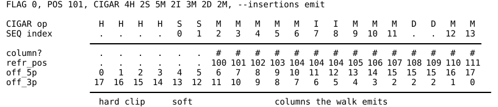

# 03 — The alignment walk and how hits are reported

Scope: which **columns** a BAM record produces, in what order, with which
coordinates, offsets, qualities and strands; how the automaton consumes them;
and how a hit row's reported values (`off_5p`, `off_3p`, `refr_pos`, `qual`,
`read_base`, `refr_base`, `capture_*`) come from those columns. alnbase 0.1.2.

Conventions:

- `src/file.rs:N` cites the code. **(example NN)** means the claim was checked
  by running `examples/03-walk/NN-*/run.sh` against the release binary; the
  output is in that directory's `expected.txt`. **(code only)** means it was
  read from source and not executed.
- Coordinates are 0-based, as in the parquet output. SAM `POS` is 1-based.
- "Top" / "bottom" is the walk direction, the same thing the `strand` record
  column prints as `+` / `-`.
- Symbols are printed with their canonical names (`Seq::name`): `.` gap,
  `_` pad, `,` junction (SKIP). `--trace-records` prints the one-byte forms
  `Z`, `X`, `J` instead (`src/seq.rs:47-51`).

Examples (each directory has `ref.fa`, `reads.sam` with `@CO` lines explaining
every record, query TOML, `run.sh`, `expected.txt`, `README.txt`):

| NN | directory | shows |
|---|---|---|
| 01 | `examples/03-walk/01-orientation` | walk direction for FLAG 0/16/65/81/129/145/256/2048; as-sequenced offsets for read 2 |
| 02 | `examples/03-walk/02-cigar-ops` | M, =, X, D, I, S, H, P; insertions skip vs emit; soft clips as clip columns in the flank; hard clips counted in offsets; `--soft-clips` refused |
| 03 | `examples/03-walk/03-introns` | N: windows, marker, short introns, `--splice-context` |
| 04 | `examples/03-walk/04-flank` | pad count, pad contents, contig edges (clip columns: example 02) |
| 05 | `examples/03-walk/05-unwalked-and-odd` | unmapped, off-reference, CIGAR `*`, SEQ `*` (skipped and counted), `=` and IUPAC in SEQ, QUAL `*` |
| 06 | `examples/03-walk/06-hit-values` | anchor vs other columns, flat vs list captures, tag + `extract` |
| 07 | `examples/03-walk/07-idioms` | read ends, context past ends, indel anchors, reference-gap columns |

The examples use a query `col` (`read = "~"`, `refr = "~"`, span 1) that fires
once on every column the walk emits, pads, intron context and the `,@,` marker
included (a query fires on any window it matches, `02-query-language.md` §8.1),
so its parquet rows *are* the column list; `_tools/grid.py` prints them one
record per block. A column that no pattern matches, not even `~` (the `=` base in
example 05), is not shown. Run any example with
`PATH=<dir with samtools and python+duckdb>:$PATH ./run.sh`; override the
binary with `ALNBASE=...`.

---

## 1. What a column is

`Column` (`src/column.rs:9-22`) has five fields:

| field | meaning | parquet name |
|---|---|---|
| `read: Seq` | read symbol: a base set (IUPAC nibble), `GAP` (deletion), `CLIP` (flank beside a soft clip), `PAD` (flank past the read), `SKIP` (intron) | `read_base` / `capture_read` |
| `refr: Seq` | reference symbol: a base set, `GAP` (emitted insertion), `PAD` (off contig), `SKIP` (intron marker only) | `refr_base` / `capture_refr` |
| `refr_pos: i64` | reference coordinate, 0-based | `refr_pos` / `capture_refr_pos` |
| `read_off: i64` | offset along the walk (see §3); converted to the as-sequenced offset when written | `off_5p` / `capture_off_5p` |
| `qual: i32` | Phred value of the read base, `-1` where the column has no read base or the record's QUAL is `*` | `qual` / `capture_qual` (NULL for -1) |

Neither `off_5p` nor `off_3p` is stored in a column. Both are derived per row
from the column's walk offset, SEQ's length `read_len`, FLAG 0x80 and the
record's hard clips (`as_sequenced` in `src/hits.rs`): `off_5p` is the walk
offset, mirrored (`read_len - 1 - read_off`) for read 2, plus the hard clips at
the sequenced 5' end, and `off_3p` is the same from the other end, so
`off_5p + off_3p = read_len + hard clips - 1` (§3.2). `off_3p` would be NULL only for `read_len = 0`, and such records
(SEQ `*`) are no longer walked (§7), so a hit row has both unless it is anchored on a pad (§5.2).

The FASTA is encoded with `Seq::FROM_FASTA` (`src/seq.rs`): IUPAC letters in
either case and `U`→T; `alnbase index` refuses any other byte (01 §2.2). SEQ is taken from the BAM 4-bit nibble unchanged
(`src/alignment.rs:120-123`), so SEQ `=` (nibble 0) becomes the **empty set**
(§8).

## 2. Orientation: which way a record is walked

```
is_ot = record.is_last_in_template() == record.is_reverse()   // src/alignment.rs:101
```

The walk is **top** (`strand = '+'`) or **bottom** (`'-'`) according to the
conversion strand the run's **strand rule** calls for the record: the
`[strand.*]` tables of one of its query files (§2.3, `docs/design/strand-rules.md`).
The walk itself reads no FLAG bit and no aligner tag; it is handed a strand
call and follows it, so what a rule declares is what the coordinates do.

The table below is that call under `queries/strand/directional.toml`, the rule
for a directional library whose aligner writes no strand tag, which is where
these numbers come from: top when FLAG bit 0x80 and bit 0x10 are equal, bottom
otherwise. Another aligner's file can reach another answer from the same FLAG —
that is the point of the rule being a file.

| FLAG | meaning | 0x80 | 0x10 | walk | `strand` | strand of origin under `queries/strand/directional.toml` |
|---|---|---|---|---|---|---|
| 0 | unpaired, forward | 0 | 0 | top | `+` | OT |
| 16 | unpaired, reverse | 0 | 1 | bottom | `-` | OB |
| 65 | R1 forward | 0 | 0 | top | `+` | OT |
| 81 | R1 reverse | 0 | 1 | bottom | `-` | OB |
| 129 | R2 forward | 1 | 0 | bottom | `-` | CTOB |
| 145 | R2 reverse | 1 | 1 | top | `+` | CTOT |
| 256, 2048 (+0x10 / 0x80 as above) | secondary / supplementary | | | as the bits say | | |

All rows verified (example 01). Consequences, for that rule:

- **Unpaired reads** are treated as read 1: only 0x10 decides (example 01,
  FLAG 0 and 16). A record with 0x80 set but 0x1 clear is still "read 2",
  for the walk and for the offset mirror of §3.2. Both are properties of the
  file's conditions (`is_last_in_template`), not of the walk.
- **Secondary and supplementary records are walked exactly like primaries**
  (example 01, FLAG 256 and 2048; also `docs/alnbase.md:58-60`). Filter with
  `samtools view -F 0x900` upstream if that is not wanted.
- The `strand` record column is written from the same strand call the walk was
  given, so the column and the coordinates cannot disagree
  (`src/record_columns.rs:263-273`, `src/record_field.rs:104-122`). It is the
  walk / conversion strand, **not** FLAG 0x10: R2-reverse is `+`, R2-forward
  is `-` (example 01). `is_reverse` is available separately.
- **A record the rule declines** — its `unknown` key, or an aligner tag saying
  the conversion was never observed — has no strand, so it has no walk: it is
  skipped, counted, and the count is reported at the end of the run (0.1.17).
  In a hit table it gets no row at all; in a tagged BAM it is written untagged.
- The two mates of a directional pair get the same `strand`. The record field
  `conv_strand` (new in 0.1.8; in `-f all`, not in the default `core`) splits
  them: `OT`, `OB`, `CTOT` or `CTOB`, the name in the table above, as the run's
  strand rule named it (`src/record_columns.rs:275-283`,
  `src/record_field.rs:123-135`). `OB` and `CTOB` are exactly the records whose
  `strand` is `-` (unit test
  `conv_strand_is_the_directional_conversion_strand`, `src/record_columns.rs:900-915`;
  `04-outputs` example 03 shows the column in the `-f all` schema). A rule that
  names only two strands leaves it null (0.1.15).
- `read_reverse` (0.1.15) is the third thing a strand call decides: whether the
  read as sequenced runs backwards along the reference, which is what makes
  `off_5p` and `off_3p` count from the end they do. It is not FLAG 0x10, which
  is `is_reverse`; under the directional rule the two agree, and under a rule
  written for an aligner that puts something else in the bit they do not.
- The BAM-tag writer and `extract` decide "bottom" from the same call the walk
  was given, `StrandCall::walk_reversed()` (`src/bam_out.rs:286-288`,
  `src/tag_extract.rs:320`), so the tags a run writes and the rows it writes
  cannot disagree about orientation: one rule per run, consulted once per
  record (0.1.17).

### 2.1 What "complemented" means

On a **bottom** walk (`src/alignment.rs:138-141,155-159,402-436`):

- CIGAR operations are visited last to first; the reference cursor starts at
  the alignment end and moves down; the query cursor starts at `len(SEQ)` and
  moves down.
- **Both** the read bases and the reference bases of every column are
  complemented (`orient` = reverse + `Seq::complement`). `complement` swaps
  A↔T, C↔G on the base bits and preserves GAP/PAD/CLIP/SKIP bits
  (`src/seq.rs:293-300`).
- Qualities are reversed with their bases but not changed
  (`orient_gen`, `src/alignment.rs:415-427`).
- `refr_pos` decreases along the record.

So for FLAG 16/81/129 the grid shows `refr_pos 27 26 … 20`, `qual 17 16 … 10`,
and `read_base` = reverse complement of SEQ (example 01). `refr_base` in a
hit row on the bottom strand is the complement of the forward-strand FASTA
base (example 06: `r16` `CG` hit at `refr_pos 26`, where the FASTA has `G`,
reports `refr_base C`). This is what makes one pattern (`C~@CG`) find
cytosines on both strands (`src/scanner.rs:1003-1017`, example 06).

## 3. Offsets: `read_off` / `off_5p` / `off_3p`

### 3.1 The walk offset

`read_off` starts at 0 and increases by one for **every query base consumed in
walk order**: aligned, inserted, or soft-clipped, emitted or not
(`src/alignment.rs:143-145,172,262,273,283`). Hard clips consume nothing
(`src/alignment.rs:286-287`). So on a top walk `read_off` is the SEQ index, and
on a bottom walk it is `len(SEQ) - 1 - SEQ index`. This is what `Column`
carries, what the scanner and `--trace` / `--trace-records` see and print
(`src/trace.rs:349-352`), and what patterns are matched along.

### 3.2 The written offsets: as sequenced, for every FLAG

`off_5p` and `off_3p` are measured from the ends of the **read as sequenced**,
whatever the walk direction, over the whole read: SEQ plus any hard-clipped bases
(`as_sequenced` in `src/hits.rs`, with the hard clips from
`alignment::hard_clips_as_sequenced`):

```
seq_len     = len(SEQ)
five_in_seq = (flags & 0x80) ? seq_len - 1 - read_off : read_off
off_5p      = five_in_seq + hard_clip_5p
off_3p      = (seq_len - 1 - five_in_seq) + hard_clip_3p
```

`hard_clip_5p` is the CIGAR's leading `H` for a forward record and its trailing
`H` for a reverse one (SEQ and CIGAR are stored in reference orientation);
`hard_clip_3p` is the other. Both are also available as record fields
(`-F hard_clip_5p,hard_clip_3p`).


Each arrow points the way the sequencer read the bases: `off_5p` counts from its
tail and `off_3p` from its head, for every FLAG. The walk line underneath is the
direction patterns are matched in (§3.3). For read 2 the two run in opposite
directions.



For one forward record, the figure above shows which CIGAR operations emit columns
and the values each column carries. Hard- and soft-clipped bases emit no aligned columns
but are counted by both offsets, so the first aligned base here is `off_5p` 6. (With
`--end-context` above 0, soft-clipped bases appear as clip columns in the flank, §5.2;
the figure shows none.) Inserted
bases (with `--insertions emit`) carry the reference position of the base before
them. Deleted positions carry the offsets of the read base before them and a null
quality. `off_5p + off_3p` is the read length minus 1 (18 − 1 = 17) on every column.
The values were produced by running alnbase 0.1.4 on this record.

The walk runs along the conversion strand (§2). That is the sequencing order
for read 1 and unpaired reads, and the reverse of it for read 2, so only read
2's walk offset is mirrored. Therefore `off_5p = 0` is **the first base the
sequencer read, for every FLAG** (example 01, second and third tables):

| FLAG | walk | walk starts at | `off_5p = 0` at | first **sequenced** base at | `read_base` vs base as sequenced |
|---|---|---|---|---|---|
| 0 / 65 (R1 fwd) | top | leftmost (SEQ[0]) | leftmost | leftmost | same |
| 16 / 81 (R1 rev) | bottom | rightmost | rightmost | rightmost | same (SEQ stores the revcomp; the walk undoes it) |
| 129 (R2 fwd) | bottom | rightmost | **leftmost** | leftmost | **complement** |
| 145 (R2 rev) | top | leftmost | **rightmost** | rightmost | **complement** |

- `off_5p` is the sequencing cycle for every record, with no FLAG-dependent
  correction (example 01 prints `off_5p` running 0..7 from the first sequenced
  base for 65/81/129/145).
- `off_5p` equals the SEQ index exactly when FLAG 0x10 is clear; with 0x10 set
  it is `len(SEQ) - 1 - SEQ index`.
- Hard- and soft-clipped bases are both counted: they were sequenced. A
  supplementary alignment `60H20M` reports `off_5p = 60` for its first base, the
  same value the primary alignment of that read reports for that base. (Before
  0.1.4 hard clips were not counted, so `3H6M2H` gave offsets 0..5; it now gives
  3..8.)
- `off_5p + off_3p = len(SEQ) + hard clips - 1` on every row with offsets. Pads
  have none: both are NULL (§5.2, since 0.1.9).
- The same conversion is applied to `capture_off_5p` / `capture_off_3p`
  (`src/hits.rs:234`) and to rows `extract` decodes from a tag
  (`src/hits.rs:280`), so all three agree (example 06).
- Before 0.1.2, read 2 was **not** mirrored: its `off_5p = 0` was its last
  sequenced base (D1, fixed).

The `bases` tag writer places a code at SEQ position `len-1-off` on the bottom
strand and `off` on the top, using the walk offset (`src/bam_out.rs:306-312`),
so **tags are placed correctly in SEQ order** (example 06, `XM` strings for
`r16`/`r129` are the mirror of `r0`).

### 3.3 Patterns follow the walk, offsets follow the sequencer

Patterns, pads and "walk-first" columns are defined along the conversion
strand, not the sequencing direction. For read 2 the two frames are opposite:

- The leading pad block (the pads the walk emits first) lies past R2's
  **last** sequenced base. `"_N"` (mark `.+`) anchors R2's last sequenced base,
  which reports `off_3p = 0`; `"N_"` (mark `+.`) anchors its first, with
  `off_5p = 0` (example 07, `r2f`/`r2r`: `walk_first` has `off_5p 9`,
  `off_3p 0`, at `refr_pos 29` for R2-forward, whose sequencing began at 20).
- Within one pattern, a later column has a **smaller** `off_5p` on read 2
  (example 06: `r129` `CG` anchored on C has `off_5p 6`, on G `off_5p 5`).
- The pads the walk emits first lie past R2's sequenced 3' end; they carry no
  offsets (example 01, FLAG 129: `off_5p . . .` then `7 … 0`).
- `read_base` / `refr_base`: for every R2 record they are the complement of
  the base as the sequencer called it (for 129 the SEQ is as sequenced and the
  walk complements it; for 145 SEQ is the reverse complement and the walk does
  not undo it). A C→T change seen by the R2 sequencer is reported as G→A.
- Single-end reads never have 0x80, so for them walk order and sequencing
  order coincide.

Consequences:

- **M-bias and read-end trimming** can group or filter on `off_5p` (or
  `off_3p`) directly, for both reads: `off_5p < n` is "the first n cycles".
- **"The first base the sequencer read"** is `off_5p = 0` on any FLAG. To get
  it with a pattern instead, use `"_N"` when `flags & 128 = 0` and `"N_"`
  otherwise (§9, idiom 1).
- For damage patterns (e.g. ancient DNA), an R2 row's `off_5p` is measured
  from R2's first cycle, but its bases are complemented relative to the R2
  base calls, so a C→T the R2 sequencer saw at its first cycles is reported as
  G→A at small `off_5p`.
- Soft-clipped bases are never aligned columns: they are clip columns in the
  flank (§5.2), so "walk-first" columns are at the first *aligned* base, not at
  SEQ's end; offsets still count the clip. The `soft_clip_5p` / `soft_clip_3p` record fields (0.1.9) give the clip at
  each sequenced end, so `off_5p - soft_clip_5p - hard_clip_5p` counts from the
  first aligned base.

## 4. Column emission per CIGAR operation

Order: an optional leading pad block, then the CIGAR operations in walk order
(forward for top, reversed for bottom), then an optional trailing pad block
(`src/alignment.rs:147-296`). Columns are passed one at a time to the ring and
the automaton (`src/scanner.rs:263-290`).

Notation in tables: "prev" = the column emitted immediately before, in walk
order. `len` = `len(SEQ)`.

### 4.1 `M`, `=`, `X` (`src/alignment.rs:163-174`)

| | |
|---|---|
| columns | one per base |
| `read` | the SEQ base (complemented on bottom) — any IUPAC set, as stored |
| `refr` | the FASTA base (complemented on bottom); PAD if off-contig |
| `refr_pos` | the base's own coordinate |
| `read_off` | its own offset, then +1 |
| `qual` | the base's Phred value (NULL when QUAL is `*` since 0.1.4, §8) |

`=` and `X` are not checked against the reference: an `X` over identical
bases or an `=` over different ones is emitted as the bases actually are
(code only; example 02 `eqx` shows `2=2X4M` identical in shape to `8M`).

### 4.2 `D` (`src/alignment.rs:176-187`)

| | |
|---|---|
| columns | one per deleted reference base |
| `read` | `.` (GAP) |
| `refr` | the FASTA base (complemented on bottom) |
| `refr_pos` | the deleted base's coordinate |
| `read_off` | `read_off - 1` = the offset of prev read base in walk order (on both strands) |
| `qual` | -1 → NULL |
| `off_3p` | from the same walk offset, so `off_5p + off_3p = len + hard clips - 1` still holds |

Example 02: `4M2D4M`, top: offsets `0 1 2 3 3 3 4 5 6 7`; bottom: the same
sequence with `refr_pos` descending. A deletion at the very start of the
walk (not valid SAM) would carry `read_off = -1` (code only).

### 4.3 `N` (`src/alignment.rs:189-256`)

Let `c` = splice context, `n` = intron length.

| case | columns (walk order) |
|---|---|
| `n <= 2c` | all `n` bases: `read ,`, real `refr`, own `refr_pos`. **No marker.** |
| `n > 2c` | `c` bases from the walk-5' end of the intron, one **marker** (`read ,`, `refr ,`), `c` bases from the walk-3' end |

All intron columns: `read_off` = offset of prev read base, `qual` NULL.
Marker `refr_pos` = first elided base in walk order: `start + c` on top,
`end - c - 1` on bottom (`src/alignment.rs:246`). On bottom the leading window
is the **high** end of the intron (`src/alignment.rs:236-240`).

`c` = `--splice-context N` if given, else `max_span`, the widest query's span
(the same default as the pad count; `max_span - 1` before 0.1.8)
(`src/scanner.rs:526-540`, `src/cli_query.rs:230-249`).

Example 03 (`3M10N3M` at 2, intron 5–14):

| context | top columns in intron | bottom |
|---|---|---|
| default (3) | `5 6 7 [8] 12 13 14` | `14 13 12 [11] 7 6 5` |
| 0 | `[5]` | `[14]` |
| 5 | `5 … 14` whole, no marker (10 ≤ 10) | |

`3M4N3M` with default 3: whole intron (4 ≤ 6), no marker. A pattern containing `,@,`
therefore cannot match an intron short enough to be shown whole
(`src/alignment.rs:528-547`).

A query fires on intron columns and the marker like on any other column,
including windows made only of them. Since the default `c` is the widest span,
the widest query too fits a whole window into each intron edge's context
(unit test `reference_context_reaches_into_an_intron`: a span-2 query fires on
a CG made only of intron context). Adding a wider query widens every intron's
context, so a query that can match all-intron windows (a read row of `~` or `,`
throughout) can gain hits; set `--splice-context`
explicitly, or exclude such windows with `and not` over a `,,`-style pattern
(**edge case: pads and the widest query**, [02 §8.6](02-query-language.md#86-pads-flank-contig-ends-and-record-boundaries)). A motif or
marker pattern needs an explicit `--splice-context` anyway, so its layout does
not move (0 puts the marker right between the exons). `~,@~~` (an aligned base
followed by an intron column) detects a junction from the aligned side at any
context.

### 4.4 `I` (`src/alignment.rs:258-276`)

`--insertions skip` (default):

| | |
|---|---|
| columns | none |
| `read_off` | advances by `n` — the next column's `off_5p` jumps (example 02 `ins_0`: `3 → 6`) |
| effect | the reference columns either side are adjacent, so patterns span the insertion |

`--insertions emit`:

| | |
|---|---|
| columns | one per inserted base |
| `read` | the base (complemented on bottom) |
| `refr` | `.` (GAP) |
| `refr_pos` | **prev column's coordinate**: `rpos-1` on top, `rpos` on bottom — every inserted base in a run shares it |
| `read_off` | its own offset, +1 each |
| `qual` | the base's own quality |

Example 02 `ins_0` (top, after ref 8): inserted columns `refr_pos 8 8`;
`ins_16` (bottom): `9 9` (the column before, in walk order, was 9).
`lead_ins` (`2I6M`, top, emitted): `refr_pos 9 9` = the preceding pad's
coordinate (POS-1).

### 4.5 `S` (`src/alignment.rs:278-284`)

No aligned columns, ever: soft-clipped bases are sequenced but not aligned.
`read_off` advances by `n`. In the flank at that end, the columns nearest the
aligned part are clip columns standing for the clipped bases, with their offsets
(§5.2).
There is no option: `--soft-clips` was removed in 0.1.2, and passing it is a
command-line error, `unexpected argument '--soft-clips' found` (example 02).
`sclip_0` / `sclip_16` (`2S6M3S`) produce the same columns with or without
`--insertions emit` (example 02): with flank 3, `sclip_0` has `_ : :` before its
aligned bases (offsets `. 0 1`) and `: : :` after (`8 9 10`).

Before 0.1.2, `--soft-clips emit` emitted clipped bases like insertions, against
a reference GAP.

### 4.6 `H`, `P` (`src/alignment.rs:286-287`)

No columns and no coordinate change. `P` changes nothing (example 02 `padop`:
`4M2P4M` is identical to `8M`). `H` does not advance the walk offset, but hard-clipped
bases are added to `off_5p` / `off_3p` (§3.2): example 02 `hclip` (`3H6M2H`,
flank 3) reports `off_5p` 3..8 for its aligned bases (before 0.1.4: 0..5).

### 4.7 Summary: what each column type carries

`off_5p` below is the written, as-sequenced value (§3.2); "prev" is in walk
order.

| column type | `read_base` | `refr_base` | `refr_pos` | `off_5p` | `qual` |
|---|---|---|---|---|---|
| M/=/X | base | base / `_` | own | own | Phred (NULL if QUAL `*`) |
| D | `.` | base | own | prev read base's | NULL |
| N window | `,` | base | own | prev read base's | NULL |
| N marker | `,` | `,` | first elided (walk order) | prev read base's | NULL |
| I (emit) | base | `.` | prev column's | own | Phred |
| S | no aligned column; clip columns in the flank | | | | |
| clip | `:` | base, or `_` off-contig | implied: outward from the aligned part | the clipped base's own (§5.2) | NULL |
| pad | `_` | base, or `_` off-contig | own (may be <0 or ≥ contig length) | none: `off_5p`/`off_3p` NULL (§5.2) | NULL |

## 5. Flank columns: clips and pads

### 5.1 How many

`flank = --end-context N` if given (new in 0.1.7), else `max_span` (`max_span - 1`
before 0.1.8) (`src/scanner.rs:526-540`, `src/cli_query.rs:210-228`), where `max_span` is the
longest **pattern used by any query in the run** (`src/query.rs:184`), whether
or not that query is the one you are reading. With the default, adding a wider
query to a run adds pad columns to every record (example 04: widest span 1 → 1
pad, 3 → 3, 5 → 5; `col` gains a row for each). A span-k query needs only k − 1
pads to reach past a read end; the k-th means the widest query, like every
narrower one, also meets windows made only of pads (example 04, widest span 1: `col`,
the only query, now fires on one pad at each end; unit test
`a_hit_anchored_off_the_read_is_counted_not_written`, `src/bam_out.rs:823-841`:
the lone span-2 query fires on the all-pad window before the 5' end). A query fires on any window it
matches, all-pad windows included, so a query that can match windows made only
of pads (a read row of `~` or `_` throughout) gains hits when a wider query is
added. Either pass `--end-context` explicitly, or exclude all-pad windows in the
query with `and not` over a pattern like `read = "__"`, `refr = "~~"`: see
**edge case: pads and the widest query** in [02 §8.6](02-query-language.md#86-pads-flank-contig-ends-and-record-boundaries) and
`02-query-language` example 09. The ring holds `max_span` columns
(`src/scanner.rs:231`, `src/column_ring.rs`). Pads are emitted at **both** ends
in equal number (`src/alignment.rs`, `emit_flank`). A soft clip does not add
columns: it turns flank columns into clip columns (§5.2).

### 5.2 What a flank column carries (`src/alignment.rs`, `emit_flank`)

- **Clip or pad.** Where the read's end is soft-clipped, the flank columns
  nearest the aligned part stand for the clipped bases, one each, up to the
  flank width: `read` = `:` (CLIP). The rest are pads, `read` = `_` (PAD).
  `2S6M3S` with flank 3 has `_ : :` before the aligned bases and `: : :` after;
  a `10S` clip with flank 3 has three clip columns, the three clipped bases
  nearest the aligned part (unit test
  `a_soft_clip_fills_the_flank_beside_the_aligned_part`; example 02). Hard clips
  are not in SEQ and give no clip columns.
- `qual` NULL on both.
- `refr` = the **real** reference base (complemented on bottom) when the
  coordinate is on the contig: reference context is readable past the read
  end (example 04 `mid`; `src/scanner.rs:1031-1044`).
- Off the contig, `Aref::fetch` returns PAD for the missing part
  (`src/aref.rs:321-345`); `refr_pos` is emitted anyway, negative before the
  contig start or ≥ contig length after its end (example 04, widest span 3:
  `contig_start` pads `-3 -2 -1` with `refr _`; `contig_end` bottom leading pads
  `42 41 40`).
- Leading flank: `refr_pos` = the `flank` positions walk-5' of the aligned span
  (below POS on top, at/above `end` on bottom, descending). A clip column's
  position is the one its base would occupy if the clip were aligned without
  indels; for a long clip from a chimeric read it is not a real alignment.
- **Clip offsets** are the clipped base's own, as for any sequenced base: the
  clipped base next to the aligned part is nearest it. Scalars and capture lists
  both carry them.
- **Pads have no offsets**: `off_5p` and `off_3p` are NULL on a hit anchored on
  a pad, as scalars and in capture lists (`src/hits.rs`, `push_hit`; examples
  01, 02, 06). A pad is past the read, and on a supplementary alignment
  (`60H20M`) the bases beyond the record are other parts of the read.
  Internally the walk gives a pad `read_off = i64::MIN` (`PAD_READ_OFF`,
  `src/column.rs`) so nothing can index SEQ with it. Up to 0.1.9 there were no
  clip columns: the flank beside a clip was pads, which up to 0.1.8 took the
  clipped bases' offsets.
- **Tags**: a `bases` tag never marks a pad or a clip; a hit anchored on one is
  counted in `unplaced_hits`. Up to 0.1.8 a hit on the flank next to a soft clip
  marked the clipped base (unit test
  `a_hit_on_the_flank_beside_a_soft_clip_marks_nothing`).
- **Queries**: `~` matches both. `_` matches only a pad, so `read = "_N"` fires
  on the first aligned base only where that end is not clipped, and `:N` only
  where it is; `{_:}N` (as an alias) fires either way (example 07). The
  concordance check ignores both.
- Pads are always emitted even when `flank` columns would run past contig
  edges; a record on a 4-bp contig is still emitted with full pad blocks
  (code only).

The test for "no read base here" is `read_base IN ('_', ':', '.', ',')`, not an
offset range. `qual IS NULL` also holds there, but since 0.1.4 it holds on
every base of a record with QUAL `*` too (§8).

## 6. How queries fire and what a row reports

### 6.1 Firing

Per column: store in the ring, step the automaton, then evaluate every query
whose `span <= stored` columns (`src/scanner.rs:263-290`); it fires when its
predicate is true, whatever the window's columns are (pads, intron context and
the marker included; `02-query-language.md` §8.1). A query fires on
the **last** column of its pattern. Rows for one record are written in the
order they fire, i.e. by last column, then by query declaration order
(example 06). A record's rows are never split across batches
(`src/scanner.rs:373-376`).

Column matching is subset-based: an observed symbol matches a pattern column
if it is contained in the column's set (`src/query.rs:160-162` indexes a
256×256 compatibility table filled by `fill_compat`). `~` = `{N._:J}` is every
symbol, and the empty set from SEQ `=` matches nothing (§8).

### 6.2 Which column each value comes from

`anchor_back = span - anchor`, `capture_back[i] = span - capture[i]`
(`src/query.rs:210-213`); `ring.get(1)` is the column just stored
(`src/column_ring.rs:28-37`). So column *i* of the pattern is `get(span - i)`.

Scalar columns (`src/hits.rs:203-213`) — always the **anchor** column
(default anchor = column 0, not the last column):

| row column | value | NULL when |
|---|---|---|
| `off_5p` | anchor `read_off`, mirrored for read 2, plus the 5' hard clips (§3.2) | anchor on a pad (§5.2); gaps get a number |
| `off_3p` | `len + hard clips - 1 - off_5p` | as `off_5p` (`len = 0` records are not walked) |
| `refr_pos` | anchor `refr_pos` | never on a hit row |
| `qual` | anchor quality | anchor has no read base |

Flat captures (every query captures only its anchor, `src/query.rs:218-220`):
`read_base` / `refr_base` = the anchor's symbols by canonical name
(`src/hits.rs:220-223`), complemented on bottom walks, possibly `.`, `_`, `,`.

List captures (any query in the run has a `^`): the **whole file** switches to
`capture_col`, `capture_read`, `capture_refr`, `capture_qual`,
`capture_off_5p`, `capture_off_3p`, `capture_refr_pos` and drops
`read_base`/`refr_base` (`src/hits.rs:218-252,381-397`). The anchor is always
one of the captures. For a capture with `qual < 0` (pad, deletion, intron)
`capture_qual`, `capture_off_5p` **and** `capture_off_3p` are NULL
(`src/hits.rs:229-241`), whereas the scalar `off_5p` of the same column as an
anchor is a number. `capture_refr_pos` is never NULL.

Example 06:

| record | query | `off_5p` | `off_3p` | `refr_pos` | `qual` | `read_base` | `refr_base` |
|---|---|---|---|---|---|---|---|
| `r0` (top) | `CG` anchor C | 5 | 4 | 25 | 15 | C | C |
| `r0` | `CG_on_G` anchor G | 6 | 3 | 26 | 16 | G | G |
| `r16` (bottom) | `CG` | 3 | 6 | **26** | 16 | C | **C** (FASTA has G) |
| `ends_on_C` | `CG_on_G` (anchor on pad) | **NULL** | **NULL** | 26 | NULL | `_` | G |
| `del_G` | `CG_on_G` (anchor on deletion) | **5** (prev base) | 4 | 26 | NULL | `.` | G |
| `conv` | `CG` | 5 | 4 | 25 | 15 | T | C |

### 6.3 `refr_base` in direct parquet vs `extract`

- `query --parquet`: `refr_base` is always the walked reference symbol; it is
  never NULL on a hit row (it can be `_` off-contig — example 04).
- `extract` reads no reference: it writes `refr_base` only when the query
  fixes the anchor's reference symbol (`QuerySpec::anchor_refr`,
  `src/tag_extract.rs:342-346`, `src/dsl.rs:707`): a single fixed set
  (`CG` → `C`), or `=` (the read's own base); otherwise NULL. Example 06:
  `A_any` (`refr = "~"`) is NULL in extract and `A` in direct parquet; all
  other columns agree.
- `extract` offsets: the tag position is converted to a walk offset and then
  to `off_5p` / `off_3p` exactly as a walked hit's (`src/tag_extract.rs:323-355`,
  `src/hits.rs:268-282`), so they are as sequenced, read 2 included (example 06
  `r129`: `extract` and direct parquet agree). `refr_pos` for inserted and
  soft-clipped bases carries the nearest 5' coordinate, as an emitted
  insertion does (`src/tag_extract.rs:385-422`). `qual` is the base's quality,
  NULL for QUAL `*` (**Fixed in 0.1.4**; it was 255). Extract can only produce rows for bases a tag marked, so
  never pads, gaps or introns.
- Tagging refuses a query whose anchor can be a gap or intron
  (`src/tags.rs:229-245`) and counts hits anchored on a pad as `unplaced_hits`
  rather than marking them (`src/bam_out.rs`, unit tests
  `a_hit_anchored_off_the_read_is_counted_not_written` and
  `a_hit_on_a_pad_beside_a_soft_clip_marks_nothing`).

## 7. Records that are not walked

The reader decides before routing, with one test shared by the tagged BAM,
`query --parquet` and `--trace-records` (`walkability`,
`src/scanner.rs:541-570`; counted by `src/batch.rs:55-86`; called at
`src/parallel.rs:432-437`, `src/ordered.rs:262-263`, `src/main.rs:451-458`):

| record | parquet (`query --parquet`, `extract`) | BAM output | verified |
|---|---|---|---|
| unmapped (0x4), placed or not | one row, all query columns NULL; dropped by `--only-hits` | written untagged | example 05 |
| FLAG 0 with CIGAR `*` | htslib warns "mapped query must have a CIGAR; treated as unmapped" and sets 0x4 → as unmapped (`flags` reads 4) | as unmapped | example 05 |
| RNAME not in the reference | **run stops** with an error naming the record; with `--permissive`, one NULL row and counted as "on contigs the reference does not have" | untagged with `--permissive` | example 05 |
| mapped, SEQ `*` | `query --parquet`: skipped, counted ("of those, N were mapped but had no SEQ ('*')"), one NULL row; never an error. `extract` reads no reference and does not apply this test (`src/parallel.rs:432-436`) | written untagged, counted (code only) | example 05 |
| mapped, on a contig the reference has, whose `@SQ` line has no `M5`, **under `--require-m5`** (new in 0.1.8) | **run stops**, whatever `--permissive` says: `record R is on contig C, whose @SQ line has no M5 checksum, and --require-m5 was given. ...`, and the run's output files are removed. Decided per record (`Walkability::MissingM5`, tested after off-reference and before SEQ `*`), so a contig no record is on is never refused. `extract` reads no reference and has no such option | same; the partial BAM is removed | code (`src/contig_map.rs:149-171`, `src/batch.rs:46-53`, `75-80`; unit tests `required_m5_marks_only_resolved_contigs_without_one`, `a_required_m5_that_is_missing_stops_the_run`); executed on `01-reference` example 06 inputs while writing (not a checked-in example) |
| secondary / supplementary / duplicate / QC-fail | walked normally | tagged | example 01 (0x100, 0x800) |

Before 0.1.2 a mapped record with SEQ `*` panicked the worker and failed the run
(D5, fixed).

`--trace-records N` skips unmapped, off-reference and SEQ `*` records silently
and traces the next N walkable ones; a record refused by `--require-m5` stops it
with the same error as a scan. It still requires the OUT positional
(`src/main.rs:423-511`; `/dev/null` works). Since 0.1.8 it also checks reference
concordance as a scan does: each record's trace ends with
`reference concordance: X of Y compared read bases differ (P%; a reference C read as T is not counted)`
(`01-reference` example 06 §7), and after the last record the traced total is
judged against `--max-discordance`: over at least 1,000 compared bases a rate
above it is an error (exit 1, after the traces are printed); over fewer, a
`warning: ... too few to judge ...` line (executed while writing: 3 of 8 bases
against `01-reference` example 06's `other_assembly.fa`, 37.5%, warned, exit 0).

## 8. Unusual SEQ and QUAL

| input | behaviour | verified |
|---|---|---|
| `N`, `R`, `Y`, … in SEQ | emitted as that base set; matches a pattern column only if the set is a subset of it (`N` does not match `C`) | example 05 `iupac` |
| `=` in SEQ | read symbol is the empty set (trace prints `0`). **No pattern, not even `~`, matches it**, so every pattern spanning that column dies there; the column still occupies a position and an offset | example 05 `eq_in_seq` |
| QUAL `*` | htslib stores 0xFF per base; since 0.1.4 the walk treats that as no quality, so `qual` is NULL on every column, as for a deletion, and `qual_phred` is NULL (before 0.1.4: 255, and a string of 0xFF+33 characters) | example 05 `qual_star`, `alignment::tests::a_missing_quality_is_minus_one_not_255` |
| lowercase FASTA | folded to upper case | code only (`src/seq.rs:275-281`) |

## 9. Idioms

All verified in example 07 unless noted.

1. **First / last base the walk emits.** With the alias `f = "{_:}"` (a pad
   or a clip), `read = "fN"`, `refr = "~~"`, `mark = ".+"` anchors the first
   aligned base after the leading flank; `"Nf"` with `mark = "+."` the last.
   They need `max_span >= 2` (true because the pattern itself spans 2). These
   are **walk-order** ends of the **aligned** region, so `clip_only` (`2S10M`)
   fires at `off_5p 2`. `"_N"` fires only where that end is not soft-clipped
   (`unclipped_first`) and `":N"` only where it is (`clipped_first`). For reads with 0x80 set, `"_N"` is the last
   sequenced base (`r2f`: `off_5p 9`, `off_3p 0`, `refr_pos 29`, sequencing
   started at 20). For "the first sequenced base" on every FLAG, filter rows
   on `off_5p = 0`, or use `"_N"` when `flags & 128 = 0` and `"N_"` otherwise.
2. **Reference context past the read end.** `read = "C_"`, `refr = "CG"`
   fires only when the C is the last emitted read base and its G is beyond
   the read (`ends_on_C`), and the read is not soft-clipped there (the column
   after would be `:`; use `{_:}`). `read = "C~"` fires in both situations
   (`src/scanner.rs:1031-1044`).
3. **Anchoring beside a deletion.** `read = "N."`, `refr = "NN"`,
   `mark = "+."` anchors the read base walk-5' of a deletion; `".N"` with
   `mark = ".+"` the base walk-3' of it. On bottom walks these are the
   reference-right and reference-left neighbours respectively. The gap
   column's own `off_5p` equals the walk-5' neighbour's.
4. **Reference-gap columns.** With `--insertions emit`, every `N@.` column is
   an inserted base: soft-clipped bases are clip columns over the reference (4a;
   `clip_only` and `clip_3p` have none).
   - An insertion of exactly *k* bases is bounded by aligned columns,
     `read "N…N"` / `refr "N.…N"` (`ins_len2` fires only on `ins_only`); the
     one-sided `"NN"@"N."` fires on the first base of an insertion of any
     length (4b). Variable-length insertions need one pattern per length
     joined with `or`.
   - A clipped record's walk-first / walk-last bases are aligned bases, and
     their offsets count the clip (4c: `clip_3p` `walk_last` has `off_3p 2`).
   - `cigar` (`-F cigar`) is available on every row for post-hoc checks.
5. **Excluding columns without a read base** in SQL: `qual IS NOT NULL`
   (§5.2).
6. **Stable intron layout for motif patterns:** set `--splice-context`
   explicitly; the default moves with the widest query
   (`src/scanner.rs:526-540`). Likewise set `--end-context` explicitly when a
   query's read row accepts pads throughout, or exclude all-pad windows with
   `and not` (§5.1).

---

## Discrepancies

Rows marked **Fixed in 0.1.2** or **Fixed in 0.1.4** are kept, struck through, for reference.

| # | where | claim | actual (evidence) | severity |
|---|---|---|---|---|
| D1 | ~~`src/hits.rs:16-28` (module docs); `--help` field list; `docs/alnbase.md:397`; `src/alignment.rs:92`; `src/column.rs:17`~~ | ~~`off_5p` counts from the 5' end of the read as sequenced; `off_3p = 0` is the last sequenced base~~ | **Fixed in 0.1.2.** Written offsets are mirrored for FLAG 0x80 (`src/hits.rs:457-482`), so `off_5p = 0` is the first sequenced base for every FLAG (example 01: FLAG 129 `off_5p 0` at `refr_pos 20`, where sequencing started). In 0.1.1 it was the last sequenced base for read 2. | ~~High~~ |
| D2 | `src/alignment.rs:14-19` (`Insertions` doc) | offsets "remain true offsets into SEQ" | True only for records with FLAG 0x10 clear and no hard clips; with 0x10 set `off_5p = len-1-SEQ index`, and since 0.1.4 hard clips at the sequenced 5' end are added (example 01 FLAG 16, 81, 145; example 02 `hclip`). | Medium |
| D3 | ~~`src/column.rs:19-20`, `src/alignment.rs:125-129`~~ | ~~`qual` is -1 (NULL) when "the record carries no quality string"~~ | **Fixed in 0.1.4.** QUAL `*` gives NULL `qual` on every column (§8, example 05 `qual_star`). Up to 0.1.3 it gave 255, never NULL, because htslib fills 0xFF and the length check passed, so a `qual >= 30` filter kept these bases. | ~~Medium~~ |
| D4 | `src/alignment.rs:83-85`, `src/hits.rs:468-470` | flank columns "may run negative or past the read length"; "a column before the first sequenced base has a negative `off_5p`" | **Fixed in 0.1.9.** Pads have NULL offsets (§5.2). Up to 0.1.8 pad offsets equalled the clipped bases' offsets with soft clips, stayed negative beside a skipped leading insertion, and a pad hit beside a soft clip was tagged on the clipped base. | ~~Low–medium~~ |
| D5 | ~~`src/scanner.rs:138-145` (debug assertions), no user doc~~ | ~~none documented~~ | **Fixed in 0.1.2.** A mapped record with SEQ `*` is skipped and counted, not walked (`src/scanner.rs:558-570`, example 05). In 0.1.1 it panicked the worker and failed the run. | ~~High~~ |
| D6 | `--list-codes` and `--help` ("`~` anything at all", `src/codes.rs:50`) | `~` matches anything | SEQ `=` becomes the empty set, which no pattern matches, so it breaks every pattern spanning it (example 05 trace). `docs/alnbase.md` says so. (Up to 0.1.9 `~` also excluded ERR.) | Low |
| D7 | `src/hits.rs:9-11` vs `src/hits.rs:229-241` | scalar `off_5p`/`off_3p` describe the anchor | Correct. For a pad both are NULL since 0.1.9 (example 06 `ends_on_C`). For a deletion the scalars are numbers while the same column as a list capture gets NULL offsets (example 06 `del_G`): two conventions for one column. | Low |
| D8 | `docs/alnbase.md` ("walked in its own orientation, complemented") | describes bottom-strand reads | Omits that `refr_base` is complemented too and that R2 is "bottom" when *forward*; the strand table in `docs/alnbase.md` is correct. | Low |
| D9 | `docs/cli-reference.md`, `src/cli_query.rs:230-249` | default splice context = the widest query's span (widest query − 1 before 0.1.8) | Correct. The **pad count** is also set by the widest query of the whole run (unless `--end-context` is given), so adding a query changes columns for all others (example 04), and a query that can match an all-pad or all-intron window gains hits. 0.1.3 gated firing on observed columns; 0.1.7 reverted that and added `--end-context`; 0.1.8 raised both defaults from span − 1 to span, so the widest query too meets all-pad and all-intron windows; documented as intended behaviour (`02-query-language.md` §8.6, example 09; `docs/alnbase.md` "Pads and the widest query"). | Low (documentation gap) |
| D10 | `src/alignment.rs:106-107` ("Callers filter these records out") | off-reference records never reach the walk | True; but the default is to stop the run, not skip (`docs/cli-reference.md` says so correctly). `--trace-records` skips them silently (`src/main.rs:451-458`). | Informational |
| D11 | `src/alignment.rs:76` ("Columns are emitted 5'->3' *as sequenced*"), `src/alignment.rs:83` ("`read_off` is the 0-based query offset as sequenced, indexing SEQ"), `src/alignment.rs:143-144` ("the SEQ index directly, on both strands"), `src/column.rs:17` ("offset as sequenced") | the walk and `Column::read_off` are in sequencing order and index SEQ | The walk runs along the conversion strand (`src/alignment.rs:101`), which for read 2 is the reverse of sequencing order, and `read_off` is `len-1-SEQ index` on a bottom walk. `src/hits.rs:16-24` describes this correctly and converts when writing. | Low (internal comments; the output is right) |
