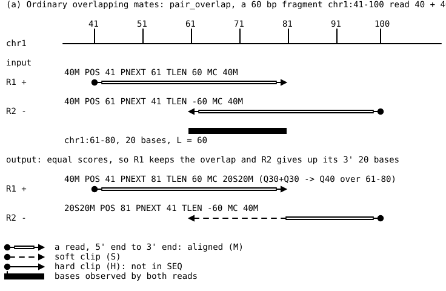
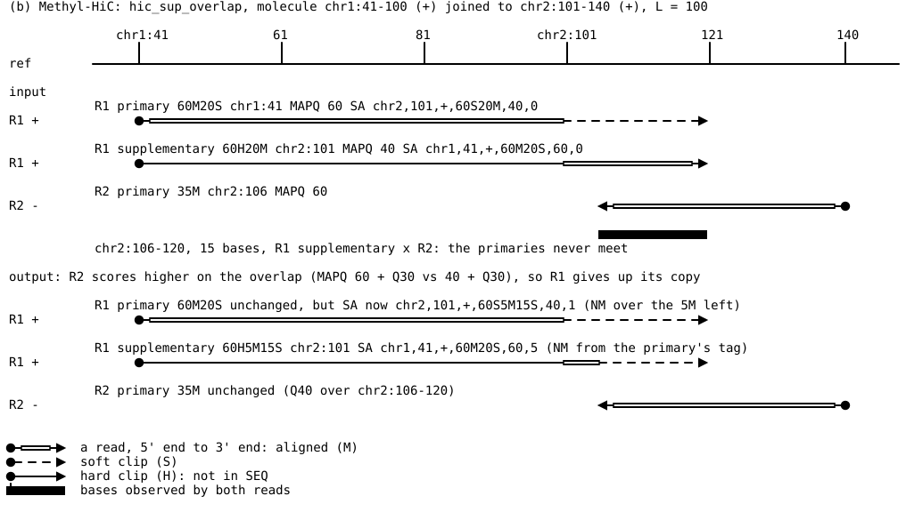
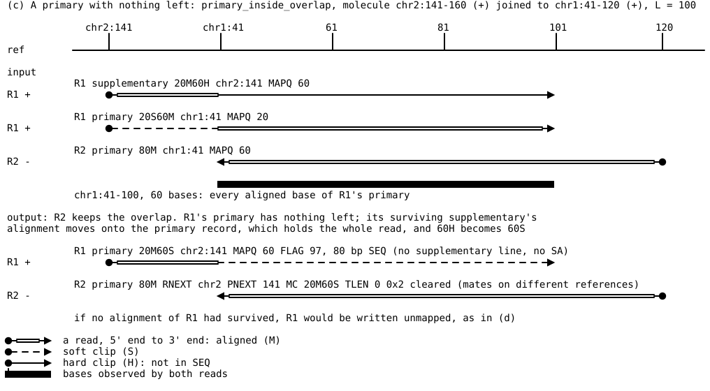
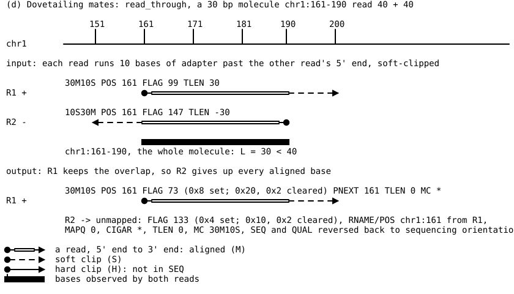

# 05 — `alnbase overlap`

Reference for alnbase 0.1.5. The mate-field, promotion, QUAL `*` and compression-level
behaviour changed in 0.1.5 (see [Edge cases](#edge-cases-and-how-they-are-resolved) and
[Discrepancies](#discrepancies)). Every statement here was checked against the source
(`src/overlap.rs`, `src/overlap_apply.rs`, `src/cli_overlap.rs`, `src/main.rs`,
`src/contig_map.rs`) and, where marked **(example NN)**, run against the release binary
using the hand-built templates in
[`examples/05-overlap/`](examples/05-overlap/). **(code only)** means the statement comes
from reading the code and was not run. `file.rs:N` means a line in `src/`.

Conventions used throughout:

- **q**: query index, a 0-based offset into a record's SEQ as stored.
- **e**: end index, a 0-based offset from the 5' base of the original read.
- **f**: fragment index, a 0-based offset along the molecule, starting at R1's 5' base.
- **L**: fragment (molecule) length. **len1**, **len2**: full read lengths of R1 and R2.
- Reference coordinates in prose are 1-based, as in SAM. Internally POS is 0-based.
- QUAL characters in the example outputs: `!`=0, `+`=10, `-`=12, `0`=15, `5`=20, `?`=30,
  `D`=35, `I`=40, `P`=47, `X`=55, `]`=60.

---

## 1. What the command is

```
alnbase overlap [OPTIONS] <INPUT> <OUTPUT>
```

`INPUT` and `OUTPUT` are BAM paths, or `-` for stdin/stdout (`bam_io.rs:24-84`). The
output is always BAM (`bam_io.rs:73-84`). `overlap` is a BAM-to-BAM filter meant to run
before any caller, including `alnbase query` (`main.rs:94`, `main.rs:493`,
`cli_overlap.rs:1-11`).

For each template (all records sharing a QNAME), it:

1. gathers the primary and supplementary alignments of R1 and R2
   (`overlap_apply.rs:153-157`);
2. works out the fragment length L from reference positions that both reads cover
   (`overlap.rs:775-877`);
3. if L is trusted and the reads overlap by at least `--min-overlap` bases, edits the
   qualities (and optionally the bases) of both copies of each doubly observed base
   (`overlap.rs:1039-1108`), then clips the overlap off one read
   (`overlap.rs:882-911`);
4. writes the records back in input order, edited or not, with tags; a record with
   nothing left is left out, unmapped, or replaced by a surviving alignment of its read,
   and the template's mate fields and SA tags are rebuilt if any alignment changed
   (`overlap_apply.rs:178-281`; §7).

The design, stated at `overlap.rs:1-74`: the overlap is defined on the molecule (fragment
indices), not on the reference. Reference positions are only used to find the offset
between the two reads' coordinates.

---

## 2. Input requirements

### 2.1 Name grouping (header check only)

Before any record is read, `check_grouping` (`overlap.rs:102-132`) examines the header text
(`overlap_apply.rs:42-43`):

| `@HD` line | result |
|---|---|
| absent | refused: `no @HD line, so the record order cannot be verified...` |
| has `GO:query` | accepted (collated), whatever `SO:` says (`overlap.rs:116`) |
| no `GO:query`, `SO:queryname` | accepted (sorted) |
| `SO:` anything else (e.g. `coordinate`, `unsorted`) | refused: `records are ordered by <SO>...` |
| neither `SO:` nor `GO:` | refused: `the @HD line declares neither SO: nor GO:...` |

Only the first line starting with `@HD` counts. A `GO:query` on a `@CO` line does not
(`overlap.rs:103`; example 02). A refusal is an error: exit status 1, message on stderr, no
output written (example 02).

**The record order itself is never checked.** Templates are formed by grouping
*consecutive* records with the same QNAME (`overlap_apply.rs:76-92`). A file whose header
claims `SO:queryname` but whose records are interleaved is accepted, and each run of equal
QNAMEs is processed as a separate template. In example 02 an interleaved file
(R1 of A, R1 of B, R2 of A, R2 of B) gives 4 single-ended templates, all tagged
`oO:i:0`, with exit status 0.

### 2.2 Which records take part

`resolve` (`overlap_apply.rs:148-282`) sorts the records of a template:

| record | planned? | written? | tags written? |
|---|---|---|---|
| primary (neither 0x100 nor 0x800), mapped | yes | yes (possibly edited, unmapped, or given a promoted supplementary's alignment, §6.5) | yes |
| supplementary (0x800), mapped | yes | yes, unless dropped (§6.5) | yes |
| secondary (0x100) | no (`overlap_apply.rs:154`) | yes, unchanged except mate fields when the template changed (§7.4) | yes, the template's tags (example 01 `with_secondary`) |
| unmapped (0x4) | no (`overlap_apply.rs:154`) | yes, unchanged except mate fields when the template changed (§7.4) | yes (example 01 `mate_unmapped`) |
| duplicate (0x400), QC-fail (0x200) | yes, no filtering on these flags | yes | yes (code only) |

Secondaries are excluded because a secondary is the same bases placed elsewhere, not a
second observation (`overlap_apply.rs:150-152`, `overlap.rs:756-759`).

With `--on-unresolved drop`, every record of a refused template is discarded, secondaries
and unmapped records included (`overlap_apply.rs:172-176`).

### 2.3 R1, R2 and single-end reads

A record is R2 when flag 0x80 (last in template) is set, and R1 otherwise
(`overlap_apply.rs:293`). So:

- An unpaired record (flag 0) counts as R1. A template made only of such records has no R2
  (example 01 `single_end`).
- The paired flag (0x1) and 0x40 are not consulted (code only).

If either end has no planned record (single-end, unmapped mate, all-secondary), the
planner returns at once with verdict "no overlap" (`overlap.rs:778-780`). Those records
get `oO:i:0` (example 01).

### 2.4 How the CIGAR is read

`=` and `X` are read as `M` (`overlap_apply.rs:955`). Of the operations
(`overlap.rs:142-188`):

- `M`, `I`, `S` consume the read and are present in SEQ.
- `M` and `I` are **aligned**: an observed base placed on the reference. `S` is not
  (`overlap.rs:173-175`).
- `H` consumes the read but is not in SEQ. `D`, `N` consume only the reference. `P`
  consumes neither.

**Soft and hard clips.** Both count toward the read length
(`overlap.rs:198-204`: sum of `M`, `I`, `S`, `H`), so a supplementary that is soft-clipped
(`bwa mem -Y` style) and one that is hard-clipped give the same read length and end
indices. Soft-clipped bases are observations without a reference position: they can never
be candidates (§4.1), they are counted as `positions_unpaired` when they fall in the
overlap (`overlap.rs:824-827`), and they are never clipped again, since only aligned bases
are counted when clipping (`overlap.rs:1169-1182`).

---

## 3. The three coordinate systems

### 3.1 Query index q

q is the index into the record's SEQ as stored, which is always in reference-forward
orientation (`overlap.rs:229-233`). `seq_map` (`overlap.rs:295-321`) walks the CIGAR and
returns, for each q, whether the base is aligned and its reference position:

- `M`: aligned, with a reference position.
- `I`: aligned, with **no** reference position.
- `S`: not aligned, no reference position.

### 3.2 Read length

`read_length = Σ len(M, I, S, H)` over the record's CIGAR (`overlap.rs:198-204`). This is
the full original read, including bases that are hard-clipped here and bases at a ligation
junction that align to neither side (`overlap.rs:190-197`, test at `overlap.rs:1861-1874`).

### 3.3 End index e

With `lead_hard` = the total of the leading `H` operations in the CIGAR
(`overlap.rs:254-260`) and `n` = read length (`overlap.rs:268-275`):

```
forward record:  e = q + lead_hard
reverse record:  e = n - 1 - (q + lead_hard)      (saturating at 0)
```

On a reverse record the CIGAR is reference-forward, so its leading `H` sits at the read's
3' end and q runs against the read. That reversal is all the strand handling there is
(`overlap.rs:262-267`). Pinned by the test at `overlap.rs:2773-2789`: for `70H80M`, forward
q=0 is e=70; reverse q=0 is e=79 and q=79 is e=0.

`end_offset` (`overlap.rs:279-287`), used only to choose which supplementary to promote
(§6.5), is the e of the record's 5'-most SEQ base: `lead_hard` when forward,
`n - lead_hard - seq_len` when reverse.

Worked (example 03, `hic_sup_overlap`, R1 is 80 bp):

| record | CIGAR | strand | q | e | reference |
|---|---|---|---|---|---|
| R1 primary | `60M20S` | + | 0..59 aligned, 60..79 soft | e = q (0..79) | chr1:41-100 for q 0..59 |
| R1 supplementary | `60H20M` | + | 0..19 | e = q + 60 (60..79) | chr2:101-120 |
| R2 primary (35 bp) | `35M` | − | 0..34 | e = 34 − q (34..0) | chr2:106-140 |

### 3.4 Fragment index f

Once L is known, R1 covers `f = e1` over `[0, len1)` and R2 covers `f = L − 1 − e2` over
`[L − len2, L)` (`overlap.rs:36-38`). Two observations are the same molecule base exactly
when their f values are equal.

### 3.5 Assembling one end from its records

`build_end` (`overlap.rs:365-408`) runs once for R1 and once for R2:

- `len` = the largest read length among the end's records. If
  `max − min > --length-tolerance`, the end is marked inconsistent (`overlap.rs:370-372`)
  and the template is refused `inconsistent_length` (`overlap.rs:781-784`).
- Each SEQ base goes into slot e (bases with `e ≥ len` are ignored). Each record computes
  e with **its own** read length (`overlap.rs:377-378`). If
  `--length-tolerance` lets two records with different lengths through, the shorter
  record's end indices are not corrected: in example 06 `inconsistent_length` with
  `--length-tolerance 10` the template gets past that check and is then refused
  `indel_disagreement` at L=100.
- If two records claim the same e (an ambiguous split at a junction), the new claim
  replaces the old one only if `(aligned, MAPQ)` is strictly greater
  (`overlap.rs:393`). On a tie the record that comes first in the input keeps the base.
- `last_aligned` = the largest e that holds an aligned (`M` or `I`) base
  (`overlap.rs:401-406`).

Only these per-e winners are used for candidates, comparison and scoring. Clipping is
applied to every record of the end, winners or not (`overlap.rs:1153-1160`; §6.3).

---

## 4. The fragment-length estimator

### 4.1 Candidate pairs

`candidate_groups` (`overlap.rs:935-984`) merge-joins the two ends' winning bases on
`(tid, reference position)`. Only bases with a reference position take part: `M` bases,
not `I` and not `S`. For every R1 base and R2 base at the same position, the pair is a
candidate **only if the covering records are on opposite strands**
(`overlap.rs:963-965`), since R2 reads the reverse complement of the molecule. It implies

```
L = e1 + e2 + 1
```

Base identity is **not** checked: a candidate is a position match, not a sequence match.
If several R1 or R2 bases share one position (a molecule that visits a locus twice), every
combination is a candidate (`overlap.rs:957-976`).

### 4.2 Groups

Candidates are grouped by L. Each group keeps `n` (number of pairs), `min_e1`, `max_e1`
(`overlap.rs:715-725`), and `span = max_e1 − min_e1 + 1`.

For a group, with `a1`, `a2` = R1's and R2's `last_aligned`:

- **reach** (`overlap.rs:732-735`): `reach1 = a1 − max_e1`,
  `reach2 = a2 − (L − 1 − min_e1)` (both clamped at 0). This is how far the group stops
  short of each read's 3'-most aligned base.
- **past_end** (`overlap.rs:748-751`): `max(0, a1 − (L−1)) + max(0, a2 − (L−1))`, the
  number of aligned read positions beyond the end of the molecule this L implies.

If there are no groups, or either end has no aligned base, the verdict is "no overlap"
with no L (`overlap.rs:788-790`, `805-807`).

### 4.3 Choosing the best group

`best` = the group that minimises `max(reach1, reach2)`. Ties go to the larger `n`, then to
the smaller L (`overlap.rs:797-804`). Neither size nor median decides. The reasoning
(`overlap.rs:40-52`): a real overlap runs from `max(0, L−len2)` to `min(len1, L)`, and
those two ends are exactly the reads' 3' termini, so the true group reaches both. A group
caused by a repeat or a second copy usually does not. `past_end` plays no part in the
choice. It is checked afterwards (§4.5).

### 4.4 Predicted overlap and `--min-overlap`

```
lo = max(0, L − len2),  hi = min(len1, L),  predicted = hi − lo   (0 if lo ≥ hi)
```

(`overlap.rs:699-707`, `809-810`). Full read lengths are used here, not aligned spans.
If `predicted < --min-overlap` (default 4), the verdict is "no overlap" and nothing is
changed (`overlap.rs:811-814`; example 01 `pair_overlap_3`, a 3-base overlap). The L found
is not written to any tag (§7.6).

### 4.5 Comparing the overlap and validating L

For each `f` in `[lo, hi)`, `e1 = f`, `e2 = L−1−f` (`overlap.rs:818-840`):

- either end lacks a base at that e, or either base is unaligned (soft clip) →
  `positions_unpaired`;
- either call is ambiguous (IUPAC with more than one base, including `N`) or empty (`=`)
  → `positions_ambiguous`, not compared (`overlap.rs:682-687`, `seq.rs:339-341`);
- otherwise → `positions_compared`, and match or mismatch by nibble equality. Both SEQs
  are reference-forward, so no complementing is done. A C/T difference is a mismatch like
  any other (test `overlap.rs:2156-2174`).

`I` bases are compared by fragment index like any other aligned base.

The statistics used for validation (`overlap.rs:843-846`):

```
anchor_slack = max(reach1, reach2)         of best
past_end     = past_end(best)
span_frac    = best.span / predicted
mism_frac    = mismatches / (matches + mismatches)     (0 if none compared)
```

A **rival** is another group (`L ≠ best.L`) that is itself anchored, meaning
`max(reach) ≤ --max-anchor-slack` and `past_end ≤ --max-past-end`, and has the largest
`n` of such groups, with `n ≥ --ambiguity-ratio × best.n` (`overlap.rs:855-863`).

`refusal` (`overlap.rs:990-1032`) runs these tests in order. The first that fails gives
the reason:

| # | test fails when | reason |
|---|---|---|
| 1 | `best.n < --min-support` | `low_support` |
| 2 | `past_end > --max-past-end` | `past_end` |
| 3 | `anchor_slack > --max-anchor-slack` | `anchor_slack` |
| 4 | `span_frac < --min-span-frac` | `short_span` |
| 5 | `mism_frac > --max-mismatch-frac` | `high_mismatch` |
| 6 | a rival exists | `ambiguous_L` |

**Indel renaming** (`overlap.rs:1020-1029`): if the reason is `anchor_slack` or
`ambiguous_L` and some other group `g` has `g.n ≥ --min-support`,
`|g.L − best.L| ≤ --indel-window`, and an e1 range disjoint from best's, the reason
becomes `indel_disagreement`. This only renames a refusal. It never causes one.

`inconsistent_length` (§3.5) is decided before all of this.

Every reason, as produced by the release binary (example 06, except as noted):

| reason | template | what happened |
|---|---|---|
| `low_support` | `low_support` | 6-base overlap, R1 `36M4S`: 2 pairs < 3 |
| `short_span` | `short_span` | 20-base overlap, R2's 3' 10 bases soft-clipped: span 10/20 = 0.5 |
| `anchor_slack` | `anchor_slack` | 4-way ligation. R2's 3' supplementary lands inside R1, implying L=50, 20 bases short of R1's 3' end |
| `past_end` | example 07 `two_copy_past_end`; example 05 `read_through_aligned` | the only group implies L=25 but R2 has 30 aligned read positions; an adapter that aligned |
| `high_mismatch` | `high_mismatch` | 4 of 20 overlap bases differ: 0.2 > 0.15 |
| `ambiguous_L` | — (code only) | needs two anchored L values with comparable support; not built as an example |
| `indel_disagreement` | `indel_disagreement` | R2 `10M1D50M`, R1 has no deletion: groups L=79 (31 pairs, reach 10) and L=78 (10 pairs), disjoint e1 ranges |
| `inconsistent_length` | `inconsistent_length` | R1 primary `60M20S` (80) and supplementary `50H20M` (70) |

Loosening one threshold exposes the next test. In example 06, `--min-support 2` turns
`low_support` into `short_span`, `--max-anchor-slack 20` turns `anchor_slack` into
`short_span`, and `indel_disagreement` into `high_mismatch`.

**`--max-past-end` interacts with `--max-anchor-slack`.** For the read that runs past the
molecule, `reach ≥ past_end` always holds, because every candidate has `e1 ≤ L−1` (and
`L−1−min_e1 ≤ L−1`). A template with `past_end = k > --max-anchor-slack` therefore fails
test 3 even when `--max-past-end ≥ k`. Example 05 `read_through_aligned` (10 aligned
adapter bases): `--max-past-end 10` alone gives `anchor_slack`, and
`--max-past-end 10 --max-anchor-slack 10` resolves it.

### 4.6 Verdicts

| verdict | when | changes to records |
|---|---|---|
| no overlap | single-ended; no candidates; either end has no aligned base; `predicted < --min-overlap` | none |
| resolved | all tests passed | consensus + clipping (§5, §6) |
| unresolved (reason) | `inconsistent_length`, or a failed test | none with `--on-unresolved pass` (default). With `drop`, the whole template is left out of the output (`overlap_apply.rs:172-176`, `overlap.rs:1268-1272`) |

On `pass`, "unmodified" means SEQ, QUAL, CIGAR and flags are untouched. The tags are still
rewritten: old overlap tags are removed and `oV` is added (§7.6). After the run, if any
template was unresolved, one summary line goes to stderr:
`N of M templates had a fragment length that could not be established, and were passed
through unmodified|discarded. ...` (`overlap_apply.rs:94-106`; examples 05, 06).

### 4.7 Threshold options

All in `cli_overlap.rs:116-169`, mapped at `cli_overlap.rs:273-316`, defaults also at
`overlap.rs:497-521`, validated at `cli_overlap.rs:329-417` before any input is read.

| option | default | used at | meaning | validation |
|---|---|---|---|---|
| `--length-tolerance N` | 0 | `overlap.rs:372` | allowed spread of read lengths among one end's records | usize |
| `--min-overlap N` | 4 | `overlap.rs:811` | `predicted` below this → no overlap | ≥ 1 |
| `--min-support N` | 3 | `overlap.rs:998`, `1005` | fewest pairs for best (and for the indel-renaming group) | ≥ 1 |
| `--min-span-frac F` | 0.7 | `overlap.rs:1004` | lowest `span/predicted` | in [0,1] |
| `--max-anchor-slack N` | 5 | `overlap.rs:857`, `984` | most `max(reach1, reach2)` for best, and for a group to count as a rival | usize |
| `--max-past-end N` | 0 | `overlap.rs:857`, `982` | most aligned read positions past L−1 (both reads summed) | usize |
| `--max-mismatch-frac F` | 0.15 | `overlap.rs:1006` | highest mismatches/compared (strict `>` refuses) | in [0,1] |
| `--ambiguity-ratio F` | 0.8 | `overlap.rs:863` | an anchored rival with `n ≥ F·best.n` refuses | none |
| `--indel-window N` | 10 | `overlap.rs:1024` | largest L difference for renaming to `indel_disagreement` | usize |
| `--on-unresolved pass\|drop` | pass | `overlap_apply.rs:172` | what happens to refused templates | enum |

Values clap cannot parse (for example `--keep r3`, `--qual-cap 300`) are rejected by clap
with exit status **2**. Values that parse but fail `validate` exit with **1** (example 02).

---

## 5. Consensus arithmetic

`apply_consensus` (`overlap.rs:1039-1108`) runs only for resolved templates, over the
compared positions (matches and mismatches, not ambiguous or unpaired ones). It edits
**both** copies of each base, including the copy about to be clipped. Qualities are
**absolute** values stored per SEQ index (`overlap.rs:538-540`), not deltas. They come from
the input QUAL, not from other edits. When applied they are capped at 93
(`overlap_apply.rs:319`).

**A missing quality string** (QUAL `*`, which BAM stores as 255 in every byte) has nothing
to combine. At a compared position where either copy has no quality, neither copy's
quality is edited; a `--mismatch-base set-n` edit still applies
(`overlap.rs:1050-1063`). The writer never edits a quality byte of a record whose QUAL is
`*` (`overlap_apply.rs:316`), so `*` comes out as `*` (example 02).

Let q1, q2 be the two input qualities.

**Agreeing bases** (`--match-qual`, default `sum-capped`):

| value | both copies become |
|---|---|
| `none` | unchanged |
| `max` | `max(q1, q2)` (not capped by `--qual-cap`) |
| `sum-capped` | `min(q1 + q2 [saturating at 255], --qual-cap)` |

`--qual-cap` defaults to 40 and must be ≤ 93. `sum-capped` can **lower** a quality: an
agreeing Q45 base with Q10 becomes 40 (code only). Example 04: Q30+Q30 → 40 (`I`),
Q35+Q12 → 40. With `--qual-cap 60`: 60 (`]`) and 47 (`P`). With `max`: Q35 on both.

**Disagreeing bases.** The winner is the base with the larger
`(quality, MAPQ of its covering record, is_R2)`, compared in that order
(`overlap.rs:1081`). On equal quality and equal MAPQ, **R2 wins**. The winner is decided
per base and has nothing to do with which end keeps the overlap
(`overlap.rs:1078-1080`). With winner quality qw and loser quality ql
(`--mismatch-qual`, default `subtract`):

| value | winner | loser |
|---|---|---|
| `none` | qw | ql |
| `zero-both` | 0 | 0 |
| `zero-loser` | qw | 0 |
| `subtract` | `max(0, qw − ql)` | 0 |

`--mismatch-base set-n` also sets **both** calls to `N` (`overlap.rs:1099-1104`,
`overlap_apply.rs:323-327`). The default `none` keeps the calls.

Example 04 (`cons`, overlap chr1:61-90, all Q30 unless stated), default policy:

| position | situation | R1 result | R2 result |
|---|---|---|---|
| 63 | R2 wrong (Q20) | 30−20 = 10 (`+`) | 0 |
| 66 | R1 wrong, Q30 vs Q30, equal MAPQ | 0 (loses the tie) | 30−30 = 0 |
| 69 | R1 is `N` | unchanged, not compared | unchanged |
| 72 | agree, Q35 + Q12 | 40 | 40 |
| 75 | R2 wrong but Q35, R1 Q20 | 0 | 35−20 = 15 (`0`) |

At position 66 the kept end (R1) holds a zeroed base. With `set-n`, R1 gets `N` at
63, 66 and 75 (SEQ indices 22, 25, 34), and R2 gets `N` at SEQ indices 2, 5, 14.

---

## 6. Which copy survives

### 6.1 `--keep`

`r1`, `r2`, or `score` (default) (`overlap.rs:882-897`). The score for each end is taken
over `f` in `[lo, hi)`, at positions where that end's winning base is aligned
(`overlap.rs:1122-1150`, combined at `overlap.rs:882-897`):

```
score = mean(MAPQ of the covering record) + --score-qual-weight × mean(input base quality)
```

The score is −∞ if no such base exists. The quality mean is over bases that have a quality;
if either end has none (QUAL `*`), neither score has a quality term. **Ties go to R1**
(`s1 >= s2`). MAPQ is taken per base from the covering record, so a low-MAPQ supplementary
counts as low even when its primary is not (`overlap.rs:1122-1124`). Example 04 `score_weight`: R1 MAPQ 60/Q20 scores
80, R2 MAPQ 50/Q35 scores 85, so R2 is kept. With `--score-qual-weight 0` it is 60 vs 50
and R1 is kept. Example 03 `hic_sup_overlap`: R1's overlap bases sit on its MAPQ-40
supplementary (70) and R2's on MAPQ 60 (90), so R2 is kept.

### 6.2 What is discarded

The overlap is a suffix of both reads in end-index terms, so each read gives up every
aligned base with `e ≥ from` (`overlap.rs:899-906`):

| kept | R1 gives up e1 ≥ | R2 gives up e2 ≥ |
|---|---|---|
| R1 | L (adapter guard only) | L − hi |
| R2 | lo | L (adapter guard only) |

If `from ≥ read length` nothing is clipped (`overlap.rs:1162-1164`). When `L ≤ len1` and R1
is kept, `L − hi = 0`: R2 gives up **all** its aligned bases. When `L ≤ len2` and R2 is
kept, R1 gives up everything. Example 05 `read_through` (30 bp molecule, 40 bp reads,
adapters soft-clipped): R1 kept, R2 written unmapped; with `--keep r2`, R1 unmapped
(diagram (d) under [Edge cases](#edge-cases-and-how-they-are-resolved)).

Bases at `e ≥ L` are removed from **both** reads whatever `--keep` says, but only if they
are aligned. Soft-clipped adapter is left as it is.

### 6.3 Turning a boundary into per-record clips

`clip_end` (`overlap.rs:1161-1185`) visits **every** planned record of the read, not only
records that won bases in §3.5 (test `overlap.rs:2343-2387`). It counts that record's
aligned (`M`/`I`) bases with `e ≥ from`. On a forward record they are removed from the
CIGAR tail (`clip_back`), on a reverse record from the CIGAR head (`clip_front`).
`add_clip` (`overlap.rs:1187-1203`) keeps the larger of any existing and new clip. If
`clip_front + clip_back ≥ aligned bases (M+I)`, the record is marked **drop** and its clips
are reset to 0.

### 6.4 Cleaning terminal indels on the kept end

Unless `--keep-terminal-indels` is given, `clean_terminus` (`overlap.rs:1210-1235`) looks at
the record holding the kept end's `last_aligned` base (skipped if that record is dropped).
`terminal_trim(window = --terminal-indel-window, default 3)` (`overlap.rs:1239-1264`) walks
the record's **original** CIGAR inward from the read's 3' end, ignoring `H`/`S` and `P`:

- `M` adds up to `window − m` matched bases and stops once `m ≥ window`;
- `I(n)` adds n to the run and marks `best = run`;
- `D`/`N` marks `best = run`.

The result `best` is the number of aligned query bases to add to that end's clip, on top
of any clip already planned (`add_clip(..., k + extra)`).

Example 08 (R1 kept):

| R1 CIGAR | window | result |
|---|---|---|
| `37M2I1M` | 3 | `37M3S` |
| `38M1D2M` | 3 | `38M2S` (the exposed `D` is folded away, §7.2) |
| `30M2D10M` | 3 | unchanged |
| `30M2D10M` | 12 | `30M10S` |

Consequences read from the code:

- With `--terminal-indel-window 0`, an insertion that comes before any `M` (at the very
  terminus) is still clipped (code only).
- The trim is measured from the original terminus, not from the terminus left after the
  adapter guard. If the kept read also lost aligned adapter bases (possible only with
  `--max-past-end > 0`), an indel inside that adapter adds its count on top: example 05
  `adapter_indel` (`37M1I2M`, 10 aligned adapter bases) gives `27M13S` instead of
  `30M10S`, losing 3 real molecule bases. `--keep-terminal-indels` gives `30M10S`.

### 6.5 Drops and promotion

`finish` (`overlap.rs:1267-1308`), which always runs (`overlap.rs:766-770`):

1. Unresolved with `--on-unresolved drop`: every plan is marked drop (the writer then
   skips the whole template, §4.6).
2. For each read whose primary is marked drop, the supplementary of that read that
   survives and has the smallest `end_offset` (its 5'-most) is marked **promote**.
3. Duplicate edits are removed and the statistics summed.

The writer (§7.1) then leaves dropped supplementaries out. A dropped primary with a
promoted survivor is **replaced**: the survivor's alignment moves onto the primary record
(`graft`, `overlap_apply.rs:399-442`) and the supplementary record is not written. A
dropped primary with no survivor is written as an unmapped read (`overlap_apply.rs:343-359`).
Either way the read keeps exactly one primary line.

Example 05 `sup_inside_overlap`: both R2 supplementaries lie inside the overlap and are
not written. The R2 primary `30S70M` becomes `40S60M` at POS 151, and loses its SA (no other
alignment of R2 is left). `primary_inside_overlap`: the aligner chose R1's chr1 segment
(all inside the overlap) as primary. R1 is written as one line, flag 97, `20M60S` at
chr2:141 with MAPQ 60 and the whole 80 bp read; flagstat on the output counts 10 primary
lines for 10 reads (examples 05, 09; diagram (c) under
[Edge cases](#edge-cases-and-how-they-are-resolved)).

**Why the survivor's alignment moves onto the primary record, rather than the other way
round.** SAMv1 §1.4 requires exactly one line with `FLAG & 0x900 == 0` per read, so an
unmapped primary cannot sit beside a promoted one, and a mapped supplementary cannot
belong to an unmapped primary (0x800 means "part of a chimeric alignment", and a
chimeric alignment's representative line is one of its linear alignments, §1.2). The
primary record is the one aligners write with the whole read in SEQ (soft-clipped), and
it carries the read-level tags (RG, barcodes, UMIs, base-modification `MM`/`ML`, whose
offsets count along the whole SEQ). A supplementary is usually hard-clipped, so promoting
it as it stands would leave a primary line that no longer holds the read: `samtools
fastq`, `bam2fq`-style re-alignment and anything reading `MM`/`ML` would lose bases. So the
primary record is kept and given the survivor's RNAME, POS, MAPQ, strand and CIGAR; the
CIGAR's hard clips become soft clips over the whole read (reverse-complemented if the
strand changes), qualities edited on the survivor's own bases are kept, NM/MD/AS are taken
from the survivor and XA is dropped. Two exceptions:

- under `--clip-mode hard`, a side this run itself hard-clipped stays hard-clipped, since
  that mode's purpose is to remove the discarded copy from SEQ (the aligner's own hard
  clip on the other side is still softened; example 09);
- if the whole read cannot be assembled from the template's records (a primary that was
  itself hard-clipped), the survivor simply loses 0x800 and the old primary record is not
  written (code only).

---

## 7. What is written

### 7.1 Per-record paths

`resolve`/`apply` (`overlap_apply.rs:236-267`, `332-387`):

| plan | written as |
|---|---|
| empty (no clip, no edit, no drop, no promote) | the record exactly as read, plus tags; mate fields rebuilt if the template changed (§7.4) |
| drop, supplementary | not written (`overlap_apply.rs:244-247`) |
| drop, primary, a supplementary of the read survives | replaced by the survivor's alignment on the primary record (§6.5, `graft`) |
| drop, primary, nothing of the read survives | written unmapped (`overlap_apply.rs:343-359`): quality/base edits applied; SEQ reverse-complemented and QUAL reversed if 0x10 was set, and 0x10 cleared; CIGAR `*`; flag 0x4 set and 0x2 cleared; MAPQ 0; NM/MD/AS/SA/XA removed; RNAME/POS set to the mate's (§7.4) |
| clipped | quality/base edits applied, then new CIGAR/POS (§7.2), then stale tags handled (§7.5) |
| quality/base edits only | SEQ/QUAL replaced, CIGAR re-set from the record's own ops (`=`/`X` kept) |

Records are written in input order; a grafted primary takes the primary's place
(`overlap_apply.rs:274-281`).

### 7.2 CIGAR and POS

`reclip(cigar, pos, front, back)` (`overlap.rs:1321-1366`):

- `eat` (`overlap.rs:1400-1449`) turns the first n aligned (`M`/`I`) query bases into one
  soft clip. Existing `S` is absorbed into the new clip, and `H` stays outermost. `D`/`N`
  passed while clipping are dropped and their length added to the reference shift. A
  clip from the back reverses the list, eats, and reverses back.
- POS moves forward by the reference bases removed at the front (`M` + `D` + `N`). A clip
  at the back leaves POS alone. Examples: `10S40M`, front 20 → `30S20M` and POS +20
  (example 03). `8M2D32M`, front 18 → `18S22M` and POS 163 → 183 (example 08, the `2D`
  counted).
- Afterwards, any `D`/`N`/`P` left as the first or last non-clip operation is removed. A
  leading one also moves POS. Adjacent same-type operations are merged.
- `=`/`X` come out as `M` on clipped records, because the CIGAR is rebuilt from the
  planner's ops (`overlap_apply.rs:361-376`, `953-963`). Code only; a one-off check (`19=1X20=`
  → `20S20M`) agreed but is not kept as an example.

`--clip-mode hard` (`overlap.rs:1372-1392`, `overlap_apply.rs:366-375`): on a side that was
clipped, the outermost `S` becomes `H`, and SEQ/QUAL lose those bases. **Any soft clip
already on that side is hardened too**: R2 `10S40M` → `30H20M`, with 30 bases removed from
SEQ. Quality edits to the removed bases are lost with them (example 04: `30H20M`,
`20M30H`).

### 7.3 SEQ and QUAL

Edits are applied by SEQ index before any clip (`edited`, `overlap_apply.rs:312-330`);
indices past the end are ignored. A record whose QUAL is `*` keeps it: no quality byte of it
is edited (§5). Example 02: with QUAL `*` on both reads, the pair is still resolved and both
records print QUAL `*`.

### 7.4 Flags, mate fields, TLEN

When any record of a template was clipped, dropped or promoted, `sync_mates`
(`overlap_apply.rs:786-894`) rebuilds the mate fields of every written record from the
two final primary lines, following `samtools fixmate` (1.24, checked in example 09 and
over 6000 simulated chimeric templates: `fixmate -m` on the output changes no FLAG, RNAME,
POS, MAPQ, CIGAR, RNEXT, PNEXT, TLEN or MC):

- An unmapped primary takes its mapped mate's RNAME and POS, so it sorts beside it
  (SAMv1 recommended practice 4.1). If both are unmapped, both get `*` and 0 (4.2).
- RNEXT/PNEXT are the mate primary's RNAME/POS; 0x20 is the mate primary's 0x10; 0x8 is
  its 0x4 (set or cleared).
- TLEN is `mate 5' − own 5'`, where the 5' position is POS for a forward record and
  the alignment end (POS + reference length, as htslib's `bam_endpos`) for a reverse one;
  0 if either is unmapped or they are on different references. This is fixmate's
  5'-to-5' convention, which SAMv1 footnote 16 lists as one of the two in use; it equals
  the leftmost-to-rightmost TLEN for ordinary non-dovetailed FR pairs, and gives 0 when both
  5' ends coincide (example 07 `self_circle`).
- `MC` is the mate primary's CIGAR, `*` when the mate is unmapped, and is removed when both
  are unmapped. An existing `MQ` becomes the mate's MAPQ, or is removed when the mate is
  unmapped; `MQ` is not added (fixmate adds it) and neither is `ms`.
- 0x2 is cleared on every record of the template unless both primaries are mapped, on
  one reference, forward-then-reverse by 5' position (fixmate's check). It is never set.
- Supplementary and secondary lines get the same RNEXT/PNEXT/0x20/0x8/MC relative to the
  mate's primary, and TLEN by the same formula, as BWA writes them. fixmate itself leaves
  them as they are.

Nothing is rebuilt unless each end has exactly one primary line and both have 0x1. A
template that was not changed (no overlap, refused, or quality edits only) keeps its mate
fields as they came, whatever convention the aligner used.

`SA` is rebuilt (`rebuild_sa`, `overlap_apply.rs:544-599`) on every surviving mapped
alignment of a read whose alignments changed, if any record of that read carried `SA` in
the input: one `rname,pos,strand,CIGAR,mapQ,NM;` entry per other surviving alignment,
primary first, with the CIGAR's hard clips written as soft clips (the BWA and minimap2
convention). A record left with no other alignment loses `SA`. NM in an entry is the
record's own NM tag; if `--stale-tags strip` removed it, it is recounted from the input
MD over the aligned bases that survived clipping (`nm_from_md`, `overlap_apply.rs:627-707`),
which is exact; failing that, the input NM (an upper bound); failing that, 0. Example 03
`hic_sup_overlap`: R1's primary now carries `SA:Z:chr2,101,+,60S5M15S,40,1;`.

No `@PG` line is added, and the header is copied as it was (`overlap_apply.rs:45`;
example 01).

### 7.5 Stale NM, MD, AS, SA, XA (`--stale-tags`)

Only on **clipped** records (`fix_tags`, `overlap_apply.rs:986-1018`):

- AS, SA, XA are always removed (SA is then rebuilt with the read's other alignments if the
  read had SA, §7.4).
- `strip` (default): NM and MD removed.
- `recompute` (requires `--refr`, a `.aref` from `alnbase index`): NM and MD recomputed
  from the reference over the new alignment (`nm_and_md`, `overlap_apply.rs:1029-1088`).
  `M`/`=`/`X` mismatches count toward NM (an `N` read base is a mismatch), `I` and `D`
  count their lengths, `N` counts toward neither, and positions past the contig count as
  matches. The BAM contig is looked up **by name** in the reference
  (`contig_map.rs`, `overlap_apply.rs:61-70`, `1001`). If a shared contig has a different
  length the run fails, and so does a BAM with no contig in common with the reference. A
  record on a contig the reference lacks gets no NM/MD. Example 04: the clipped R2
  `30S20M` gets `NM:i:0 MD:Z:20`.

Unmapped primaries lose AS/SA/XA/NM/MD (§7.1); SA is then rebuilt where the read has
alignments left (§7.4). Records edited without clipping keep their
tags. With `--mismatch-base set-n` this leaves NM/MD describing the old bases (example 04:
R1 keeps `MD:Z:25T2A21` while SEQ now has `N` at three positions).

### 7.6 Tags written

Unless `--no-tag` is given, every written record of the template (secondaries and
unmapped records included) first has `<p>O <p>N <p>S <p>X <p>K <p>V <p>v` and the length
tag removed, then gets (`overlap_apply.rs:903-939`), with `<p>` = `--tag-prefix` (default
`o`) and length tag `--length-tag` (default `XL`):

| verdict | tags |
|---|---|
| no overlap | `oO:i:0` |
| unresolved | `oV:Z:<reason>` |
| resolved | `XL:i:L`, `oO:i:overlap` (= `predicted`), `oN:i:support` (best.n), `oS:f:span_frac`, `oX:i:mismatches`, `oK:A:1` or `2` (kept end) |

Also, on every planned record with a non-empty edit count or a drop:
`ov:i:(clip_front + clip_back + number of distinct quality edits)`. Base-to-`N` edits are
not counted. Neither are the clips of dropped records, which are reset to 0. A primary
that took a promoted survivor's alignment gets the sum of both records' counts.

Validation (`cli_overlap.rs:338-388`): `--tag-prefix` must be one ASCII letter and not
`x`/`X` unless `--no-tag`. `--length-tag` must be a letter followed by a letter or digit,
must not equal `XM XR XG NM MD AS SA` (case-insensitive), and must not share its first
letter with the prefix unless `--no-tag`. Example 02 shows each error message and
`--tag-prefix q --length-tag ZF` → `ZF:i:60 qO:i:20 ...`.

`--no-tag` writes and removes none of these tags. Tags from an earlier run are left in
place, so a second pass with `--no-tag` still shows the first pass's `XL`/`oK`
(example 02). It does not affect tags that describe an alignment this step changed:
NM/MD/AS/XA are still handled per `--stale-tags` (§7.5), and SA, MC and MQ are still
rebuilt (§7.4), because leaving them describing an alignment that no longer exists would
make the record wrong.

**Re-running.** On `overlap` output, the soft-clipped discarded copy no longer produces
candidates, so the second pass finds no overlap. SEQ/QUAL/CIGAR do not change, but the
resolved tags are **replaced** by `oO:i:0` (example 02, test `overlap.rs:2542-2571`).

### 7.7 Other options

- `-@, --threads N` (default 1): htslib BGZF threads for reader and writer if > 1
  (`bam_io.rs:36-38`, `80-82`). Planning is single-threaded.
- `--compression-level N` (default 3, 0 to 9, validated at `cli_overlap.rs:405-410`): the
  output's BGZF level (`overlap_apply.rs:48-51`). Example 02: levels 0, 3, 9 give 970, 535
  and 511 bytes.
- `--refr FILE`: opened only if given. The contig map is built (and its warnings printed)
  even when `--stale-tags strip` (`overlap_apply.rs:53-70`). Building it applies the same
  checks as `query` (01 §9.1): a length mismatch, or an `@SQ M5` that disagrees with the
  index's MD5, stops the run. The index must be format version 2 (alnbase 0.1.2); an older
  one is refused and must be rebuilt with `alnbase index`.

---

## 8. `--stats` and `--report-unresolved`

### 8.1 `--stats FILE|-`

A three-column TSV with header `section key value`, written after the run. With `-` it
goes to **stderr** (`overlap_apply.rs:115-122`, `overlap.rs:1539-1584`). Rows, in order:

| section | keys | meaning |
|---|---|---|
| counts | `templates` | groups of consecutive equal QNAMEs, including single-ended ones and ones with only unmapped or secondary records |
| counts | `templates_touched` | templates with any clip, quality change, `N`, or dropped record. Under `--on-unresolved drop` every refused template counts |
| counts | `no_overlap`, `resolved`, `kept_r1`, `kept_r2` | verdicts |
| unresolved | `low_support short_span anchor_slack past_end high_mismatch ambiguous_L indel_disagreement inconsistent_length` | always all 8 rows, in this order (`overlap.rs:601-610`), which is not the order the tests run in |
| counts | `positions_compared positions_match positions_mismatch positions_unpaired positions_ambiguous` | summed over resolved **and refused** templates (for refused ones the comparison has already run, `overlap.rs:817-840` before `854`) |
| counts | `bases_clipped`, `bases_hard_clipped` | planned clips on records not dropped |
| counts | `quals_raised`, `quals_lowered`, `bases_set_n` | edits, counted per copy |
| counts | `records_dropped` | planned records marked drop (includes all records of templates discarded by `--on-unresolved drop`) |
| rate_ppm | `templates_touched`, `resolved_of_templates`, `unresolved_of_templates`, `mismatch_of_compared` | `num × 1,000,000 / den`, integer, 0 when the denominator is 0 |
| overlap_len | `<overlap>` | histogram over resolved templates, ascending |
| fragment_len | `<L>` | histogram over resolved templates, ascending |

Because refused templates count, `mismatch_of_compared` covers them too (example 06 with
`drop`: 31 of 103 compared, 300970 ppm, 0 resolved).

### 8.2 `--report-unresolved`

For each refused template, as it is processed, one stderr line
(`overlap_apply.rs:162-167`):

```
<QNAME>: <reason> (best fragment length Some(<L>))
<QNAME>: inconsistent_length (best fragment length None)
```

The `Some(..)`/`None` wrapper is Rust's debug format (example 06).

---

## 9. Chimeric reads and supplementary alignments

### 9.1 Why reference intervals are the wrong key

A read that crosses a ligation junction is written as a primary plus one or more
supplementaries, often on different contigs and strands. Reference-interval overlap
methods intersect the reference intervals of two mate records. `bamUtil clipOverlap` and
`fgbio ClipBam --clip-overlapping-reads` work on the R1/R2 **primary** pair and need both
mates on the same contig. Pileup-level detection in `samtools mpileup` pairs reads by
QNAME at a column, using each record's mate fields. All three assume the molecule is
colinear with the reference between the two primaries. The bamUtil and fgbio behaviour is
described from their documented design and **was not run here**. samtools mpileup 1.24
**was** run (examples 03, 07). A ligation product breaks that assumption in three ways:

1. **Overlaps on non-primary records are missed.** When R2 overlaps R1's supplementary,
   the primaries can be on different contigs and never intersect (example 03
   `hic_sup_overlap`).
2. **An overlap that spans the junction splits across record pairs** that are not the
   primary pair (example 03 `hic_junction_overlap`: chr1 part R1-primary × R2-supplementary,
   chr2 part R1-supplementary × R2-primary).
3. **Primary intervals can intersect with no shared molecule bases.** In a molecule that
   holds a locus twice, the primaries cover different copies (example 07
   `sister_chromatid`: the primaries both cover chr2:41-80, but the true overlap is
   entirely primary × supplementary).

alnbase indexes every base of every primary and supplementary record by its position in
the read (e, using the hard/soft clip lengths that each record carries), and then by its
position in the molecule (f). The reference is used only to find L: any base both reads
align to the same position, on opposite strands, gives `L = e1 + e2 + 1`, whichever
records hold them. The overlap is then the f range `[L − len2, min(len1, L))`, which
crosses records, contigs and junctions freely.

### 9.2 Worked example: Methyl-HiC-like split R1, R2 on R1's supplementary

Example 03, template `hic_sup_overlap`. The molecule is a ligation product chr1:41-100 (+)
joined to chr2:101-140 (+), L = 100, bisulfite-converted on the molecule strand (every C
not followed by G reads as T in both mates, so the mates agree with each other and differ
from the reference).

Input (`reads.sam`, key fields):

| read | flag | pos | MAPQ | CIGAR | mate fields |
|---|---|---|---|---|---|
| R1 primary | 97 | chr1:41 | 60 | `60M20S` | chr2, 106, TLEN 0 |
| R1 supplementary | 2145 | chr2:101 | 40 | `60H20M` | =, 106, TLEN 40 |
| R2 primary | 145 | chr2:106 | 60 | `35M` | chr1, 41, TLEN 0 |

Coordinates (§3.3): R1 supplementary q 0..19 → e1 60..79 at chr2:101-120. R2 q 0..34 →
e2 34..0 at chr2:106-140.

Estimator:

- Candidates: chr2:106-120, R1 forward vs R2 reverse. e1 = p − 41, e2 = 140 − p, so
  every pair gives L = 100. One group: n = 15, e1 ∈ [65, 79].
- a1 = 79, a2 = 34. reach1 = 79 − 79 = 0. reach2 = 34 − (99 − 65) = 0. past_end = 0.
- lo = 100 − 35 = 65, hi = min(80, 100) = 80, predicted = 15. span_frac = 15/15 = 1.
  15 compared, 15 matches (the converted T's agree).
- Score over f 65..79: R1 = 40 (supplementary MAPQ) + 30 = 70, R2 = 60 + 30 = 90 → keep R2.
- R1 gives up e1 ≥ 65: on the supplementary q 5..19 → `clip_back` 15. The primary has no
  aligned base with e ≥ 65.

Output (example 03 `expected.txt`):

```
hic_sup_overlap 97   chr1 41  60 60M20S   chr2 106 0  ... NM MD AS  SA:Z:chr2,101,+,60S5M15S,40,1;  MC:Z:35M  XL:i:100 oO:i:15 oN:i:15 oS:f:1 oX:i:0 oK:A:2
hic_sup_overlap 2145 chr2 101 40 60H5M15S =    106 40 ... ?????IIIIIIIIIIIIIII  SA:Z:chr1,41,+,60M20S,60,5;  MC:Z:35M  XL:i:100 oO:i:15 ... oK:A:2 ov:i:30
hic_sup_overlap 145  chr2 106 60 35M      chr1 41  0  ... IIIIIIIIIIIIIII????????????????????  MC:Z:60M20S ... oK:A:2 ov:i:15
```

The 15 doubly observed bases are Q40 on both copies. R1's copy is soft-clipped, so each
molecule base is counted once. The supplementary lost AS/NM/MD. SA is rebuilt on both R1
records: the primary's entry for the supplementary now reads `60S5M15S` with NM 1 (of the
supplementary's three C→T differences, `MD:Z:0C4C2C11`, only the first is in the 5 bases
left). R2's primary did not move, so R1's RNEXT/PNEXT/MC are unchanged (diagram (b) under
[Edge cases](#edge-cases-and-how-they-are-resolved)).

What the other approaches do with the same template:

- **Interval intersection of the primary pair** (the bamUtil/fgbio model, not run): the
  primaries are on chr1 and chr2, so no overlap is found and nothing is clipped.
  chr2:106-120 stays doubly counted.
- **samtools mpileup 1.24** (run, `-A -B -Q 13`, depth column), chr2:101-125:

  ```
  input,  default  1 1 1 1 1 2 2 2 2 2 2 2 2 2 2 2 2 2 2 2 1 1 1 1 1
  input,  -x       1 1 1 1 1 2 2 2 2 2 2 2 2 2 2 2 2 2 2 2 1 1 1 1 1
  alnbase output   1 1 1 1 1 1 1 1 1 1 1 1 1 1 1 1 1 1 1 1 1 1 1 1 1
  ```

  mpileup's overlap detection does not act on this template (the default and `-x` rows
  are the same). On the colinear control in the same file it does act (depth 1 by
  default, 2 with `-x`), so the detection is working and simply does not cover this case.
  A likely reason, not checked in the htslib source: R2's mate fields point to chr1.

### 9.3 Further chimeric cases (example 03)

- **`hic_junction_overlap`**: same molecule, R2 is 50 bp and split: primary
  chr2:101-140 `10S40M` (−), supplementary chr1:91-100 `10M40H` (−, MAPQ 10). L = 100,
  overlap f[50, 80) = 30 bases across the junction (chr1:91-100 + chr2:101-120), with
  candidates on both contigs in one group (n = 30). Score R1 = (10·60 + 20·40)/30 + 30 =
  76.7, R2 = (10·10 + 20·60)/30 + 30 = 73.3, so R1 is kept (`oK:A:1`). R2 gives up e2 ≥ 20: the supplementary
  (e2 40..49) is dropped and not written, and the primary becomes `30S20M` at chr2:121.
  Both R1 records now have PNEXT 121 and `MC:Z:30S20M`, and R2's primary loses its SA.
  mpileup depth over chr1:91-100 and chr2:101-120 is 2 on the input, with or without
  `-x`, and 1 on alnbase output.
- **`hic_inverted`**: the chr2 part is entered against the reference. R1's supplementary
  is reverse and R2 forward; the opposite-strand rule still holds and L = 100 is
  recovered. R2 is kept, and R1's supplementary `20M60H` (reverse, so the read's 3' end is
  the CIGAR head) becomes `15S5M60H` with POS 121 → 136.
- **`colinear_control`**: an ordinary pair, resolved as usual.

A primary lying wholly inside the overlap (example 05 `primary_inside_overlap`) is
replaced by its read's surviving supplementary alignment (§6.5).

### 9.4 Limits

- Only primaries and supplementaries of the **same QNAME** that are **adjacent** in the
  file are considered (§2.1).
- Every pair of the group must be supported by reference positions that both reads align
  to. Overlap bases that are soft-clipped or unaligned in one read cannot be candidates:
  they lower support/span and are never clipped.
- Hard-clip lengths must be consistent across one read's records (`--length-tolerance`).
  A supplementary whose clips do not add up to the primary's length is refused as a
  template (`inconsistent_length`), not repaired.
- Mate fields are rebuilt from the two primary lines (§7.4), so they describe the
  primaries, not the molecule: for a chimeric template RNEXT/PNEXT point at the mate's
  primary segment, TLEN is 0 across references, and 0x2 is cleared unless the primaries
  happen to face each other on one reference.

---

## 10. Self-circles and two-copy molecules

The module's claims (`overlap.rs:54-71`) against what the code does:

- **Sheared self-ligated circle** (example 07 `self_circle`): a restriction fragment
  chr1:41-120 circularised and sheared at 80/81 gives the molecule chr1:81-120 | chr1:41-80.
  Every base is present once, so the estimator needs no special case: L = 80, overlap 20
  (chr1:111-120 + chr1:41-50), resolved. R2's supplementary is dropped, and its primary
  becomes `20S30M`. The primaries face outward and their intervals (chr1:81-120,
  chr1:41-80) do not meet, so a primary-pair interval method finds nothing. samtools
  mpileup on the input reduces chr1:41-50 to depth 1 (that half pairs
  R1-supplementary × R2-primary through matching mate fields) but leaves chr1:111-120 at
  2. alnbase output is depth 1 on both.
- **Two copies, with a real overlap** (example 07 `sister_chromatid`, chr2:41-80 twice,
  L = 80, reads 60/60): the decoy group L = 40 (40 pairs, R1 copy 1 × R2 copy 2) ties the
  true group L = 80 (40 pairs) on size, but its reach is 20 and the true group's is 0. **It
  is resolved on L = 80**, not refused, which matches the reasoning at
  `overlap.rs:848-854` and the test at `overlap.rs:1976-1992`. Output: R1 primary
  chr2:41-80 (copy 1), R1 supplementary chr2:41-60 (copy 2), R2 primary cut to
  `40S20M` at chr2:61 (copy 2); R2's supplementary (copy 1, chr2:61-80) is dropped. Each
  molecule base appears once.
  mpileup depth over chr2:41-80: input `-x` 3 everywhere; input default 2 everywhere
  (consistent with pairing the two primaries, which overlap on the reference but not in
  the molecule); alnbase output `-x` 2 everywhere (the true count: two copies);
  **alnbase output with mpileup's default detection: 1 at chr2:61-80**, so mpileup then
  removes a genuine observation: the rebuilt mate fields pair R1's primary (copy 1,
  chr2:41-80) with R2's primary (copy 2, now chr2:61-80), which share reference positions
  but not molecule bases. (Before 0.1.5 the stale mate fields made it 1 at chr2:41-60
  instead.) Run mpileup-based callers with `-x` on `overlap` output.
- **Two copies, no real overlap** (example 07 `two_copy_past_end`): chr1:161-185 twice,
  R1 15 bp, R2 30 bp. The only group implies L = 25 while R2 has 30 aligned read
  positions: `past_end = 5` → refused `past_end` (test `overlap.rs:1995-2033`).
- **Two copies that look colinear** (example 07 `two_copy_indistinguishable`):
  chr2:141-170 | chr2:151-190, R1 chr2:141-165, R2 chr2:161-190. The reads do not meet in
  the molecule, but the alignments are exactly those of a 50 bp colinear fragment, so
  alnbase resolves L = 50 and clips 5 bases. No alignment-only method can tell these apart.
- **Refusal as `ambiguous_L`** needs two anchored groups (both within the anchor slack,
  both with past_end within limit) of comparable support (code only). The module header
  said until 0.1.4 that two-copy molecules "are detected as two comparable groups and
  refused"; it now describes this behaviour (Discrepancies 4).

The property tests (run with `cargo test` for 0.1.5, passing) simulate 3000 random 1-3
segment molecules and require > 95 % of geometric overlaps ≥ 4 to resolve with the true L,
the true overlap and zero mismatches (`overlap.rs:2645-2703`). They simulate 1500 more and
require that no fragment index keeps more than one aligned copy after clipping
(`overlap.rs:2709-2763`). The simulator emits a primary for the read's 5' segment and
hard-clipped supplementaries (`overlap.rs:1716-1775`).

---

## Edge cases and how they are resolved

Each diagram is drawn from a template in
[`examples/05-overlap/09-edge-cases-and-mate-fields/`](examples/05-overlap/09-edge-cases-and-mate-fields/),
whose `expected.txt` holds the records shown, `samtools fixmate -m` finding nothing to
change, and `samtools flagstat` counting one primary line per read. Reads are drawn
along the reference, one character per base, from a dot at the read's 5' end to an
arrowhead at its 3' end: a double line is aligned (`M`), a dashed line soft-clipped (`S`),
and a thin line hard-clipped (`H`, bases not in SEQ). The black bar marks the bases both
reads observed. Sources are `figures/overlap-*.bob`, rendered with `figures/render.sh`.

### (a) Ordinary overlapping mates



A 60 bp fragment read 40 + 40 from both ends. The reads share chr1:61-80, candidates on
opposite strands give L = 60, and the overlap is f[20, 40). Both copies of each shared
base become Q40 (Q30 + Q30, capped). The scores tie, so R1 keeps the overlap and R2 gives
up its read positions e2 ≥ L − hi = 20: its last 20 bases, which on a reverse record are
the CIGAR head, so R2 becomes `20S20M` and its POS moves to 81. Because R2's POS and CIGAR
changed, R1's PNEXT becomes 81 and its MC `20S20M`. Neither 5' end moved, so TLEN stays
60/−60 (§7.4). With `--keep r2`, R1 becomes `20M20S` at POS 41 instead.

### (b) Methyl-HiC: R1 split, R2 overlapping only the supplementary



The molecule is a ligation product chr1:41-100 joined to chr2:101-140 (L = 100). R1 (80 bp)
crosses the junction and is split into a primary on chr1 (soft-clipped over the chr2 part)
and a supplementary on chr2 (hard-clipped over the chr1 part). R2 (35 bp) lies wholly on
chr2 and overlaps only R1's supplementary. The primaries are on different references, so
an interval method sees nothing; here the supplementary's bases at chr2:106-120 pair with
R2's to give L = 100 and a 15-base overlap (§9.2). R2's covering MAPQ is higher, so R1's
supplementary gives up those bases and becomes `60H5M15S`. R1's primary is unchanged, but
its SA entry for the supplementary is rebuilt, and the supplementary's SA takes the
primary's NM. R2 did not move, so no mate field changes.

### (c) A primary with nothing left



Here the aligner made R1's chr1 segment the primary (MAPQ 20) and the chr2 segment a
hard-clipped supplementary (MAPQ 60). R2 keeps the overlap, which is every aligned base of
R1's primary. Writing that primary unmapped next to a promoted supplementary would give R1
two primary lines; dropping it would lose the read's only full SEQ. Instead R1 is written
as one primary line with the supplementary's alignment: chr2:141, MAPQ 60, `20M60S` with
the whole 80 bp read, NM/MD/AS from the supplementary, no SA (§6.5 gives the reasoning
against the SAM specification). R2's RNEXT/PNEXT/MC follow it, and 0x2 is cleared because
the primaries are now on different references. When no alignment of the read survives,
the primary is written unmapped instead, as in (d).

### (d) Dovetailing mates



A 30 bp molecule read with 40 bp reads: each read's last 10 bases are adapter, soft-clipped,
and reach past the other read's 5' end. L = 30 is shorter than either read, so the overlap
is the whole molecule, f[0, 30), and the read that gives it up (e2 ≥ L − hi = 0) has no
aligned base left. R2 is written as an unmapped read (FLAG 147 → 133): CIGAR `*`, MAPQ 0,
0x2 cleared, and SEQ/QUAL reverse-complemented to the orientation it was sequenced in
with 0x10 cleared, placed at R1's chr1:161 so a coordinate sort keeps the pair together.
R1 gets 0x8 set and 0x20/0x2 cleared (FLAG 99 → 73), TLEN 0 and `MC:Z:*`. With
`--keep r2` the roles swap (R1 → 101, R2 → 153). If the adapter had aligned instead of
being soft-clipped, the template would be refused `past_end` by default (§4.5, example 05
`read_through_aligned`).

---

## 11. Examples

Each directory under `examples/05-overlap/` has `ref.fa`, `reads.sam` (every template
described in `@CO` lines), `run.sh`, `README.txt` and `expected.txt` (the output of
`run.sh`; deterministic, checked by running twice). `run.sh` uses
`${ALNBASE:-alnbase}` and samtools. The SAMs were made
by a small generator from the stated molecule layouts (FLAG, mate fields, TLEN, MC, SA,
NM, MD, AS filled in the way a BWA-like aligner would) and checked by hand.

| NN | directory | shows |
|---|---|---|
| 01 | `01-basics` | resolved pair, no-overlap cases, single-end, unmapped mate, secondary, stats, header unchanged |
| 02 | `02-input-and-options` | grouping check, undetected interleaving, option validation and exit codes, tag renaming, QUAL `*`, compression level, `--no-tag` and re-running |
| 03 | `03-methyl-hic-chimera` | split reads, junction-spanning overlap, inverted ligation, mpileup comparison |
| 04 | `04-consensus-and-keep` | every consensus policy, `--keep`, scoring weight, hard clip, `--stale-tags recompute` |
| 05 | `05-drops-promotion-readthrough` | dropped supplementaries, unmapped primary and promotion, read-through, past-end/anchor interaction, terminal-trim over-clip |
| 06 | `06-refusals` | each refusal reason, `--report-unresolved`, `--on-unresolved drop`, threshold cascade |
| 07 | `07-circles-and-two-copy` | self-circle, sister chromatid, past_end, indistinguishable two-copy, mpileup comparison |
| 08 | `08-terminal-indels` | terminal insertion/deletion cleanup and its window |
| 09 | `09-edge-cases-and-mate-fields` | one template per diagram under [Edge cases](#edge-cases-and-how-they-are-resolved); `samtools fixmate -m` and `flagstat` on the output, `--keep r2`, `--clip-mode hard` |

---

## Discrepancies

Severity: **high** = produces wrong or misleading output silently; **medium** = a
documented behaviour differs from what happens, or output is inconsistent with the SAM
spec; **low** = wording or missing documentation.

Items 1, 2, 3, 4, 6 and 11 were fixed in 0.1.5; their original text is kept, with what
changed.

1. **Fixed in 0.1.5.** ~~Mate fields, TLEN, MC and sibling SA go stale; unmapped primaries
   keep mapped-pair fields.~~ *Was medium.* `overlap_apply.rs` never wrote
   RNEXT/PNEXT/TLEN/0x8/0x20/MC, and did not touch SA on records that were not clipped. A
   dropped primary got 0x4 and CIGAR `*` but kept MAPQ, 0x2, 0x10, TLEN and mate fields,
   and its mate was not given 0x8. **Now** every template with a clipped, dropped or
   promoted alignment has its mate fields rebuilt as `samtools fixmate` builds them, SA is
   rebuilt for a read whose alignments changed, and an unmapped primary follows the SAM
   conventions for unmapped reads (§7.1, §7.4). Checked with `samtools fixmate -m` on
   every example here and on 6000 simulated chimeric templates (two random seeds), each
   under six option sets: fixmate changed no FLAG, RNAME, POS, MAPQ, CIGAR, RNEXT, PNEXT,
   TLEN or MC of any record in a template alnbase had changed. The 0.1.4 binary, on the
   examples and the first 3000 simulated templates, gave 30,687 such differences. Remaining difference from
   fixmate: `MQ` is updated only where present and `ms` is not added.
2. **Fixed in 0.1.5.** ~~Promotion creates two primary records for one read.~~ *Was
   medium.* An unmapped primary was written beside a promoted supplementary (example 05:
   flagstat reported 11 primaries for 10 reads), and the promoted record kept its hard
   clips, so its SEQ was not the whole read. **Now** the survivor's alignment moves onto
   the primary record, with the whole read and soft clips, and the supplementary record is
   not written (§6.5); flagstat reports 10 primaries for 10 reads.
3. **Fixed in 0.1.5.** ~~`--compression-level` does nothing.~~ *Was medium.* The value
   was discarded. **Now** it sets the output's BGZF level and must be 0 to 9 (example 02:
   970, 535 and 511 bytes at levels 0, 3 and 9).
4. **Fixed in 0.1.5.** ~~Module header on two-copy molecules contradicts the code.~~ *Was
   medium.* The header said two-copy molecules "are detected as two comparable groups and
   refused rather than merged", while the code, its comments and test
   `overlap.rs:1976-1992` resolve the true group and pass over the decoy by the anchor
   test. The code and tests were right: the design's stated intent is that the true group
   touches both 3' termini and a decoy pairing one copy against the other does not, and
   refusing would discard correctly resolvable sister-chromatid and A-B-A molecules. The
   header (`overlap.rs:54-71`) now says so, and that refusal comes from `past_end` or
   `ambiguous_L`.
5. **`--max-past-end` help is misleading.** *Medium.* "Raise it only to absorb a stray
   adapter alignment" (`cli_overlap.rs:143-150`, `--help`, cli-reference). Raising it above
   `--max-anchor-slack` has no effect, because anchor slack ≥ past-end bases for the same
   read (§4.5; example 05).
6. **Fixed in 0.1.5.** ~~QUAL `*` is corrupted.~~ *Was medium.* Missing qualities (255)
   took part in the arithmetic, and edited positions got real values while the rest stayed
   255. **Now** a position where either copy has no quality is not quality-edited, a
   record with QUAL `*` is never quality-edited, and scoring drops the quality term when
   either end has none (§5, §6.1; example 02).
7. **Exit status 2 for argument errors.** *Low.* `docs/cli-reference.md` ("Any error exits
   1; there are no distinct codes") vs clap parse errors exiting 2 (example 02
   `--keep r3`, `--qual-cap 300`).
8. **Terminal-indel cleanup measures from the original terminus.** *Low.* With aligned
   read-through on the kept end, an indel in the adapter adds to the adapter clip
   (`overlap.rs:1225-1233`; example 05 `adapter_indel`: `27M13S`, 3 molecule bases lost).
   Needs `--max-past-end > 0`.
9. **`--mismatch-base set-n` leaves NM/MD stale** on records edited but not clipped.
   *Low.* `fix_tags` runs only for clipped records (`overlap_apply.rs:360-381`; example 04).
   The `--stale-tags` documentation implies clipping is the only thing that invalidates
   tags.
10. **Grouping is checked from the header only.** *Low.* cli-reference: "Anything else is
    rejected rather than warned about". An interleaved file with a `SO:queryname` header
    is processed silently as single-ended fragments (example 02).
11. **Fixed in 0.1.5 (documentation).** ~~`--no-tag` is not "write no tags at all".~~
    *Was low.* cli-reference said "write no tags at all", while NM/MD were still written by
    `recompute` and AS/SA/XA/NM/MD still removed. The code was right to do so: those tags
    describe an alignment the step changed, and leaving them would make the record wrong,
    which `--no-tag` (an option about this step's own diagnostic tags) should not be able to
    do. cli-reference and `--help` now say `--no-tag` covers only the length tag and the
    prefixed tags, and that NM/MD/AS/XA, SA, MC and MQ are still kept correct. Overlap tags
    from an earlier run are still left in place (example 02).
12. **Re-running erases the first run's resolution tags.** *Low.* The output is
    idempotent (test `overlap.rs:2542-2571`), but the second pass replaces `XL`/`oO`/... with
    `oO:i:0` (example 02). Undocumented.
13. **`--length-tolerance` does not reconcile indices.** *Low.* Help: "Permitted
    disagreement between one read's records about its length". Records within tolerance
    are indexed with their own lengths (`overlap.rs:377-378`), so the template is usually
    refused for another reason (example 06: `indel_disagreement`).
14. **`build_end` tie-break depends on input order.** *Low.* The comment
    (`overlap.rs:361-364`) says "then the earlier record, so the result does not depend on
    input order", but "earlier" is input order, and the strict `>` at `overlap.rs:393` keeps
    the first record on equal `(aligned, MAPQ)`.
15. **Tag namespace comment vs default length tag.** *Low.* `overlap_apply.rs:898-902` says
    the tags are "deliberately outside the X namespace", but the default `--length-tag` is
    `XL`.
16. **Undocumented details in the user docs.** *Low.* `docs/cli-reference.md` and
    `docs/alnbase.md` do not describe: the tags written (`oO oN oS oX oK oV ov`); the
    `--stats` TSV layout (and that position counts include refused templates); the
    `--report-unresolved` line format (Rust `Some(..)`/`None`); that ties go to R1 for
    `--keep score` and to R2 for the mismatch winner; that `sum-capped` can lower a
    quality above the cap; that `--clip-mode hard` hardens existing soft clips; and that
    secondaries/unmapped records are tagged. (What happens to records with nothing left,
    and the mate-field and SA rebuild, are described in cli-reference since 0.1.5, and
    `-@` has help text.)
17. **`docs/alnbase.md` summary is accurate but minimal.** *Low.* "keeps one copy of the
    overlap, and merges the qualities" is correct for resolved templates. It does not say
    that refused templates are passed through with both copies (default
    `--on-unresolved pass`), which matters for any double-counting claim.
