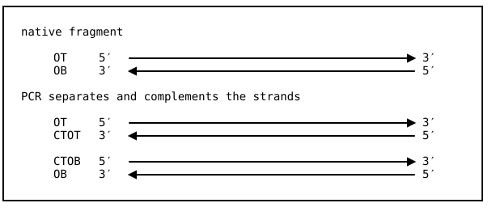
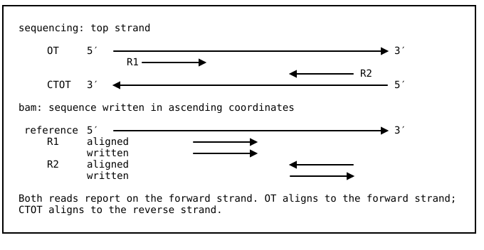
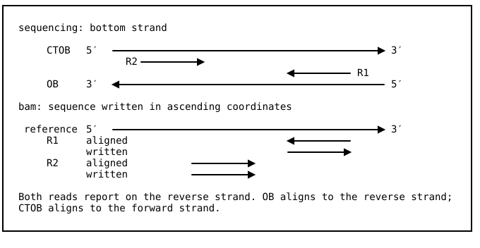

# Understanding strand of origin

A native dsDNA fragment is denatured into two ssDNA molecules, the original top (OT) and original bottom (OB) strands. PCR then generates the complement to the OT (CTOT) and the complement to the OB (CTOB).



Paired-end sequencing generates reads from the 5' ends of the OT and CTOT or the OB and CTOB molecules, reported as mates in the FASTQ files in 5'->3' orientation as sequenced on the molecule. In a directional library, read 1 comes from OT or OB and read 2 from CTOT or CTOB. Since the mates are complements, correct alignment maps them to opposite strands, even though they both report on the same original strand.





There is thus a distinction between the direction in which a read aligns to the reference ("aligned") and the strand it reports on ("original").

| molecule | aligned | original |
| -------- | ------- | -------- |
| OT       | forward | forward  |
| CTOT     | reverse | forward  |
| OB       | reverse | reverse  |
| CTOB     | forward | reverse  |

**Important:** A non-directional library is one where a read being in the R1 vs. R2 FASTQ conveys no information on its strand of origin. `alnbase` never infers the strand from the library design itself; it takes it from the strand rule. If an upstream tool has already determined the strand and stored that call in flags or tags, that can be written as an `alnbase` strand rule `.toml`. The shipped rules for Bismark, BISCUIT, BSMAP and BSBolt read the aligner's own tags, so they work on non-directional output. `directional.toml` assumes a directional library.

## Choosing a strand query file

Each aligner stores this information in specific tags or flags. Strand rules for a variety of aligners are stored in `query/strand/[aligner].toml`. One of them must be submitted using the `--query-file` flag, along with one or more query `.toml` files. Example using the bwa-meth aligner's strand rules with a MethylDackel DNA methylation query:

```
alnbase query --parquet --query-file query/strand/bwameth.toml --query-file query/extract/methyldackel.toml input.bam mm10.aref hits.parquet
```

This is all most users need to know. Choose the correct file in `query/strand` for your aligner and include it with the `--query-file` argument, along with the query file for your main query.

Note: we include strand rules even for aligners that include a prepackaged caller. This allows expanding the functionality of what the caller usually provides and facilitates direct comparisons between `alnbase` and the caller.

## How to write a strand query file

This section is for users who want to understand and possibly write a strand query file. The category (`OT`, `CTOT`, `OB`, or `CTOB`) is uniquely determined by the combination of `aligned` and `original` strands. Those strands are stored in aligner-specific flags or tags. For example, Bismark writes two tags: `XG`, the converted genome the read aligned to, which gives the original strand, and `XR`, the conversion seen in the read itself. The aligned direction follows from the two together. Its strand `.toml` file looks like this:

`query/strand/bismark.toml`
```
[strand.original]
forward = 'XG == "CT"'
reverse = 'XG == "GA"'

[strand.aligned]
forward = '(XR == "CT" and XG == "CT") or (XR == "GA" and XG == "GA")'
reverse = '(XR == "GA" and XG == "CT") or (XR == "CT" and XG == "GA")'
```

The bwa-meth aligner's strand `.toml` uses a mix of the `YD` tag and the `is_reverse` flag:

`query/strand/bwameth.toml`
```
[strand.original]
forward = 'YD == "f"'
reverse = 'YD == "r"'

[strand.aligned]
forward = "not is_reverse"
reverse = "is_reverse"
```

Both the `original` and `aligned` sections are required. The allowed keys are `forward`, `reverse`, and `unknown`. Not all are required. Values are given as boolean expressions over aux tags and flags. Expressions may use `and`, `or`, `not`, `==` and parentheses. Tags with no type are treated as strings. Tags with non-string types should have the type explicitly specified using SAM notation (i.e. `NM:i` for an integer `NM` tag). If the tag is missing, the comparison is treated as false. The whole flag can be compared to a number (`flags == 137').

Every record must match one key per section. A match to `unknown` counts the record and writes it when the output is BAM, but does not run queries over it and produces no parquet output rows. Records matching 0 or 2+ keys generate an error and the program exits.

Valid BAM flags that can be used in strand rules:

| name                   | FLAG bit | meaning                                  |
| ---------------------- | -------- | ---------------------------------------- |
| `is_paired`            | `0x1`    | template has multiple segments           |
| `is_proper_pair`       | `0x2`    | each segment properly aligned            |
| `is_unmapped`          | `0x4`    | segment unmapped                         |
| `is_mate_unmapped`     | `0x8`    | next segment unmapped                    |
| `is_reverse`           | `0x10`   | SEQ reverse complemented                 |
| `is_mate_reverse`      | `0x20`   | SEQ of next segment reverse complemented |
| `is_first_in_template` | `0x40`   | first segment (read 1)                   |
| `is_last_in_template`  | `0x80`   | last segment (read 2)                    |
| `is_secondary`         | `0x100`  | secondary alignment                      |
| `is_qc_fail`           | `0x200`  | not passing quality controls             |
| `is_duplicate`         | `0x400`  | PCR or optical duplicate                 |
| `is_supplementary`     | `0x800`  | supplementary alignment                  |
